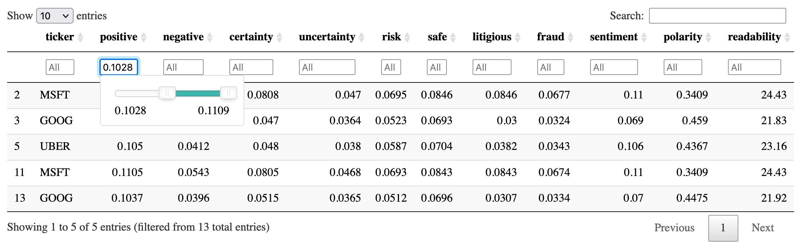
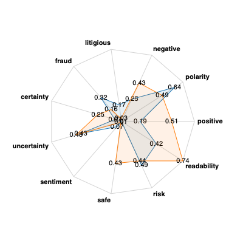

.. important::

   This page is for preview purposes only to show the content of
   `Amazon SageMaker JumpStart Industry Example Notebooks
   <https://docs.aws.amazon.com/sagemaker/latest/dg/studio-jumpstart-industry.html#studio-jumpstart-industry-examples>`_.

.. note::

   The SageMaker JumpStart Industry example notebooks
   are hosted and runnable only through SageMaker Studio.
   Log in to the `SageMaker console
   <https://console.aws.amazon.com/sagemaker>`_,
   and launch SageMaker Studio.
   For instructions on how to access the notebooks, see
   `SageMaker JumpStart <https://docs.aws.amazon.com/sagemaker/latest/dg/studio-jumpstart.html>`_ and
   `SageMaker JumpStart Industry <https://docs.aws.amazon.com/sagemaker/latest/dg/studio-jumpstart-industry.html>`_
   in the *Amazon SageMaker Developer Guide*.

.. important::

   The example notebooks are for demonstrative purposes only.
   The notebooks are not financial advice and should not be relied on as
   financial or investment advice.

Dashboarding SEC Text for Financial NLP
=======================================

The U.S. Securities and Exchange Commission (SEC) filings are widely
used in finance. Companies file the SEC filings to notify the world
about their business conditions and the future outlook of the companies.
Because of the potential predictive values, the SEC filings are good
sources of information for workers in finance, ranging from individual
investors to executives of large financial corporations. These filings
are publicly available to all investors.

In this example notebook, we focus on the following three types of SEC
filings: 10-Ks, 10-Qs, and 8-Ks.

-  `10-Ks <https://www.investopedia.com/terms/1/10-k.asp>`__ - Annual
   reports of companies(and will be quite detailed)
-  `10-Qs <https://www.investopedia.com/terms/1/10q.asp>`__ - Quarterly
   reports, except in the quarter in which a 10K is filed (and are less
   detailed then 10Qs)
-  `8-Ks <https://www.investopedia.com/terms/1/8-k.asp>`__ - Filed at
   every instance when there is a change in business conditions that is
   material and needs to be reported. This means that there can be
   multiple 8-Ks filed throughout the fiscal year.

The functionality of SageMaker JumpStart Industry will be presented
throughout the notebook, which provides an overall dashboard to
visualize the three types of filings with various analyses. We can
append several standard financial characteristics, such as *Analyst
Recommendation Mean* and *Return on Equity*, but one interesting part of
the dashboard is *attribute scoring*. Using word lists derived from
natural language processing (NLP) techniques, we will score the actual
texts of these filings for a number of characteristics, such as risk,
uncertainty, and positivity, as word proportions, providing simple,
accessible numbers to represent these traits. Using this dashboard,
anybody can pull up information and related statistics about any
companies they have interest in, and digest it in a simple, useful way.

This notebook goes thorugh the following steps to demonstrate how to
extract texts from specific sections in SEC filings, score the texts,
and summarize them.

1. Retrieve and parse 10-K, 10-Q, 8-K filings. Retrieving these filings
   from SEC’s EDGAR service is complicated, and parsing these forms into
   plain text for further analysis can be time consuming. We provide the
   `SageMaker JumpStart Industry Python
   SDK <https://sagemaker-jumpstart-industry-pack.readthedocs.io/en/latest/index.html>`__
   to create a curated dataset in a *single API call*.
2. Create separate dataframes for each of the 3 types of forms, along
   with separate columns for each extracted section.
3. Combine two sections of the 10-K forms and shows how to use the NLP
   scoring API to add numerical values to the columns for the text of
   these columns. The column is called ``text2score``.
4. Add a column with a summary of the ``text2score`` column.
5. Prepare the final dataframe that can be used as input for a
   dashboard.

One of the features of this notebook helps break long SEC filings into
separate sections, each of which deals with different aspects of a
company’s reporting. The goal of this example notebook is to make
accessing and processing texts from SEC filing easy for investors and
training their algorithms.

   **Important**: This example notebook is for demonstrative purposes
   only. It is not financial advice and should not be relied on as
   financial or investment advice.

Financial NLP
-------------

Financial NLP is one of the rapidly increasing use cases of ML in
industry. To find more discussion about this, see the following survey
paper: `Deep Learning for Financial Applications: A
Survey <https://arxiv.org/abs/2002.05786>`__. The starting point for a
vast amount of financial NLP is about extracting and processing texts in
SEC filings. The SEC filings report different types of information
related to various events involving companies. To find a complete list
of SEC forms, see `Forms List <https://www.sec.gov/forms>`__.

The SEC filings are widely used by financial services and companies as a
source of information about companies in order to make trading, lending,
investment, and risk management decisions. They contain forward-looking
information that helps with forecasts and are written with a view to the
future. In addition, in recent times, the value of historical
time-series data has degraded, since economies have been structurally
transformed by trade wars, pandemics, and political upheavals.
Therefore, text as a source of forward-looking information has been
increasing in relevance.

There has been an exponential growth in downloads of SEC filings. See
`How to Talk When a Machine is Listening: Corporate Disclosure in the
Age of AI <https://www.nber.org/papers/w27950>`__; this paper reports
that the number of machine downloads of corporate 10-K and 10-Q filings
increased from 360,861 in 2003 to 165,318,719 in 2016.

There is a vast body of academic and practitioner research that is based
on financial text, a significant portion of which is based on SEC
filings. For more readings, see the the following review article:
`Textual Analysis in Finance
(2020) <https://www.annualreviews.org/doi/abs/10.1146/annurev-financial-012820-032249>`__.

This notebook describes how a user can quickly retrieve a set of forms,
break them into sections, score texts in each section using pre-defined
word lists, and prepare a dashboard to filter the data.

SageMaker Studio Kernel Setup
-----------------------------

Recommended kernel is **Python 3 (Data Science)**. *DO NOT* use the
**Python 3 (SageMaker JumpStart Data Science 1.0)** kernel because there
are some differences in preinstalled dependencies. For the instance
type, using a larger instance with sufficient memory can be helpful to
download the following materials.

Load SDK and Helper Scripts
---------------------------

The following code cell downloads the ```smjsindustry``
SDK <https://pypi.org/project/smjsindustry/>`__ and helper scripts from
the S3 buckets prepared by SageMaker JumpStart Industry. You will learn
how to use the ``smjsindustry`` SDK which contains various APIs to
curate SEC datasets. The dataset in this example was synthetically
generated using the ``smjsindustry`` package’s SEC Forms Retrieval tool.
For more information, see the `SageMaker JumpStart Industry Python SDK
documentation <https://sagemaker-jumpstart-industry-pack.readthedocs.io/en/latest/notebooks/index.html>`__.

   **Important**: This example notebook uses data obtained from the SEC
   EDGAR database. You are responsible for complying with EDGAR’s access
   terms and conditions located in the `Accessing EDGAR
   Data <https://www.sec.gov/os/accessing-edgar-data>`__ page.

.. code:: ipython3

    # Download scripts from S3
    notebook_artifact_bucket = 'jumpstart-cache-alpha-us-west-2'
    notebook_sdk_prefix = 'smfinance-notebook-dependency/smjsindustry'
    notebook_script_prefix = 'smfinance-notebook-data/sec-dashboard'

    # Download smjsindustry SDK
    sdk_bucket = f's3://{notebook_artifact_bucket}/{notebook_sdk_prefix}'
    !aws s3 sync $sdk_bucket ./

    # Download helper scripts
    scripts_bucket = f's3://{notebook_artifact_bucket}/{notebook_script_prefix}'
    !aws s3 sync $scripts_bucket ./sec-dashboard

Install the ``smjsindustry`` library
~~~~~~~~~~~~~~~~~~~~~~~~~~~~~~~~~~~~

We deliver APIs through the ``smjsindustry`` client library. The first
step requires pip installing a Python package that interacts with a
SageMaker processing container. The retrieval, parsing, transforming,
and scoring of text is a complex process and uses many different
algorithms and packages. To make this seamless and stable for the user,
the functionality is packaged into an collection of APIs. For
installation and maintenance of the workflow, this approach reduces your
effort to a pip install followed by a single API call.

.. code:: ipython3

    # Install smjsindustry SDK
    !pip install --no-index smjsindustry-1.0.0-py3-none-any.whl

Load the functions for extracting the “Item” sections from the forms
--------------------------------------------------------------------

We created various helper functions to enable sectioning the SEC forms.
These functions do take some time to load.

.. code:: ipython3

    %run sec-dashboard/SEC_Section_Extraction_Functions.ipynb

The next block loads packages for using the AWS resources, SageMaker
features, and SageMaker JumpStart Industry SDK.

.. code:: ipython3

    %pylab inline
    import boto3
    import pandas as pd
    import sagemaker
    pd.get_option("display.max_columns", None)

    import smjsindustry
    from smjsindustry.finance import utils
    from smjsindustry import NLPScoreType, NLPSCORE_NO_WORD_LIST
    from smjsindustry import NLPScorerConfig, JaccardSummarizerConfig, KMedoidsSummarizerConfig
    from smjsindustry import Summarizer, NLPScorer
    from smjsindustry.finance.processor import DataLoader, SECXMLFilingParser
    from smjsindustry.finance.processor_config import EDGARDataSetConfig

Next, we import required packages and load the S3 bucket from the
SageMaker session, as shown below.

.. code:: ipython3

    # Prepare the SageMaker session's default S3 bucket and a folder to store processed data
    session = sagemaker.Session()
    bucket = session.default_bucket()
    secdashboard_processed_folder='jumpstart_industry_secdashboard_processed'

Download the filings you wish to work with
------------------------------------------

Downloading SEC filings is done from the SEC’s Electronic Data
Gathering, Analysis, and Retrieval (EDGAR) website, which provides open
data access. EDGAR is the primary system under the U.S. Securities And
Exchange Commission (SEC) for companies and others submitting documents
under the Securities Act of 1933, the Securities Exchange Act of 1934,
the Trust Indenture Act of 1939, and the Investment Company Act of 1940.
EDGAR contains millions of company and individual filings. The system
processes about 3,000 filings per day, serves up 3,000 terabytes of data
to the public annually, and accommodates 40,000 new filers per year on
average. Below we provide a simple *one*-API call that will create a
dataset of plain text filings in a few lines of code, for any period of
time and for a large number of tickers.

We have wrapped the extraction functionality into a SageMaker processing
container and provide this notebook to enable users to download a
dataset of filings with meta data such as dates and parsed plain text
that can then be used for machine learning using other SageMaker tools.
Users only need to specify a date range and a list of ticker symbols and
this API will do the rest.

The extracted dataframe is written to S3 storage and to the local
notebook instance.

The API below specifies the machine to be used and the volume size. It
also specifies the tickers or CIK codes for the companies to be covered,
as well as the 3 form types (10-K, 10-Q, 8-K) to be retrieved. The data
range is also specified as well as the filename (CSV) where the
retrieved filings will be stored.

The API is in 3 parts:

1. Set up a dataset configuration (an ``EDGARDataSetConfig`` object).
   This specifies (i) the tickers or SEC CIK codes for the companies
   whose forms are being extracted; (ii) the SEC forms types (in this
   case 10-K, 10-Q, 8-K); (iii) date range of forms by filing date, (iv)
   the output CSV file and S3 bucket to store the dataset.
2. Set up a data loader object (a ``DataLoader`` object). The middle
   section shows how to assign system resources and has default values
   in place.
3. Run the data loader (``data_loader.load``).

This initiates a processing job running in a SageMaker container.

   **Important**: This example notebook uses data obtained from the SEC
   EDGAR database. You are responsible for complying with EDGAR’s access
   terms and conditions located in the `Accessing EDGAR
   Data <https://www.sec.gov/os/accessing-edgar-data>`__ page.

.. code:: ipython3

    %%time

    dataset_config = EDGARDataSetConfig(
        tickers_or_ciks=['amzn', 'goog', '27904', 'fb', 'msft', 'uber', 'nflx'],  # list of stock tickers or CIKs
        form_types=['10-K', '10-Q', '8-K'],              # list of SEC form types
        filing_date_start='2019-01-01',                  # starting filing date
        filing_date_end='2020-12-31',                    # ending filing date
        email_as_user_agent='test-user@test.com')        # user agent email

    data_loader = DataLoader(
        role=sagemaker.get_execution_role(),    # loading job execution role
        instance_count=1,                       # instances number, limit varies with instance type
        instance_type='ml.c5.2xlarge',          # instance type
        volume_size_in_gb=30,                   # size in GB of the EBS volume to use
        volume_kms_key=None,                    # KMS key for the processing volume
        output_kms_key=None,                    # KMS key ID for processing job outputs
        max_runtime_in_seconds=None,            # timeout in seconds. Default is 24 hours.
        sagemaker_session=sagemaker.Session(),  # session object
        tags=None)                              # a list of key-value pairs

    data_loader.load(
        dataset_config,
        's3://{}/{}/{}'.format(bucket, secdashboard_processed_folder, 'output'),                  # output s3 prefix (both bucket and folder names are required)
        'dataset_10k_10q_8k_2019_2021.csv',                                                       # output file name
        wait=True,
        logs=True)

Copy the file into Studio from the s3 bucket
--------------------------------------------

We can examine the dataframe that was constructed by the API.

.. code:: ipython3

    client = boto3.client('s3')
    client.download_file(bucket, '{}/{}/{}'.format(secdashboard_processed_folder, 'output', 'dataset_10k_10q_8k_2019_2021.csv'), 'dataset_10k_10q_8k_2019_2021.csv')

See how a complete dataset was prepared. Altogether, a few hundred forms
were retrieved across tickers and the three types of SEC form.

.. code:: ipython3

    df_forms = pd.read_csv('dataset_10k_10q_8k_2019_2021.csv')
    df_forms


.. raw:: html

    <div>
    <style scoped>
        .dataframe tbody tr th:only-of-type {
            vertical-align: middle;
        }

        .dataframe tbody tr th {
            vertical-align: top;
        }

        .dataframe thead th {
            text-align: right;
        }
    </style>
    <table border="1" class="dataframe">
      <thead>
        <tr style="text-align: right;">
          <th></th>
          <th>ticker</th>
          <th>form_type</th>
          <th>accession_number</th>
          <th>filing_date</th>
          <th>text</th>
          <th>mdna</th>
        </tr>
      </thead>
      <tbody>
        <tr>
          <th>0</th>
          <td>AMZN</td>
          <td>10-Q</td>
          <td>0001018724-19-000043</td>
          <td>2019-04-26</td>
          <td>PART I. FINANCIAL INFORMATION\n\nItem 1.\n\nFi...</td>
          <td>Management’s Discussion and Analysis of Financ...</td>
        </tr>
        <tr>
          <th>1</th>
          <td>AMZN</td>
          <td>10-Q</td>
          <td>0001018724-19-000071</td>
          <td>2019-07-26</td>
          <td>PART I. FINANCIAL INFORMATION\n\nItem 1.\n\nFi...</td>
          <td>Management’s Discussion and Analysis of Financ...</td>
        </tr>
        <tr>
          <th>2</th>
          <td>AMZN</td>
          <td>10-Q</td>
          <td>0001018724-19-000089</td>
          <td>2019-10-25</td>
          <td>PART I. FINANCIAL INFORMATION\n\nItem 1.\n\nFi...</td>
          <td>Management’s Discussion and Analysis of Financ...</td>
        </tr>
        <tr>
          <th>3</th>
          <td>AMZN</td>
          <td>10-Q</td>
          <td>0001018724-20-000010</td>
          <td>2020-05-01</td>
          <td>PART I. FINANCIAL INFORMATION\n\nItem 1.\n\nFi...</td>
          <td>Management’s Discussion and Analysis of Financ...</td>
        </tr>
        <tr>
          <th>4</th>
          <td>AMZN</td>
          <td>10-Q</td>
          <td>0001018724-20-000021</td>
          <td>2020-07-31</td>
          <td>PART I. FINANCIAL INFORMATION\n\nItem 1. Finan...</td>
          <td>Management’s Discussion and Analysis of Financ...</td>
        </tr>
        <tr>
          <th>...</th>
          <td>...</td>
          <td>...</td>
          <td>...</td>
          <td>...</td>
          <td>...</td>
          <td>...</td>
        </tr>
        <tr>
          <th>243</th>
          <td>NFLX</td>
          <td>10-Q</td>
          <td>0001065280-20-000155</td>
          <td>2020-04-21</td>
          <td>FORM 10-Q\n\n(Mark One)\n\n☒ QUARTERLY REPORT ...</td>
          <td>Management’s Discussion and Analysis of Financ...</td>
        </tr>
        <tr>
          <th>244</th>
          <td>NFLX</td>
          <td>10-Q</td>
          <td>0001065280-20-000309</td>
          <td>2020-07-20</td>
          <td>FORM 10-Q\n\n(Mark One)\n\n☒ QUARTERLY REPORT ...</td>
          <td>Management’s Discussion and Analysis of Financ...</td>
        </tr>
        <tr>
          <th>245</th>
          <td>NFLX</td>
          <td>10-Q</td>
          <td>0001065280-20-000451</td>
          <td>2020-10-22</td>
          <td>FORM 10-Q\n\n(Mark One)\n\n☒ QUARTERLY REPORT ...</td>
          <td>Management’s Discussion and Analysis of Financ...</td>
        </tr>
        <tr>
          <th>246</th>
          <td>NFLX</td>
          <td>10-K</td>
          <td>0001065280-19-000043</td>
          <td>2019-01-29</td>
          <td>PART I\n\nForward-Looking Statements\n\nThis A...</td>
          <td>"Management's Discussion and Analysis of Finan...</td>
        </tr>
        <tr>
          <th>247</th>
          <td>NFLX</td>
          <td>10-K</td>
          <td>0001065280-20-000040</td>
          <td>2020-01-29</td>
          <td>PART I\n\nForward-Looking Statements\n\nThis A...</td>
          <td>Management’s Discussion and Analysis of Financ...</td>
        </tr>
      </tbody>
    </table>
    <p>248 rows × 6 columns</p>
    </div>


Here is a breakdown of the few hundred forms by **ticker** and
**form_type**.

.. code:: ipython3

    df_forms.groupby(['ticker','form_type']).count().reset_index()


.. raw:: html

    <div>
    <style scoped>
        .dataframe tbody tr th:only-of-type {
            vertical-align: middle;
        }

        .dataframe tbody tr th {
            vertical-align: top;
        }

        .dataframe thead th {
            text-align: right;
        }
    </style>
    <table border="1" class="dataframe">
      <thead>
        <tr style="text-align: right;">
          <th></th>
          <th>ticker</th>
          <th>form_type</th>
          <th>accession_number</th>
          <th>filing_date</th>
          <th>text</th>
          <th>mdna</th>
        </tr>
      </thead>
      <tbody>
        <tr>
          <th>0</th>
          <td>27904</td>
          <td>10-K</td>
          <td>2</td>
          <td>2</td>
          <td>2</td>
          <td>2</td>
        </tr>
        <tr>
          <th>1</th>
          <td>27904</td>
          <td>10-Q</td>
          <td>6</td>
          <td>6</td>
          <td>6</td>
          <td>6</td>
        </tr>
        <tr>
          <th>2</th>
          <td>27904</td>
          <td>8-K</td>
          <td>48</td>
          <td>48</td>
          <td>48</td>
          <td>0</td>
        </tr>
        <tr>
          <th>3</th>
          <td>AMZN</td>
          <td>10-K</td>
          <td>2</td>
          <td>2</td>
          <td>2</td>
          <td>2</td>
        </tr>
        <tr>
          <th>4</th>
          <td>AMZN</td>
          <td>10-Q</td>
          <td>6</td>
          <td>6</td>
          <td>6</td>
          <td>6</td>
        </tr>
        <tr>
          <th>5</th>
          <td>AMZN</td>
          <td>8-K</td>
          <td>21</td>
          <td>21</td>
          <td>21</td>
          <td>0</td>
        </tr>
        <tr>
          <th>6</th>
          <td>FB</td>
          <td>10-K</td>
          <td>2</td>
          <td>2</td>
          <td>2</td>
          <td>2</td>
        </tr>
        <tr>
          <th>7</th>
          <td>FB</td>
          <td>10-Q</td>
          <td>6</td>
          <td>6</td>
          <td>6</td>
          <td>6</td>
        </tr>
        <tr>
          <th>8</th>
          <td>FB</td>
          <td>8-K</td>
          <td>16</td>
          <td>16</td>
          <td>16</td>
          <td>0</td>
        </tr>
        <tr>
          <th>9</th>
          <td>GOOG</td>
          <td>10-K</td>
          <td>2</td>
          <td>2</td>
          <td>2</td>
          <td>2</td>
        </tr>
        <tr>
          <th>10</th>
          <td>GOOG</td>
          <td>10-Q</td>
          <td>6</td>
          <td>6</td>
          <td>6</td>
          <td>6</td>
        </tr>
        <tr>
          <th>11</th>
          <td>GOOG</td>
          <td>8-K</td>
          <td>23</td>
          <td>23</td>
          <td>23</td>
          <td>0</td>
        </tr>
        <tr>
          <th>12</th>
          <td>MSFT</td>
          <td>10-K</td>
          <td>2</td>
          <td>2</td>
          <td>2</td>
          <td>2</td>
        </tr>
        <tr>
          <th>13</th>
          <td>MSFT</td>
          <td>10-Q</td>
          <td>6</td>
          <td>6</td>
          <td>6</td>
          <td>6</td>
        </tr>
        <tr>
          <th>14</th>
          <td>MSFT</td>
          <td>8-K</td>
          <td>22</td>
          <td>22</td>
          <td>22</td>
          <td>0</td>
        </tr>
        <tr>
          <th>15</th>
          <td>NFLX</td>
          <td>10-K</td>
          <td>2</td>
          <td>2</td>
          <td>2</td>
          <td>2</td>
        </tr>
        <tr>
          <th>16</th>
          <td>NFLX</td>
          <td>10-Q</td>
          <td>6</td>
          <td>6</td>
          <td>6</td>
          <td>6</td>
        </tr>
        <tr>
          <th>17</th>
          <td>NFLX</td>
          <td>8-K</td>
          <td>24</td>
          <td>24</td>
          <td>24</td>
          <td>0</td>
        </tr>
        <tr>
          <th>18</th>
          <td>UBER</td>
          <td>10-K</td>
          <td>1</td>
          <td>1</td>
          <td>1</td>
          <td>1</td>
        </tr>
        <tr>
          <th>19</th>
          <td>UBER</td>
          <td>10-Q</td>
          <td>6</td>
          <td>6</td>
          <td>6</td>
          <td>6</td>
        </tr>
        <tr>
          <th>20</th>
          <td>UBER</td>
          <td>8-K</td>
          <td>39</td>
          <td>39</td>
          <td>39</td>
          <td>0</td>
        </tr>
      </tbody>
    </table>
    </div>


Create the dataframe for the extracted item sections from the 10-K filings
--------------------------------------------------------------------------

In this section, we break the various sections of the 10-K filings into
separate columns of the extracted dataframe.

1. Take a subset of the dataframe by specifying
   ``df.form_type == "10-K"``.
2. Extract the sections for each 10-K filing and put them in columns in
   a separate dataframe.
3. Merge this dataframe with the dataframe from 1.

You can examine the cells in the dataframe below to see the text from
each section.

.. code:: ipython3

    df = pd.read_csv('dataset_10k_10q_8k_2019_2021.csv')
    df_10K = df[df.form_type == "10-K"]

.. code:: ipython3

    # Construct the DataFrame row by row.
    items_10K = pd.DataFrame(columns = columns_10K, dtype=object)
    # for i in range(len(df)):
    for i in df_10K.index:
        form_text = df_10K.text[i]
        item_iter = get_form_items(form_text, "10-K")
        items_10K.loc[i] = items_to_df_row(item_iter, columns_10K, "10-K")

.. code:: ipython3

    items_10K.rename(columns=header_mappings_10K, inplace=True)
    # items_10K.head(10)

.. code:: ipython3

    df_10K = pd.merge(df_10K, items_10K, left_index=True, right_index=True)
    df_10K.head(10)


.. raw:: html

    <div>
    <style scoped>
        .dataframe tbody tr th:only-of-type {
            vertical-align: middle;
        }

        .dataframe tbody tr th {
            vertical-align: top;
        }

        .dataframe thead th {
            text-align: right;
        }
    </style>
    <table border="1" class="dataframe">
      <thead>
        <tr style="text-align: right;">
          <th></th>
          <th>ticker</th>
          <th>form_type</th>
          <th>accession_number</th>
          <th>filing_date</th>
          <th>text</th>
          <th>mdna</th>
          <th>Business</th>
          <th>Risk Factors</th>
          <th>Unresolved Staff Comments</th>
          <th>Properties</th>
          <th>...</th>
          <th>Financial Statements and Supplementary Data</th>
          <th>Changes in and Disagreements with Accountants on Accounting and Financial Disclosure</th>
          <th>Controls and Procedures</th>
          <th>Other Information</th>
          <th>Directors, Executive Officers and Corporate Governance</th>
          <th>Executive Compensation</th>
          <th>Security Ownership of Certain Beneficial Owners and Management and Related Stockholder Matters</th>
          <th>Certain Relationships and Related Transactions, and Director Independence</th>
          <th>Principal Accountant Fees and Services</th>
          <th>Exhibits, Financial Statement Schedules</th>
        </tr>
      </thead>
      <tbody>
        <tr>
          <th>27</th>
          <td>AMZN</td>
          <td>10-K</td>
          <td>0001018724-19-000004</td>
          <td>2019-02-01</td>
          <td>PART I\n\nItem 1.\n\nBusiness  \n\nThis Annual...</td>
          <td>Management’s Discussion and Analysis of Financ...</td>
          <td>Business  \n\nThis Annual Report on Form 10-K ...</td>
          <td>Risk Factors  \n\nPlease carefully consider th...</td>
          <td>Unresolved Staff Comments  \n\nNone.</td>
          <td>Properties  \n\nAs of December 31, 2018, we op...</td>
          <td>...</td>
          <td>Financial Statements and Supplementary Data  \...</td>
          <td>Changes in and Disagreements with Accountants ...</td>
          <td>Controls and Procedures  \n\nEvaluation of Dis...</td>
          <td>Other Information  \n\nDisclosure Pursuant to ...</td>
          <td>Directors, Executive Officers, and Corporate G...</td>
          <td>Executive Compensation  \n\nInformation requir...</td>
          <td>Security Ownership of Certain Beneficial Owner...</td>
          <td>Certain Relationships and Related Transactions...</td>
          <td>Principal Accountant Fees and Services  \n\nIn...</td>
          <td>Exhibits, Financial Statement Schedules  \n\n(...</td>
        </tr>
        <tr>
          <th>28</th>
          <td>AMZN</td>
          <td>10-K</td>
          <td>0001018724-20-000004</td>
          <td>2020-01-31</td>
          <td>PART I\n\nItem 1.\n\nBusiness  \n\nThis Annual...</td>
          <td>Management’s Discussion and Analysis of Financ...</td>
          <td>Business  \n\nThis Annual Report on Form 10-K ...</td>
          <td>Risk Factors  \n\nPlease carefully consider th...</td>
          <td>Unresolved Staff Comments  \n\nNone.</td>
          <td>Properties  \n\nAs of December 31, 2019, we op...</td>
          <td>...</td>
          <td>Financial Statements and Supplementary Data  \...</td>
          <td>Changes in and Disagreements with Accountants ...</td>
          <td>Controls and Procedures  \n\nEvaluation of Dis...</td>
          <td>Other Information  \n\nDisclosure Pursuant to ...</td>
          <td>Directors, Executive Officers, and Corporate G...</td>
          <td>Executive Compensation  \n\nInformation requir...</td>
          <td>Security Ownership of Certain Beneficial Owner...</td>
          <td>Certain Relationships and Related Transactions...</td>
          <td>Principal Accountant Fees and Services  \n\nIn...</td>
          <td>Exhibits, Financial Statement Schedules  \n\n(...</td>
        </tr>
        <tr>
          <th>58</th>
          <td>GOOG</td>
          <td>10-K</td>
          <td>0001652044-19-000004</td>
          <td>2019-02-05</td>
          <td>PART I  \n\nITEM 1.\n\nBUSINESS  \n\nOverview\...</td>
          <td>MANAGEMENT’S DISCUSSION AND ANALYSIS OF FINANC...</td>
          <td>BUSINESS  \n\nOverview\n\nAs our founders Larr...</td>
          <td>RISK FACTORS  \n\nOur operations and financial...</td>
          <td>UNRESOLVED STAFF COMMENTS  \n\nNot applicable.</td>
          <td>PROPERTIES  \n\nOur headquarters are located i...</td>
          <td>...</td>
          <td>FINANCIAL STATEMENTS AND SUPPLEMENTARY DATA  \...</td>
          <td>CHANGES IN AND DISAGREEMENTS WITH ACCOUNTANTS ...</td>
          <td>CONTROLS AND PROCEDURES  \n\nEvaluation of Dis...</td>
          <td>OTHER INFORMATION  \n\nNone.\n\nAlphabet Inc. ...</td>
          <td>DIRECTORS, EXECUTIVE OFFICERS AND CORPORATE GO...</td>
          <td>EXECUTIVE COMPENSATION  \n\nThe information re...</td>
          <td>SECURITY OWNERSHIP OF CERTAIN BENEFICIAL OWNER...</td>
          <td>CERTAIN RELATIONSHIPS AND RELATED TRANSACTIONS...</td>
          <td>PRINCIPAL ACCOUNTANT FEES AND SERVICES  \n\nTh...</td>
          <td>EXHIBITS, FINANCIAL STATEMENT SCHEDULES  \n\n(...</td>
        </tr>
        <tr>
          <th>59</th>
          <td>GOOG</td>
          <td>10-K</td>
          <td>0001652044-20-000008</td>
          <td>2020-02-04</td>
          <td>PART I  \n\nITEM 1.\n\nBUSINESS  \n\nOverview\...</td>
          <td>MANAGEMENT’S DISCUSSION AND ANALYSIS OF FINANC...</td>
          <td>BUSINESS  \n\nOverview\n\nAs our founders Larr...</td>
          <td>RISK FACTORS  \n\nOur operations and financial...</td>
          <td>UNRESOLVED STAFF COMMENTS  \n\nNot applicable.</td>
          <td>PROPERTIES  \n\nOur headquarters are located i...</td>
          <td>...</td>
          <td>FINANCIAL STATEMENTS AND SUPPLEMENTARY DATA  \...</td>
          <td>CHANGES IN AND DISAGREEMENTS WITH ACCOUNTANTS ...</td>
          <td>CONTROLS AND PROCEDURES  \n\nEvaluation of Dis...</td>
          <td>OTHER INFORMATION  \n\nNone.\n\nAlphabet Inc. ...</td>
          <td>DIRECTORS, EXECUTIVE OFFICERS AND CORPORATE GO...</td>
          <td>EXECUTIVE COMPENSATION  \n\nThe information re...</td>
          <td>SECURITY OWNERSHIP OF CERTAIN BENEFICIAL OWNER...</td>
          <td>CERTAIN RELATIONSHIPS AND RELATED TRANSACTIONS...</td>
          <td>PRINCIPAL ACCOUNTANT FEES AND SERVICES  \n\nTh...</td>
          <td>EXHIBITS, FINANCIAL STATEMENT SCHEDULES  \n\nW...</td>
        </tr>
        <tr>
          <th>114</th>
          <td>27904</td>
          <td>10-K</td>
          <td>0000027904-19-000003</td>
          <td>2019-02-15</td>
          <td>FORM 10-K\n\nFor the fiscal year ended Decembe...</td>
          <td>MANAGEMENT'S DISCUSSION AND ANALYSIS OF FINANC...</td>
          <td>General\n\nWe are a major passenger airline, p...</td>
          <td>Risk Factors Relating to Delta\n\nOur business...</td>
          <td>None.</td>
          <td>Flight Equipment\n\nOur operating aircraft fle...</td>
          <td>...</td>
          <td>INDEX TO CONSOLIDATED FINANCIAL STATEMENTS\n\n...</td>
          <td>None.</td>
          <td>Disclosure Controls and Procedures\n\nOur mana...</td>
          <td>None.\n\nPART III</td>
          <td>Information required by this item is set forth...</td>
          <td>Information required by this item is set forth...</td>
          <td>Securities Authorized for Issuance Under Equit...</td>
          <td>Information required by this item is set forth...</td>
          <td>Information required by this item is set forth...</td>
          <td>(a) (1). The following is an index of the fina...</td>
        </tr>
        <tr>
          <th>115</th>
          <td>27904</td>
          <td>10-K</td>
          <td>0000027904-20-000004</td>
          <td>2020-02-13</td>
          <td>FORM 10-K\n\nFor the fiscal year ended Decembe...</td>
          <td>MANAGEMENT'S DISCUSSION AND ANALYSIS OF FINANC...</td>
          <td>General\n\nWe are the leading U.S. global airl...</td>
          <td>Risk Factors Relating to Delta\n\nWe are at ri...</td>
          <td>None.</td>
          <td>Flight Equipment\n\nAs part of our ongoing fle...</td>
          <td>...</td>
          <td>INDEX TO CONSOLIDATED FINANCIAL STATEMENTS\n\n...</td>
          <td>None.</td>
          <td>Disclosure Controls and Procedures\n\nOur mana...</td>
          <td>None.\n\nPART III</td>
          <td>Information required by this item is set forth...</td>
          <td>Information required by this item is set forth...</td>
          <td>Securities Authorized for Issuance Under Equit...</td>
          <td>Information required by this item is set forth...</td>
          <td>Information required by this item is set forth...</td>
          <td>(a) (1). The following is an index of the fina...</td>
        </tr>
        <tr>
          <th>138</th>
          <td>FB</td>
          <td>10-K</td>
          <td>0001326801-19-000009</td>
          <td>2019-01-31</td>
          <td>PART I\n\nItem 1.Business\n\nOverview\n\nOur m...</td>
          <td>Management's Discussion and Analysis of Financ...</td>
          <td>Overview\n\nOur mission is to give people the ...</td>
          <td>Risk Factors  \n\nCertain factors may have a m...</td>
          <td>Unresolved Staff Comments  \n\nNone.</td>
          <td>Properties  \n\nOur corporate headquarters are...</td>
          <td>...</td>
          <td>Financial Statements and Supplementary Data  \...</td>
          <td>Changes in and Disagreements with Accountants ...</td>
          <td>Controls and Procedures  \n\nEvaluation of Dis...</td>
          <td>Other Information  \n\nIn September 2017, we f...</td>
          <td>Directors, Executive Officers and Corporate Go...</td>
          <td>Executive Compensation  \n\nThe information re...</td>
          <td>Security Ownership of Certain Beneficial Owner...</td>
          <td>Certain Relationships and Related Transactions...</td>
          <td>Principal Accounting Fees and Services  \n\nTh...</td>
          <td>Exhibits, Financial Statement Schedules  \n\nW...</td>
        </tr>
        <tr>
          <th>139</th>
          <td>FB</td>
          <td>10-K</td>
          <td>0001326801-20-000013</td>
          <td>2020-01-30</td>
          <td>PART I\n\nItem 1.Business\n\nOverview\n\nOur m...</td>
          <td>Management's Discussion and Analysis of Financ...</td>
          <td>Overview\n\nOur mission is to give people the ...</td>
          <td>Risk Factors  \n\nCertain factors may have a m...</td>
          <td>Unresolved Staff Comments  \n\nNone.</td>
          <td>Properties  \n\nOur corporate headquarters are...</td>
          <td>...</td>
          <td>Financial Statements and Supplementary Data  \...</td>
          <td>Changes in and Disagreements with Accountants ...</td>
          <td>Controls and Procedures  \n\nEvaluation of Dis...</td>
          <td>Other Information  \n\nNone.\n\nPART III</td>
          <td>Directors, Executive Officers and Corporate Go...</td>
          <td>Executive Compensation  \n\nThe information re...</td>
          <td>Security Ownership of Certain Beneficial Owner...</td>
          <td>Certain Relationships and Related Transactions...</td>
          <td>Principal Accounting Fees and Services  \n\nTh...</td>
          <td>Exhibits, Financial Statement Schedules  \n\nW...</td>
        </tr>
        <tr>
          <th>168</th>
          <td>MSFT</td>
          <td>10-K</td>
          <td>0001564590-19-027952</td>
          <td>2019-08-01</td>
          <td>PART I\n\nItem 1\n\nNote About Forward-Looking...</td>
          <td>ITEM 7. MANAGEMENT’S DISCUSSION AND ANALYSIS O...</td>
          <td>EMPLOYEES\n\nAs of June 30, 2019, we employed ...</td>
          <td>We maintain an investment portfolio of various...</td>
          <td>ITEM 1B. UNRESOLVED STAFF COMMENTS\n\nWe have ...</td>
          <td>Our corporate headquarters are located in Redm...</td>
          <td>...</td>
          <td>Income Taxes — Uncertain Tax Positions — Refer...</td>
          <td>ITEM 9. CHANGES IN AND DISAGREEMENTS WITH ACCO...</td>
          <td>REPORT OF INDEPENDENT REGISTERED PUBLIC ACCOUN...</td>
          <td>ITEM 9B. OTHER INFORMATION\n\nNot applicable.\...</td>
          <td>A list of our executive officers and biographi...</td>
          <td>The information in the Proxy Statement set for...</td>
          <td>The information in the Proxy Statement set for...</td>
          <td>The information set forth in the Proxy Stateme...</td>
          <td>Information concerning principal accountant fe...</td>
          <td>ITEM 16. FORM 10-K SUMMARY\n\nNone.\n\nSIGNATU...</td>
        </tr>
        <tr>
          <th>169</th>
          <td>MSFT</td>
          <td>10-K</td>
          <td>0001564590-20-034944</td>
          <td>2020-07-30</td>
          <td>PART I\n\nItem 1\n\nNote About Forward-Looking...</td>
          <td>ITEM 7. MANAGEMENT’S DISCUSSION AND ANALYSIS O...</td>
          <td>EMPLOYEES\n\nAs of June 30, 2020, we employed ...</td>
          <td>Measures to contain the virus that impact us, ...</td>
          <td>ITEM 1B. UNRESOLVED STAFF COMMENTS\n\nWe have ...</td>
          <td>Our corporate headquarters are located in Redm...</td>
          <td>...</td>
          <td>Income Taxes – Uncertain Tax Positions – Refer...</td>
          <td>ITEM 9. CHANGES IN AND DISAGREEMENTS WITH ACCO...</td>
          <td>REPORT OF INDEPENDENT REGISTERED PUBLIC ACCOUN...</td>
          <td>ITEM 9B. OTHER INFORMATION\n\nNot applicable.\...</td>
          <td>A list of our executive officers and biographi...</td>
          <td>The information in the Proxy Statement set for...</td>
          <td>The information in the Proxy Statement set for...</td>
          <td>The information set forth in the Proxy Stateme...</td>
          <td>Information concerning principal accountant fe...</td>
          <td>Incorporated by Reference\n\nExhibit\n\nNumber...</td>
        </tr>
      </tbody>
    </table>
    <p>10 rows × 26 columns</p>
    </div>


Let’s take a look at the text in one of the columns to see that there is
clean, parsed, plain text provided by the API:

.. code:: ipython3

    print(df_10K["Risk Factors"][138])


.. parsed-literal::

    Risk Factors

    Certain factors may have a material adverse effect on our business, financial
    condition, and results of operations. You should consider carefully the risks
    and uncertainties described below, in addition to other information contained
    in this Annual Report on Form 10-K, including our consolidated financial
    statements and related notes. The risks and uncertainties described below are
    not the only ones we face. Additional risks and uncertainties that we are
    unaware of, or that we currently believe are not material, may also become
    important factors that adversely affect our business. If any of the following
    risks actually occurs, our business, financial condition, results of
    operations, and future prospects could be materially and adversely affected.
    In that event, the trading price of our Class A common stock could decline,
    and you could lose part or all of your investment.

    Risks Related to Our Business and Industry

    If we fail to retain existing users or add new users, or if our users decrease
    their level of engagement with our products, our revenue, financial results,
    and business may be significantly harmed.

    The size of our user base and our users' level of engagement are critical to
    our success. Our financial performance has been and will continue to be
    significantly determined by our success in adding, retaining, and engaging
    active users of our products, particularly for Facebook and Instagram. We
    anticipate that our active user growth rate will generally decline over time
    as the size of our active user base increases, and it is possible that the
    size of our active user base may fluctuate or decline in one or more markets,
    particularly in markets where we have achieved higher penetration rates. For
    example, in the fourth quarter of 2017, we experienced a slight decline on a
    quarter-over-quarter basis in the number of daily active users on Facebook in
    the United States & Canada region. If people do not perceive our products to
    be useful, reliable, and trustworthy, we may not be able to attract or retain
    users or otherwise maintain or increase the frequency and duration of their
    engagement. A number of other social networking companies that achieved early
    popularity have since seen their active user bases or levels of engagement
    decline, in some cases precipitously. There is no guarantee that we will not
    experience a similar erosion of our active user base or engagement levels. Our
    user engagement patterns have changed over time, and user engagement can be
    difficult to measure, particularly as we introduce new and different products
    and services. Any number of factors could potentially negatively affect user
    retention, growth, and engagement, including if:

    users increasingly engage with other competitive products or services;

    we fail to introduce new features, products or services that users find
    engaging or if we introduce new products or services, or make changes to
    existing products and services, that are not favorably received;

    users feel that their experience is diminished as a result of the decisions we
    make with respect to the frequency, prominence, format, size, and quality of
    ads that we display;

    users have difficulty installing, updating, or otherwise accessing our
    products on mobile devices as a result of actions by us or third parties that
    we rely on to distribute our products and deliver our services;

    user behavior on any of our products changes, including decreases in the
    quality and frequency of content shared on our products and services;

    we are unable to continue to develop products for mobile devices that users
    find engaging, that work with a variety of mobile operating systems and
    networks, and that achieve a high level of market acceptance;

    there are decreases in user sentiment due to questions about the quality or
    usefulness of our products or our user data practices, or concerns related to
    privacy and sharing, safety, security, well-being, or other factors;

    we are unable to manage and prioritize information to ensure users are
    presented with content that is appropriate, interesting, useful, and relevant
    to them;

    we are unable to obtain or attract engaging third-party content;

    we are unable to successfully maintain or grow usage of and engagement with
    mobile and web applications that integrate with Facebook and our other
    products;

    users adopt new technologies where our products may be displaced in favor of
    other products or services, or may not be featured or otherwise available;

    there are changes mandated by legislation, regulatory authorities, or
    litigation that adversely affect our products or users;

    there is decreased engagement with our products, or failure to accept our
    terms of service, as part of changes that we implemented in connection with
    the General Data Protection Regulation (GDPR) in Europe, other similar changes
    that

    we implemented in the United States and around the world, or other changes we
    may implement in the future in connection with other regulations, regulatory
    actions or otherwise;

    technical or other problems prevent us from delivering our products in a rapid
    and reliable manner or otherwise affect the user experience, such as security
    breaches or failure to prevent or limit spam or similar content;

    we adopt terms, policies, or procedures related to areas such as sharing,
    content, user data, or advertising that are perceived negatively by our users
    or the general public;

    we elect to focus our product decisions on longer-term initiatives that do not
    prioritize near-term user growth and engagement;

    we make changes in how we promote different products and services across our
    family of apps;

    initiatives designed to attract and retain users and engagement are
    unsuccessful or discontinued, whether as a result of actions by us, third
    parties, or otherwise;

    third-party initiatives that may enable greater use of our products, including
    low-cost or discounted data plans, are discontinued;

    there is decreased engagement with our products as a result of taxes imposed
    on the use of social media or other mobile applications in certain countries,
    or other actions by governments that may affect the accessibility of our
    products in their countries;

    we fail to provide adequate customer service to users, marketers, developers,
    or other partners;

    we, developers whose products are integrated with our products, or other
    partners and companies in our industry are the subject of adverse media
    reports or other negative publicity, including as a result of our or their
    user data practices; or

    our current or future products, such as our development tools and application
    programming interfaces that enable developers to build, grow, and monetize
    mobile and web applications, reduce user activity on our products by making it
    easier for our users to interact and share on third-party mobile and web
    applications.

    If we are unable to maintain or increase our user base and user engagement,
    our revenue and financial results may be adversely affected. Any decrease in
    user retention, growth, or engagement could render our products less
    attractive to users, marketers, and developers, which is likely to have a
    material and adverse impact on our revenue, business, financial condition, and
    results of operations. If our active user growth rate continues to slow, we
    will become increasingly dependent on our ability to maintain or increase
    levels of user engagement and monetization in order to drive revenue growth.

    We generate substantially all of our revenue from advertising. The loss of
    marketers, or reduction in spending by marketers, could seriously harm our
    business.

    Substantially all of our revenue is currently generated from third parties
    advertising on Facebook and Instagram. As is common in the industry, our
    marketers do not have long-term advertising commitments with us. Many of our
    marketers spend only a relatively small portion of their overall advertising
    budget with us. Marketers will not continue to do business with us, or they
    will reduce the budgets they are willing to commit to us, if we do not deliver
    ads in an effective manner, or if they do not believe that their investment in
    advertising with us will generate a competitive return relative to other
    alternatives. We have recently implemented, and we may continue to implement,
    changes to our user data practices. Some of these changes will reduce
    marketers’ ability to effectively target their ads, which has to some extent
    adversely affected, and will continue to adversely affect, our advertising
    business. If we are unable to provide marketers with a suitable return on
    investment, the pricing of our ads may not increase, or may decline, in which
    case our revenue and financial results may be harmed.

    Our advertising revenue could also be adversely affected by a number of other
    factors, including:

    decreases in user engagement, including time spent on our products;

    our inability to continue to increase user access to and engagement with our
    products;

    product changes or inventory management decisions we may make that change the
    size, format, frequency, or relative prominence of ads displayed on our
    products or of other unpaid content shared by marketers on our products;

    our inability to maintain or increase marketer demand, the pricing of our ads,
    or both;

    our inability to maintain or increase the quantity or quality of ads shown to
    users, including as a result of technical infrastructure constraints;

    user behavior or product changes that may reduce traffic to features or
    products that we successfully monetize, including as a result of our efforts
    to promote the Stories format or increased usage of our messaging products;

    reductions of advertising by marketers due to our efforts to implement
    advertising policies that protect the security and integrity of our platform;

    changes to third-party policies that limit our ability to deliver or target
    advertising;

    the availability, accuracy, utility, and security of analytics and measurement
    solutions offered by us or third parties that demonstrate the value of our ads
    to marketers, or our ability to further improve such tools;

    loss of advertising market share to our competitors, including if prices to
    purchase our ads increase or if competitors offer lower priced, more
    integrated or otherwise more effective products;

    adverse government actions or legal developments relating to advertising,
    including legislative and regulatory developments and developments in
    litigation;

    decisions by marketers to reduce their advertising as a result of adverse
    media reports or other negative publicity involving us, our user data
    practices, our advertising metrics or tools, content on our products,
    developers with mobile and web applications that are integrated with our
    products, or other companies in our industry;

    reductions of advertising by marketers due to objectionable content published
    on our products by third parties, questions about our user data practices,
    concerns about brand safety, or uncertainty regarding their own legal and
    compliance obligations;

    the effectiveness of our ad targeting or degree to which users opt out of
    certain types of ad targeting, including as a result of product changes and
    controls that we implemented in connection with the GDPR, other similar
    changes that we implemented in the United States and around the world, or
    other product changes or controls we may implement in the future, whether in
    connection with other regulations, regulatory actions or otherwise, that
    impact our ability to target ads;

    the degree to which users cease or reduce the number of times they engage with
    our ads;

    changes in the way advertising on mobile devices or on personal computers is
    measured or priced;

    changes in the composition of our marketer base or our inability to maintain
    or grow our marketer base; and

    the impact of macroeconomic conditions, whether in the advertising industry in
    general, or among specific types of marketers or within particular
    geographies.

    The occurrence of any of these or other factors could result in a reduction in
    demand for our ads, which may reduce the prices we receive for our ads, or
    cause marketers to stop advertising with us altogether, either of which would
    negatively affect our revenue and financial results.

    Our user growth, engagement, and monetization on mobile devices depend upon
    effective operation with mobile operating systems, networks, technologies,
    products, and standards that we do not control.

    The substantial majority of our revenue is generated from advertising on
    mobile devices. There is no guarantee that popular mobile devices will
    continue to feature Facebook or our other products, or that mobile device
    users will continue to use our products rather than competing products. We are
    dependent on the interoperability of Facebook and our other products with
    popular mobile operating systems, networks, technologies, products, and
    standards that we do not control, such as the Android and iOS operating
    systems and mobile browsers. Any changes, bugs, or technical issues in such
    systems, or changes in our relationships with mobile operating system
    partners, handset manufacturers, browser developers, or mobile carriers, or in
    their terms of service or policies that degrade our products' functionality,
    reduce or eliminate our ability to distribute our products, give preferential
    treatment to competitive products, limit our ability to deliver, target, or
    measure the effectiveness of ads, or charge fees related to the distribution
    of our products or our delivery of ads could adversely affect the usage of
    Facebook or our other products and monetization on mobile devices. For
    example, Apple recently released an update to its Safari browser that limits
    the use of third-party cookies, which reduces our ability to provide the most
    relevant ads to our users and impacts monetization. Additionally, in order to
    deliver high quality mobile products, it is important that our products work
    well with a range of mobile technologies, products, systems, networks, and
    standards that we do not control, and that we have good relationships with
    handset manufacturers, mobile carriers and browser developers. We may not be
    successful in maintaining or developing relationships with key participants in
    the mobile ecosystem or in developing products that operate effectively with
    these technologies, products, systems, networks, or standards. In the event
    that it is more difficult for our users to access and use Facebook or our
    other products on their mobile devices, or if our users choose not to access
    or use Facebook or our other products on their mobile devices or use mobile
    products that do not offer access to Facebook or our other products, our user
    growth and user engagement could be harmed. From time to time, we may also
    take actions regarding the distribution of our products or the operation of
    our business based on what we believe to be in our long-term best interests.
    Such actions may adversely affect our users and our relationships with the
    operators of mobile operating systems, handset manufacturers, mobile carriers,
    browser developers, or other business partners, and there is no assurance that
    these actions will result in the anticipated long-term benefits. In the event
    that our users are adversely affected by these actions or if our relationships
    with such third parties deteriorate, our user growth, engagement, and
    monetization could be adversely affected and our business could be harmed.

    Our business is highly competitive. Competition presents an ongoing threat to
    the success of our business.

    We compete with companies that sell advertising, as well as with companies
    that provide social, media, and communication products and services that are
    designed to engage users on the web, mobile devices and online generally. We
    face significant competition in every aspect of our business, including from
    companies that facilitate communication and the sharing of content and
    information, companies that enable marketers to display advertising, companies
    that distribute video and other forms of media content, and companies that
    provide development platforms for applications developers. We compete with
    companies that offer products across broad platforms that replicate
    capabilities we provide. For example, among other areas, we compete with Apple
    in messaging, Google and YouTube in advertising and video, Tencent in
    messaging and social media, and Amazon in advertising. We also compete with
    companies that provide regional social networks, many of which have strong
    positions in particular countries. Some of our competitors may be domiciled in
    different countries and subject to political, legal, and regulatory regimes
    that enable them to compete more effectively than us. In addition, we face
    competition from traditional, online, and mobile businesses that provide media
    for marketers to reach their audiences and/or develop tools and systems for
    managing and optimizing advertising campaigns. We also compete with companies
    that develop and deliver consumer hardware and virtual reality products and
    services.

    Some of our current and potential competitors may have greater resources or
    stronger competitive positions in certain product segments, geographic
    regions, or user demographics than we do. These factors may allow our
    competitors to respond more effectively than us to new or emerging
    technologies and changes in market conditions. We believe that some users,
    particularly younger users, are aware of and actively engaging with other
    products and services similar to, or as a substitute for, Facebook products
    and services, and we believe that some users have reduced their use of and
    engagement with our products and services in favor of these other products and
    services. In the event that users increasingly engage with other products and
    services, we may experience a decline in use and engagement in key user
    demographics or more broadly, in which case our business would likely be
    harmed.

    Our competitors may develop products, features, or services that are similar
    to ours or that achieve greater acceptance, may undertake more far-reaching
    and successful product development efforts or marketing campaigns, or may
    adopt more aggressive pricing policies. In addition, developers whose mobile
    and web applications are integrated with Facebook or our other products may
    use information shared by our users through our products in order to develop
    products or features that compete with us. Some competitors may gain a
    competitive advantage against us in areas where we operate, including: by
    making acquisitions; by limiting our ability to deliver, target, or measure
    the effectiveness of ads; by imposing fees or other charges related to our
    delivery of ads; by making access to our products more difficult or
    impossible; by making it more difficult to communicate with our users; or by
    integrating competing platforms, applications, or features into products they
    control such as mobile device operating systems, search engines, browsers, or
    e-commerce platforms. For example, each of Apple and Google have integrated
    competitive products with iOS and Android, respectively. As a result, our
    competitors may acquire and engage users or generate advertising or other
    revenue at the

    expense of our own efforts, which may negatively affect our business and
    financial results. In addition, from time to time, we may take actions in
    response to competitive threats, but we cannot assure you that these actions
    will be successful or that they will not negatively affect our business and
    financial results.

    We believe that our ability to compete effectively depends upon many factors
    both within and beyond our control, including:

    the popularity, usefulness, ease of use, performance, and reliability of our
    products compared to our competitors' products;

    the size and composition of our user base;

    the engagement of users with our products and competing products;

    the timing and market acceptance of products, including developments and
    enhancements to our or our competitors' products;

    our safety and security efforts and our ability to protect user data and to
    provide users with control over their data;

    our ability to distribute our products to new and existing users;

    our ability to monetize our products;

    the frequency, size, format, quality, and relative prominence of the ads
    displayed by us or our competitors;

    customer service and support efforts;

    marketing and selling efforts, including our ability to measure the
    effectiveness of our ads and to provide marketers with a compelling return on
    their investments;

    our ability to establish and maintain developers' interest in building mobile
    and web applications that integrate with Facebook and our other products;

    our ability to establish and maintain publisher interest in integrating their
    content with Facebook and our other products;

    changes mandated by legislation, regulatory authorities, or litigation, some
    of which may have a disproportionate effect on us;

    acquisitions or consolidation within our industry, which may result in more
    formidable competitors;

    our ability to attract, retain, and motivate talented employees, particularly
    software engineers, designers, and product managers;

    our ability to cost-effectively manage and grow our operations; and

    our reputation and brand strength relative to those of our competitors.

    If we are not able to compete effectively, our user base and level of user
    engagement may decrease, we may become less attractive to developers and
    marketers, and our revenue and results of operations may be materially and
    adversely affected.

    Actions by governments that restrict access to Facebook or our other products
    in their countries, or that otherwise impair our ability to sell advertising
    in their countries, could substantially harm our business and financial
    results.

    Governments of one or more countries in which we operate from time to time
    seek to censor content available on Facebook or our other products in their
    country, restrict access to our products from their country entirely, or
    impose other restrictions that may affect the accessibility of our products in
    their country for an extended period of time or indefinitely. For example,
    user access to Facebook and certain of our other products has been or is
    currently restricted in whole or in part in China, Iran, and North Korea. In
    addition, government authorities in other countries may seek to restrict user
    access to our products if they consider us to be in violation of their laws or
    a threat to public safety or for other reasons, and certain of our products
    have been restricted by governments in other countries from time to time. It
    is possible that government authorities could take action that impairs our
    ability to sell advertising, including in countries where access to our
    consumer-facing products may be blocked or restricted. For example, we
    generate meaningful revenue from a limited number of resellers representing
    advertisers based in China. In the event that content shown on Facebook or our
    other products is subject to censorship, access to our products is restricted,
    in whole or in part, in one or more countries, or other restrictions are
    imposed on our products, or our competitors are able to successfully penetrate
    new geographic markets or capture a greater share of existing geographic
    markets that we cannot access or where we face other restrictions, our ability
    to retain or increase our user base, user engagement, or the level of
    advertising by marketers may be adversely affected, we may not be able to
    maintain or grow our revenue as anticipated, and our financial results could
    be adversely affected.

    Our new products and changes to existing products could fail to attract or
    retain users or generate revenue and profits.

    Our ability to retain, increase, and engage our user base and to increase our
    revenue depends heavily on our ability to continue to evolve our existing
    products and to create successful new products, both independently and in
    conjunction with developers or other third parties. We may introduce
    significant changes to our existing products or acquire or introduce new and
    unproven products, including using technologies with which we have little or
    no prior development or operating experience. For example, we do not have
    significant experience with consumer hardware products or virtual or augmented
    reality technology, which may adversely affect our ability to successfully
    develop and market these products and technologies, and we will incur
    increased costs in connection with the development and marketing of such
    products and technologies. In addition, the introduction of new products, or
    changes to existing products, may result in new or enhanced governmental or
    regulatory scrutiny or other complications that could adversely affect our
    business and financial results. We have also invested, and expect to continue
    to invest, significant resources in growing our WhatsApp and Messenger
    products. We have historically monetized messaging in only a very limited
    fashion, and we may not be successful in our efforts to generate meaningful
    revenue from messaging over the long term. If these or other new or enhanced
    products fail to engage users, marketers, or developers, or if our business
    plans are unsuccessful, we may fail to attract or retain users or to generate
    sufficient revenue, operating margin, or other value to justify our
    investments, and our business may be adversely affected.

    We make product and investment decisions that may not prioritize short-term
    financial results and may not produce the long-term benefits that we expect.

    We frequently make product and investment decisions that may not prioritize
    short-term financial results if we believe that the decisions are consistent
    with our mission and benefit the aggregate user experience and will thereby
    improve our financial performance over the long term. For example, we have
    recently implemented, and we may continue to implement, changes to our user
    data practices. Some of these changes will reduce marketers’ ability to
    effectively target their ads, which has to some extent adversely affected, and
    will continue to adversely affect, our advertising business. Similarly, we
    previously announced changes to our News Feed ranking algorithm to help our
    users have more meaningful interactions, and these changes have had, and we
    expect will continue to have, the effect of reducing time spent and some
    measures of user engagement with Facebook, which could adversely affect our
    financial results. From time to time, we may also change the size, frequency,
    or relative prominence of ads in order to improve ad quality and overall user
    experience. In addition, we have made, and we expect to continue to make,
    other changes to our products which may adversely affect the distribution of
    content of publishers, marketers, and developers, and could reduce their
    incentive to invest in their efforts on Facebook. We also may introduce new
    features or other changes to existing products, or introduce new stand-alone
    products, that attract users away from properties, formats, or use cases where
    we have more proven means of monetization. For example, we plan to continue to
    promote the Stories format, which is becoming increasingly popular for sharing
    content across our products, but our advertising efforts with this format are
    still under development and we do not currently monetize Stories at the same
    rate as News Feed. In addition, as we focus on growing users and engagement
    across our family of apps, it is possible that these efforts may from time to
    time reduce engagement with one or more products and services in favor of
    other products or services that we monetize less successfully or that are not
    growing as quickly. These decisions may adversely affect our business and
    results of operations and may not produce the long-term benefits that we
    expect.

    If we are not able to maintain and enhance our brands, our ability to expand
    our base of users, marketers, and developers may be impaired, and our business
    and financial results may be harmed.

    We believe that our brands have significantly contributed to the success of
    our business. We also believe that maintaining and enhancing our brands is
    critical to expanding our base of users, marketers, and developers. Many of
    our new users are referred by existing users. Maintaining and enhancing our
    brands will depend largely on our ability to continue to provide useful,
    reliable, trustworthy, and innovative products, which we may not do
    successfully. We may introduce new products or terms of service or policies
    that users do not like, which may negatively affect our brands. Additionally,
    the actions of our developers or advertisers may affect our brands if users do
    not have a positive experience using third-party mobile and web applications
    integrated with our products or interacting with parties that advertise
    through our products. We will also continue to experience media, legislative,
    or regulatory scrutiny of our actions or decisions regarding user privacy,
    content, advertising, and other issues, including actions or decisions in
    connection with elections, which may adversely affect our reputation and
    brands. For example, we previously announced our discovery of certain ads and
    other content previously displayed on our products that may be relevant to
    government investigations relating to Russian interference in the 2016 U.S.
    presidential election. In addition, in March 2018, we announced developments
    regarding the misuse of certain data by a developer that shared such data with
    third parties in violation of our terms and policies. We also may fail to
    respond expeditiously or appropriately to the sharing of objectionable content
    on our services or objectionable practices by advertisers or developers, or to
    otherwise address user concerns, which could erode confidence in our brands.
    Our brands may also be negatively affected by the actions of users that are
    deemed to be hostile or inappropriate to other users, by the actions of users
    acting under false or inauthentic identities, by the use of our products or
    services to disseminate information that is deemed to be misleading (or
    intended to manipulate opinions), by perceived or actual efforts by
    governments to obtain access to user information for security-related purposes
    or to censor certain content on our platform, or by the use of our products or
    services for illicit, objectionable, or illegal ends. Maintaining and
    enhancing our brands may require us to make substantial investments and these
    investments may not be successful. Certain of our past actions, such as the
    foregoing matter regarding developer misuse of data, have eroded confidence in
    our brands, and if we fail to successfully promote and maintain our brands or
    if we incur excessive expenses in this effort, our business and financial
    results may be adversely affected.

    Security breaches and improper access to or disclosure of our data or user
    data, or other hacking and phishing attacks on our systems, could harm our
    reputation and adversely affect our business.

    Our industry is prone to cyber-attacks by third parties seeking unauthorized
    access to our data or users’ data or to disrupt our ability to provide
    service. Any failure to prevent or mitigate security breaches and improper
    access to or disclosure of our data or user data, including personal
    information, content, or payment information from users, or information from
    marketers, could result in the loss or misuse of such data, which could harm
    our business and reputation and diminish our competitive position. In
    addition, computer malware, viruses, social engineering (predominantly spear
    phishing attacks), and general hacking have become more prevalent in our
    industry, have occurred on our systems in the past, and will occur on our
    systems in the future. We also regularly encounter attempts to create false or
    undesirable user accounts, purchase ads, or take other actions on our platform
    for purposes such as spamming, spreading misinformation, or other
    objectionable ends. As a result of our prominence, the size of our user base,
    and the types and volume of personal data on our systems, we believe that we
    are a particularly attractive target for such breaches and attacks. Our
    efforts to address undesirable activity on our platform may also increase the
    risk of retaliatory attacks. Such attacks may cause interruptions to the
    services we provide, degrade the user experience, cause users or marketers to
    lose confidence and trust in our products, impair our internal systems, or
    result in financial harm to us. Our efforts to protect our company data or the
    information we receive may also be unsuccessful due to software bugs or other
    technical malfunctions; employee, contractor, or vendor error or malfeasance;
    government surveillance; or other threats that evolve. In addition, third
    parties may attempt to fraudulently induce employees or users to disclose
    information in order to gain access to our data or our users' data. Cyber-
    attacks continue to evolve in sophistication and volume, and inherently may be
    difficult to detect for long periods of time. Although we have developed
    systems and processes that are designed to protect our data and user data, to
    prevent data loss, to disable undesirable accounts and activities on our
    platform, and to prevent or detect security breaches, we cannot assure you
    that such measures will provide absolute security, and we may incur
    significant costs in protecting against or remediating cyber-attacks.

    In addition, some of our developers or other partners, such as those that help
    us measure the effectiveness of ads, may receive or store information provided
    by us or by our users through mobile or web applications integrated with
    Facebook. We provide limited information to such third parties based on the
    scope of services provided to us. However, if these third parties or
    developers fail to adopt or adhere to adequate data security practices, or in
    the event of a breach of their networks, our data or our users' data may be
    improperly accessed, used, or disclosed.

    Affected users or government authorities could initiate legal or regulatory
    actions against us in connection with any actual or perceived security
    breaches or improper disclosure of data, which could cause us to incur
    significant expense and liability or result in orders or consent decrees
    forcing us to modify our business practices. Such incidents or our efforts to
    remediate such incidents may also result in a decline in our active user base
    or engagement levels. Any of these events could have a material and adverse
    effect on our business, reputation, or financial results.

    For example, in September 2018, we announced our discovery of a third-party
    cyber-attack that exploited a vulnerability in Facebook’s code to steal user
    access tokens, which were then used to access certain profile information from
    approximately 29 million user accounts on Facebook. While we took steps to
    remediate the attack, including fixing the vulnerability, resetting user
    access tokens and notifying affected users, we may discover and announce
    additional developments, which could further erode confidence in our brand. In
    addition, the events surrounding this cyber-attack became the subject of Irish
    Data Protection Commission, U.S. Federal Trade Commission and other government
    inquiries in the United States, Europe, and other jurisdictions. Any such
    inquiries could subject us to substantial fines and costs, require us to
    change our business practices, divert resources and the attention of
    management from our business, or adversely affect our business.

    We anticipate that our ongoing investments in safety, security, and content
    review will identify additional instances of misuse of user data or other
    undesirable activity by third parties on our platform.

    In addition to our efforts to mitigate cybersecurity risks, we are making
    significant investments in safety, security, and content review efforts to
    combat misuse of our services and user data by third parties, including
    investigations and audits of platform applications that previously accessed
    information of a large number of users of our services. As a result of these
    efforts we have discovered and announced, and anticipate that we will continue
    to discover and announce, additional incidents of misuse of user data or other
    undesirable activity by third parties. We may not discover all such incidents
    or activity, including as a result of our data limitations or the scale of
    activity on our platform, and we may be notified of such incidents or activity
    via the media or other third parties. Such incidents and activities may
    include the use of user data in a manner inconsistent with our terms,
    contracts or policies, the existence of false or undesirable user accounts,
    election interference, improper ad purchases, activities that threaten
    people’s safety on- or offline, or instances of spamming, scraping, or
    spreading misinformation. The discovery of the foregoing may negatively affect
    user trust and engagement, harm our reputation and brands, require us to
    change our business practices in a manner adverse to our business, and
    adversely affect our business and financial results. Any such discoveries may
    also subject us to additional litigation and regulatory inquiries, which could
    subject us to monetary penalties and damages, divert management’s time and
    attention, and lead to enhanced regulatory oversight.

    Unfavorable media coverage could negatively affect our business.

    We receive a high degree of media coverage around the world. Unfavorable
    publicity regarding, for example, our privacy practices, terms of service,
    product changes, product quality, litigation or regulatory activity,
    government surveillance, the actions of our advertisers, the actions of our
    developers whose products are integrated with our products, the use of our
    products or services for illicit, objectionable, or illegal ends, the
    substance or enforcement of our community standards, the actions of our users,
    the quality and integrity of content shared on our platform, or the actions of
    other companies that provide similar services to ours, has in the past, and
    could in the future, adversely affect our reputation. For example, beginning
    in March 2018, we were the subject of intense media coverage involving the
    misuse of certain data by a developer that shared such data with third parties
    in violation of our terms and policies, and we have continued to receive
    negative publicity. Such negative publicity could have an adverse effect on
    the size, engagement, and loyalty of our user base and result in decreased
    revenue, which could adversely affect our business and financial results.

    Our financial results will fluctuate from quarter to quarter and are difficult
    to predict.

    Our quarterly financial results have fluctuated in the past and will fluctuate
    in the future. Additionally, we have a limited operating history with the
    current scale of our business, which makes it difficult to forecast our future
    results. As a result, you should not rely upon our past quarterly financial
    results as indicators of future performance. You should take into account the
    risks and uncertainties frequently encountered by companies in rapidly
    evolving markets. Our financial results in any given quarter can be influenced
    by numerous factors, many of which we are unable to predict or are outside of
    our control, including:

    our ability to maintain and grow our user base and user engagement;

    our ability to attract and retain marketers in a particular period;

    fluctuations in spending by our marketers due to seasonality, such as
    historically strong spending in the fourth quarter of each year, episodic
    regional or global events, or other factors;

    the frequency, prominence, size, format, and quality of ads shown to users;

    the success of technologies designed to block the display of ads;

    the pricing of our ads and other products;

    the diversification and growth of revenue sources beyond advertising on
    Facebook and Instagram;

    our ability to generate revenue from Payments, or the sale of our consumer
    hardware products or other products we may introduce in the future;

    changes to existing products or services or the development and introduction
    of new products or services by us or our competitors;

    user behavior or product changes that may reduce traffic to features or
    products that we successfully monetize;

    increases in marketing, sales, and other operating expenses that we will incur
    to grow and expand our operations and to remain competitive, including costs
    related to our data centers and technical infrastructure;

    costs related to our safety, security, and content review efforts;

    costs and expenses related to the development and delivery of our consumer
    hardware products;

    our ability to maintain gross margins and operating margins;

    costs related to acquisitions, including costs associated with amortization
    and additional investments to develop the acquired technologies;

    charges associated with impairment of any assets on our balance sheet;

    our ability to obtain equipment, components, and labor for our data centers
    and other technical infrastructure in a timely and cost-effective manner;

    system failures or outages or government blocking, which could prevent us from
    serving ads for any period of time;

    breaches of security or privacy, and the costs associated with any such
    breaches and remediation;

    changes in the manner in which we distribute our products or inaccessibility
    of our products due to third-party actions;

    fees paid to third parties for content or the distribution of our products;

    share-based compensation expense, including acquisition-related expense;

    adverse litigation judgments, settlements, or other litigation-related costs;

    changes in the legislative or regulatory environment, including with respect
    to privacy and data protection, or actions by governments or regulators,
    including fines, orders, or consent decrees;

    the overall tax rate for our business, which may be affected by the mix of
    income we earn in the U.S. and in jurisdictions with comparatively lower tax
    rates, the effects of share-based compensation, the effects of integrating
    intellectual property from acquisitions, and the effects of changes in our
    business;

    the impact of changes in tax laws or judicial or regulatory interpretations of
    tax laws, which are recorded in the period such laws are enacted or
    interpretations are issued, and may significantly affect the effective tax
    rate of that period;

    tax obligations that may arise from resolutions of tax examinations, including
    the examination we are currently under by the Internal Revenue Service (IRS),
    that materially differ from the amounts we have anticipated;

    fluctuations in currency exchange rates and changes in the proportion of our
    revenue and expenses denominated in foreign currencies;

    fluctuations in the market values of our portfolio investments and in interest
    rates;

    changes in U.S. generally accepted accounting principles; and

    changes in global business or macroeconomic conditions.

    We expect our rates of growth to decline in the future.

    We expect that our user growth rate will generally decline over time as the
    size of our active user base increases, and it is possible that the size of
    our active user base may fluctuate or decline in one or more markets,
    particularly as we achieve greater market penetration. We expect our revenue
    growth rate will continue to decline over time as our revenue increases to
    higher levels. As our growth rates decline, investors' perceptions of our
    business may be adversely affected and the trading price of our Class A common
    stock could decline.

    Our costs are continuing to grow, which could reduce our operating margin and
    profitability. If our investments are not successful, our business and
    financial performance could be harmed.

    Operating our business is costly, and we expect our expenses to continue to
    increase in the future as we broaden our user base, as users increase the
    amount and types of content they consume and the data they share with us, for
    example with respect to video, as we develop and implement new products, as we
    market new and existing products and promote our brands, as we continue to
    expand our technical infrastructure, as we continue to invest in new and
    unproven technologies, and as we continue to hire additional employees and
    contractors to support our expanding operations, including our efforts to
    focus on safety, security, and content review. We will continue to invest in
    our messaging, video content, and global connectivity efforts, as well as
    other initiatives that may not have clear paths to monetization. In addition,
    we will incur increased costs in connection with the development and marketing
    of our consumer hardware and virtual and augmented reality products and
    technologies. Any such investments may not be successful, and any such
    increases in our costs may reduce our operating margin and profitability. In
    addition, if our investments are not successful, our ability to grow revenue
    will be harmed, which could adversely affect our business and financial
    performance.

    Given our levels of share-based compensation, our tax rate may vary
    significantly depending on our stock price.

    The tax effects of the accounting for share-based compensation may
    significantly impact our effective tax rate from period to period. In periods
    in which our stock price is higher than the grant price of the share-based
    compensation vesting in that period, we will recognize excess tax benefits
    that will decrease our effective tax rate. For example, in 2018, excess tax
    benefits recognized from share-based compensation decreased our provision for
    income taxes by $717 million and our effective tax rate by approximately three
    percentage points as compared to the tax rate without such benefits. In future
    periods in which our stock price is lower than the grant price of the share-
    based compensation vesting in that period, our effective tax rate may
    increase. The amount and value of share-based compensation issued relative to
    our earnings in a particular period will also affect the magnitude of the
    impact of share-based compensation on our effective tax rate. These tax
    effects are dependent on our stock price, which we do not control, and a
    decline in our stock price could significantly increase our effective tax rate
    and adversely affect our financial results.

    Our business is subject to complex and evolving U.S. and foreign laws and
    regulations regarding privacy, data protection, content, competition, consumer
    protection, and other matters. Many of these laws and regulations are subject
    to change and uncertain interpretation, and could result in claims, changes to
    our business practices, monetary penalties, increased cost of operations, or
    declines in user growth or engagement, or otherwise harm our business.

    We are subject to a variety of laws and regulations in the United States and
    abroad that involve matters central to our business, including privacy, data
    protection and personal information, rights of publicity, content,
    intellectual property, advertising, marketing, distribution, data security,
    data retention and deletion, electronic contracts and other communications,
    competition, protection of minors, consumer protection, telecommunications,
    product liability, taxation, economic or other trade prohibitions or
    sanctions, securities law compliance, and online payment services. The
    introduction of new products, expansion of our activities in certain
    jurisdictions, or other actions that we may take may subject us to additional
    laws, regulations, or other government scrutiny. In addition, foreign data
    protection, privacy, content, competition, and other laws and regulations can
    impose different obligations or be more restrictive than those in the United
    States.

    These U.S. federal and state and foreign laws and regulations, which in some
    cases can be enforced by private parties in addition to government entities,
    are constantly evolving and can be subject to significant change. As a result,
    the application, interpretation, and enforcement of these laws and regulations
    are often uncertain, particularly in the new and rapidly evolving industry in
    which we operate, and may be interpreted and applied inconsistently from
    country to country and inconsistently with our current policies and practices.
    For example, regulatory or legislative actions affecting the manner in which
    we display content to our users or obtain consent to various practices could
    adversely affect user growth and engagement. Such actions could affect the
    manner in which we provide our services or adversely affect our financial
    results.

    We are also subject to laws and regulations that dictate whether, how, and
    under what circumstances we can transfer, process and/or receive certain data
    that is critical to our operations, including data shared between countries or
    regions in which we operate and data shared among our products and services.
    For example, in 2016, the European Union and United States agreed to an
    alternative transfer framework for data transferred from the European Union to
    the United States, called the Privacy Shield, but this new framework is
    subject to an annual review that could result in changes to our obligations
    and also is subject to challenge by regulators and private parties. In
    addition, the other bases upon which Facebook relies to legitimize the
    transfer of such data, such as Standard Contractual Clauses (SCCs), have been
    subjected to regulatory and judicial scrutiny. For example, the Irish Data
    Protection Commissioner has challenged the legal grounds for transfers of user
    data to Facebook, Inc., and the Irish High Court has referred this challenge
    to the Court of Justice of the European Union for decision. We have also been
    managing investigations and lawsuits in Europe, India, and other jurisdictions
    regarding the August 2016 update to WhatsApp’s terms of service and privacy
    policy and its sharing of certain data with other Facebook products and
    services, including a lawsuit currently pending before the Supreme Court of
    India. If one or more of the legal bases for transferring data from Europe to
    the United States is invalidated, if we are unable to transfer data between
    and among countries and regions in which we operate, or if we are restricted
    from sharing data among our products and services, it could affect the manner
    in which we provide our services or our ability to target ads, which could
    adversely affect our financial results.

    Proposed or new legislation and regulations could also significantly affect
    our business. For example, the European General Data Protection Regulation
    (GDPR) took effect in May 2018 and applies to all of our products and services
    used by people in Europe. The GDPR includes operational requirements for
    companies that receive or process personal data of residents of the European
    Union that are different from those previously in place in the European Union.
    As a result, we implemented measures to change our service for minors under
    the age of 16 for certain countries in Europe that maintain the minimum age of
    16 under the GDPR. We also obtain consent and/or offer new controls to
    existing and new users in Europe before processing data for certain aspects of
    our service. In addition, the GDPR requires submission of breach notifications
    to our designated European privacy regulator, the Irish Data Protection
    Commissioner, and includes significant penalties for non-compliance with the
    notification obligation as well as other requirements of the regulation. The
    California Consumer Privacy Act, or AB 375, was also recently passed and
    creates new data privacy rights for users, effective in 2020. Similarly, there
    are a number of legislative proposals in the European Union, the United
    States, at both the federal and state level, as well as other jurisdictions
    that could impose new obligations in areas affecting our business. In
    addition, some countries are considering or have passed legislation
    implementing data protection requirements or requiring local storage and
    processing of data or similar requirements that could increase the cost and
    complexity of delivering our services.

    These laws and regulations, as well as any associated inquiries or
    investigations or any other government actions, may be costly to comply with
    and may delay or impede the development of new products, result in negative
    publicity, increase our operating costs, require significant management time
    and attention, and subject us to remedies that may harm our business,
    including fines or demands or orders that we modify or cease existing business
    practices.

    We have been subject to regulatory and other government investigations,
    enforcement actions, and settlements, and we expect to continue to be subject
    to such proceedings and other inquiries in the future, which could cause us to
    incur substantial costs or require us to change our business practices in a
    manner materially adverse to our business.

    From time to time, we receive formal and informal inquiries from government
    authorities and regulators regarding our compliance with laws and regulations,
    many of which are evolving and subject to interpretation. We are and expect to
    continue to be the subject of investigations, inquiries, data requests,
    actions, and audits in the United States, Europe, and around the world,
    particularly in the areas of privacy, data protection, law enforcement,
    consumer protection, and competition, as we continue to grow and expand our
    operations. In addition, we are currently, and may in the future be, subject
    to regulatory orders or consent decrees. For example, data protection and
    consumer protection authorities in the European Union have initiated actions,
    investigations, or administrative orders seeking to restrict the ways in which
    we collect and use information, or impose sanctions, and other authorities may
    do the same. In addition, beginning in March 2018, we became subject to U.S.
    Federal Trade Commission, Securities and Exchange Commission, state attorneys
    general, and other government inquiries in the United States, Europe, and
    other jurisdictions in connection with our platform and user data practices as
    well as the misuse of certain data by a developer that shared such data with
    third parties in violation of our terms and policies. Beginning in September
    2018, we also became subject to Irish Data Protection Commission, U.S. Federal
    Trade Commission and other government inquiries in the United States, Europe,
    and other jurisdictions in connection with a third-party cyber-attack that
    exploited a vulnerability in Facebook’s code to steal user access tokens and
    access certain profile information from user accounts on Facebook. Orders
    issued by, or inquiries or enforcement actions initiated by, government or
    regulatory authorities could cause us to incur substantial costs, expose us to
    unanticipated civil and criminal liability or penalties (including substantial
    monetary fines), or require us to change our business practices in a manner
    materially adverse to our business.

    If we are unable to protect our intellectual property, the value of our brands
    and other intangible assets may be diminished, and our business may be
    adversely affected.

    We rely and expect to continue to rely on a combination of confidentiality,
    assignment, and license agreements with our employees, consultants, and third
    parties with whom we have relationships, as well as trademark, copyright,
    patent, trade secret, and domain name protection laws, to protect our
    proprietary rights. In the United States and internationally, we have filed
    various applications for protection of certain aspects of our intellectual
    property, and we currently hold a significant number of registered trademarks
    and issued patents in multiple jurisdictions and have acquired patents and
    patent applications from third parties. Third parties may knowingly or
    unknowingly infringe our proprietary rights, third parties may challenge
    proprietary rights held by us, and pending and future trademark and patent
    applications may not be approved. In addition, effective intellectual property
    protection may not be available in every country in which we operate or intend
    to operate our business. In any or all of these cases, we may be required to
    expend significant time and expense in order to prevent infringement or to
    enforce our rights. Although we have generally taken measures to protect our
    proprietary rights, there can be no assurance that others will not offer
    products or concepts that are substantially similar to ours and compete with
    our business. In addition, we regularly contribute software source code under
    open source licenses and have made other technology we developed available
    under other open licenses, and we include open source software in our
    products. For example, we have contributed certain specifications and designs
    related to our data center equipment to the Open Compute Project Foundation, a
    non-profit entity that shares and develops such information with the
    technology community, under the Open Web Foundation License. As a result of
    our open source contributions and the use of open source in our products, we
    may license or be required to license or disclose code and/or innovations that
    turn out to be material to our business and may also be exposed to increased
    litigation risk. If the protection of our proprietary rights is inadequate to
    prevent unauthorized use or appropriation by third parties, the value of our
    brands and other intangible assets may be diminished and competitors may be
    able to more effectively mimic our products, services, and methods of
    operations. Any of these events could have an adverse effect on our business
    and financial results.

    We are currently, and expect to be in the future, party to patent lawsuits and
    other intellectual property rights claims that are expensive and time
    consuming and, if resolved adversely, could have a significant impact on our
    business, financial condition, or results of operations.

    Companies in the Internet, technology, and media industries own large numbers
    of patents, copyrights, trademarks, and trade secrets, and frequently enter
    into litigation based on allegations of infringement, misappropriation, or
    other violations of intellectual property or other rights. In addition,
    various "non-practicing entities" that own patents and other intellectual
    property rights often attempt to aggressively assert their rights in order to
    extract value from technology companies. Furthermore, from time to time we may
    introduce or acquire new products, including in areas where we historically
    have not competed, which could increase our exposure to patent and other
    intellectual property claims from competitors and non-practicing entities.

    From time to time, we receive notice from patent holders and other parties
    alleging that certain of our products and services, or user content, infringe
    their intellectual property rights. We presently are involved in a number of
    intellectual property lawsuits, and as we face increasing competition and gain
    an increasingly high profile, we expect the number of patent and other
    intellectual property claims against us to grow. Defending patent and other
    intellectual property litigation is costly and can impose a significant burden
    on management and employees, and there can be no assurances that favorable
    final outcomes will be obtained in all cases. In addition, plaintiffs may
    seek, and we may become subject to, preliminary or provisional rulings in the
    course of any such litigation, including potential preliminary injunctions
    requiring us to cease some or all of our operations. We may decide to settle
    such lawsuits and disputes on terms that are unfavorable to us. Similarly, if
    any litigation to which we are a party is resolved adversely, we may be
    subject to an unfavorable judgment that may not be reversed upon appeal. The
    terms of such a settlement or judgment may require us to cease some or all of
    our operations or pay substantial amounts to the other party. In addition, we
    may have to seek a license to continue practices found to be in violation of a
    third party's rights, which may not be available on reasonable terms, or at
    all, and may significantly increase our operating costs and expenses. As a
    result, we may also be required to develop alternative non-infringing
    technology or practices or discontinue the practices. The development of
    alternative non-infringing technology or practices could require significant
    effort and expense or may not be feasible. Our business, financial condition,
    and results of operations could be adversely affected as a result of an
    unfavorable resolution of the disputes and litigation referred to above.

    We are involved in numerous class action lawsuits and other litigation matters
    that are expensive and time consuming, and, if resolved adversely, could harm
    our business, financial condition, or results of operations.

    In addition to intellectual property claims, we are also involved in numerous
    other lawsuits, including putative class action lawsuits, many of which claim
    statutory damages and/or seek significant changes to our business operations,
    and we anticipate that we will continue to be a target for numerous lawsuits
    in the future. Because of the scale of our user base, the plaintiffs in class
    action cases filed against us typically claim enormous monetary damages even
    if the alleged per-user harm is small or non-existent. In addition, we may be
    subject to additional class action lawsuits based on employment claims,
    product performance or other claims related to the use of consumer hardware
    and software, as well as virtual reality technology and products, which are
    new and unproven.

    For example, we are currently the subject of multiple putative class action
    suits in connection with our platform and user data practices and the misuse
    of certain data by a developer that shared such data with third parties in
    violation of our terms and policies, the disclosure of our earnings results
    for the second quarter of 2018, and a third-party cyber-attack that exploited
    a vulnerability in Facebook’s code to steal user access tokens and access
    certain profile information from user accounts on Facebook. We believe these
    lawsuits are without merit and are vigorously defending them. Any negative
    outcome from any such lawsuits could result in payments of substantial
    monetary damages or fines, or undesirable changes to our products or business
    practices, and accordingly our business, financial condition, or results of
    operations could be materially and adversely affected. Although the results of
    such lawsuits and claims cannot be predicted with certainty, we do not believe
    that the final outcome of those matters relating to our products that we
    currently face will have a material adverse effect on our business, financial
    condition, or results of operations.

    There can be no assurances that a favorable final outcome will be obtained in
    all our cases, and defending any lawsuit is costly and can impose a
    significant burden on management and employees. Any litigation to which we are
    a party may result in an onerous or unfavorable judgment that may not be
    reversed upon appeal or in payments of substantial monetary damages or fines,
    or we may decide to settle lawsuits on similarly unfavorable terms, which
    could adversely affect our business, financial conditions, or results of
    operations.

    We may incur liability as a result of information retrieved from or
    transmitted over the Internet or published using our products or as a result
    of claims related to our products.

    We have faced, currently face, and will continue to face claims relating to
    information that is published or made available on our products. In
    particular, the nature of our business exposes us to claims related to
    defamation, dissemination of misinformation or news hoaxes, discrimination,
    intellectual property rights, rights of publicity and privacy, personal injury
    torts, or laws regulating hate speech or other types of content. This risk is
    enhanced in certain jurisdictions outside the United States where our
    protection from liability for third-party actions may be unclear or where we
    may be less protected under local laws than we are in the United States. For
    example, there have been recent legislative proposals in the European Union
    that could expose online platforms to liability for copyright infringement. In
    addition, there have been various Congressional efforts to restrict the scope
    of the protections available to online platforms under Section 230 of the
    Communications Decency Act, and our current protections from liability for
    third-party content in the United States could decrease or change. We could
    incur significant costs investigating and defending such claims and, if we are
    found liable, significant damages. We could also face fines or orders
    restricting or blocking our services in particular geographies as a result of
    content hosted on our services. For example, recently enacted legislation in
    Germany may result in the imposition of significant fines for failure to
    comply with certain content removal and disclosure obligations, and other
    countries are considering or have implemented similar legislation imposing
    penalties for failure to remove content. If any of these events occur, our
    business and financial results could be adversely affected.

    Our CEO has control over key decision making as a result of his control of a
    majority of the voting power of our outstanding capital stock.

    Mark Zuckerberg, our founder, Chairman, and CEO, is able to exercise voting
    rights with respect to a majority of the voting power of our outstanding
    capital stock and therefore has the ability to control the outcome of matters
    submitted to our stockholders for approval, including the election of
    directors and any merger, consolidation, or sale of all or substantially all
    of our assets. This concentrated control could delay, defer, or prevent a
    change of control, merger, consolidation, or sale of all or substantially all
    of our assets that our other stockholders support, or conversely this
    concentrated control could result in the consummation of such a transaction
    that our other stockholders do not support. This concentrated control could
    also discourage a potential investor from acquiring our Class A common stock,
    which has limited voting power relative to the Class B common stock, and might
    harm the trading price of our Class A common stock. In addition, Mr.
    Zuckerberg has the ability to control the management and major strategic
    investments of our company as a result of his position as our CEO and his
    ability to control the election or replacement of our directors. In the event
    of his death, the shares of our capital stock that Mr. Zuckerberg owns will be
    transferred to the persons or entities that he has designated. As a board
    member and officer, Mr. Zuckerberg owes a fiduciary duty to our stockholders
    and must act in good faith in a manner he reasonably believes to be in the
    best interests of our stockholders. As a stockholder, even a controlling
    stockholder, Mr. Zuckerberg is entitled to vote his shares, and shares over
    which he has voting control as governed by a voting agreement, in his own
    interests, which may not always be in the interests of our stockholders
    generally.

    We plan to continue to make acquisitions, which could harm our financial
    condition or results of operations and may adversely affect the price of our
    common stock.

    As part of our business strategy, we have made and intend to continue to make
    acquisitions to add specialized employees and complementary companies,
    products, or technologies. We may not be able to find suitable acquisition
    candidates, and we may not be able to complete acquisitions on favorable
    terms, if at all. In some cases, the costs of such acquisitions may be
    substantial, and there is no assurance that we will receive a favorable return
    on investment for our acquisitions.

    We may pay substantial amounts of cash or incur debt to pay for acquisitions,
    which could adversely affect our liquidity. The incurrence of indebtedness
    would also result in increased fixed obligations and increased interest
    expense, and could also include covenants or other restrictions that would
    impede our ability to manage our operations. We may also issue equity
    securities to pay for acquisitions and we regularly grant RSUs to retain the
    employees of acquired companies, which could increase our expenses, adversely
    affect our financial results, and result in dilution to our stockholders. In
    addition, any acquisitions we announce could be viewed negatively by users,
    marketers, developers, or investors, which may adversely affect our business
    or the price of our Class A common stock.

    We may also discover liabilities or deficiencies associated with the companies
    or assets we acquire that were not identified in advance, which may result in
    significant unanticipated costs. The effectiveness of our due diligence review
    and our ability to evaluate the results of such due diligence are dependent
    upon the accuracy and completeness of statements and disclosures made or
    actions taken by the companies we acquire or their representatives, as well as
    the limited amount of time in which acquisitions are executed. In addition, we
    may fail to accurately forecast the financial impact of an acquisition
    transaction, including tax and accounting charges. Acquisitions may also
    result in our recording of significant additional expenses to our results of
    operations and recording of substantial finite-lived intangible assets on our
    balance sheet upon closing. Any of these factors may adversely affect our
    financial condition or results of operations.

    We may not be able to successfully integrate our acquisitions, and we may
    incur significant costs to integrate and support the companies we acquire.

    The integration of acquisitions requires significant time and resources, and
    we may not manage these processes successfully. Our ability to successfully
    integrate complex acquisitions is unproven, particularly with respect to
    companies that have significant operations or that develop products where we
    do not have prior experience. For example, the technology and products we
    acquired from Oculus were relatively new to Facebook at the time of the
    acquisition, and we did not have significant experience with, or structure in
    place to support, such technology and products prior to the acquisition. We
    continue to make substantial investments of resources to support our
    acquisitions, which will result in significant ongoing operating expenses and
    may divert resources and management attention from other areas of our
    business. We cannot assure you that these investments will be successful. If
    we fail to successfully integrate the companies we acquire, we may not realize
    the benefits expected from the transaction and our business may be harmed.

    If our goodwill or finite-lived intangible assets become impaired, we may be
    required to record a significant charge to earnings.

    We review our finite-lived intangible assets for impairment when events or
    changes in circumstances indicate the carrying value may not be recoverable,
    such as a decline in stock price and market capitalization. We test goodwill
    for impairment at least annually. If such goodwill or finite-lived intangible
    assets are deemed to be impaired, an impairment loss equal to the amount by
    which the carrying amount exceeds the fair value of the assets would be
    recognized. We may be required to record a significant charge in our financial
    statements during the period in which any impairment of our goodwill or
    finite-lived intangible assets is determined, which would negatively affect
    our results of operations.

    Our business is dependent on our ability to maintain and scale our technical
    infrastructure, and any significant disruption in our service could damage our
    reputation, result in a potential loss of users and engagement, and adversely
    affect our financial results.

    Our reputation and ability to attract, retain, and serve our users is
    dependent upon the reliable performance of our products and our underlying
    technical infrastructure. We have in the past experienced, and may in the
    future experience, interruptions in the availability or performance of our
    products from time to time. Our systems may not be adequately designed with
    the necessary reliability and redundancy to avoid performance delays or
    outages that could be harmful to our business. If our products are unavailable
    when users attempt to access them, or if they do not load as quickly as
    expected, users may not use our products as often in the future, or at all,
    and our ability to serve ads may be disrupted. As the amount and types of
    information shared on Facebook and our other products continue to grow and
    evolve, as the usage patterns of our global community continue to evolve, and
    as our internal operational demands continue to grow, we will need an
    increasing amount of technical infrastructure, including network capacity and
    computing power, to continue to satisfy our needs. It is possible that we may
    fail to continue to effectively scale and grow our technical infrastructure to
    accommodate these increased demands, which may adversely affect our user
    engagement and advertising revenue growth. In addition, our business may be
    subject to interruptions, delays, or failures resulting from earthquakes,
    adverse weather conditions, other natural disasters, power loss, terrorism,
    geopolitical conflict, cyber-attacks, or other catastrophic events. If such an
    event were to occur, users may be subject to service disruptions or outages
    and we may not be able to recover our technical infrastructure and user data
    in a timely manner to restart or provide our services, which may adversely
    affect our financial results.

    A substantial portion of our network infrastructure is provided by third
    parties. Any disruption or failure in the services we receive from these
    providers could harm our ability to handle existing or increased traffic and
    could significantly harm our business. Any financial or other difficulties
    these providers face may adversely affect our business, and we exercise little
    control over these providers, which increases our vulnerability to problems
    with the services they provide.

    We could experience unforeseen difficulties in building and operating key
    portions of our technical infrastructure.

    We have designed and built our own data centers and key portions of our
    technical infrastructure through which we serve our products, and we plan to
    continue to significantly expand the size of our infrastructure primarily
    through data centers and other projects. The infrastructure expansion we are
    undertaking is complex and involves projects in multiple locations, and
    unanticipated delays in the completion of these projects, including due to any
    shortage of labor necessary in building portions of such projects, or
    availability of components, may lead to increased project costs, operational
    inefficiencies, or interruptions in the delivery or degradation of the quality
    of our products. In addition, there may be issues related to this
    infrastructure that are not identified during the testing phases of design and
    implementation, which may only become evident after we have started to fully
    utilize the underlying equipment, that could further degrade the user
    experience or increase our costs.

    Our products and internal systems rely on software that is highly technical,
    and if it contains undetected errors or vulnerabilities, our business could be
    adversely affected.

    Our products and internal systems rely on software, including software
    developed or maintained internally and/or by third parties, that is highly
    technical and complex. In addition, our products and internal systems depend
    on the ability of such software to store, retrieve, process, and manage
    immense amounts of data. The software on which we rely has contained, and will
    in the future contain, undetected errors, bugs, or vulnerabilities. Some
    errors may only be discovered after the code has been released for external or
    internal use. For example, in September 2018, we announced our discovery of a
    third-party cyber-attack that exploited a vulnerability in Facebook’s code to
    steal user access tokens and access certain profile information from user
    accounts on Facebook. Errors, vulnerabilities, or other design defects within
    the software on which we rely have in the past, and may in the future, result
    in a negative experience for users and marketers who use our products, delay
    product introductions or enhancements, result in targeting, measurement, or
    billing errors, compromise our ability to protect the data of our users and/or
    our intellectual property or lead to reductions in our ability to provide some
    or all of our services. In addition, any errors, bugs, vulnerabilities, or
    defects discovered in the software on which we rely, and any associated
    degradations or interruptions of service, could result in damage to our
    reputation, loss of users, loss of revenue, or liability for damages, any of
    which could adversely affect our business and financial results.

    Technologies have been developed that can block the display of our ads, which
    could adversely affect our financial results.

    Technologies have been developed, and will likely continue to be developed,
    that can block the display of our ads or block our ad measurement tools,
    particularly for advertising displayed on personal computers. We generate
    substantially all of our revenue from advertising, including revenue resulting
    from the display of ads on personal computers. Revenue generated from the
    display of ads on personal computers has been impacted by these technologies
    from time to time. As a result, these technologies have had an adverse effect
    on our financial results and, if such technologies continue to proliferate, in
    particular with respect to mobile platforms, our future financial results may
    be harmed.

    Real or perceived inaccuracies in our user and other metrics may harm our
    reputation and negatively affect our business.

    The numbers for our key metrics, which include our DAUs, MAUs, and average
    revenue per user (ARPU), are calculated using internal company data based on
    the activity of user accounts. While these numbers are based on what we
    believe to be reasonable estimates of our user base for the applicable period
    of measurement, there are inherent challenges in measuring usage of our
    products across large online and mobile populations around the world. In
    addition, we are continually seeking to improve our estimates of our user
    base, and such estimates may change due to improvements or changes in our
    methodology.

    We regularly evaluate these metrics to estimate the number of "duplicate" and
    "false" accounts among our MAUs. A duplicate account is one that a user
    maintains in addition to his or her principal account. We divide "false"
    accounts into two categories: (1) user-misclassified accounts, where users
    have created personal profiles for a business, organization, or non-human
    entity such as a pet (such entities are permitted on Facebook using a Page
    rather than a personal profile under our terms of service); and (2)
    undesirable accounts, which represent user profiles that we determine are
    intended to be used for purposes that violate our terms of service, such as
    spamming. The estimates of duplicate and false accounts are based on an
    internal review of a limited sample of accounts, and we apply significant
    judgment in making this determination. For example, to identify duplicate
    accounts we use data signals such as similar IP addresses or user names, and
    to identify false accounts we look for names that appear to be fake or other
    behavior that appears inauthentic to the reviewers. Our estimates may change
    as our methodologies evolve, including through the application of new data
    signals or technologies, which may allow us to identify previously undetected
    duplicate or false accounts and may improve our ability to evaluate a broader
    population of our users. Duplicate and false accounts are very difficult to
    measure at our scale, and it is possible that the actual number of duplicate
    and false accounts may vary significantly from our estimates.

    In the fourth quarter of 2018, we estimate that duplicate accounts may have
    represented approximately 11% of our worldwide MAUs. We believe the percentage
    of duplicate accounts is meaningfully higher in developing markets such as the
    Philippines and Vietnam, as compared to more developed markets. In the fourth
    quarter of 2018, we estimate that false accounts may have represented
    approximately 5% of our worldwide MAUs. Our estimation of false accounts can
    vary as a result of episodic spikes in the creation

    of such accounts, which we have seen originate more frequently in specific
    countries such as Indonesia and Vietnam. From time to time, we may make
    product changes or take other actions to reduce the number of duplicate or
    false accounts among our users, which may also reduce our DAU and MAU
    estimates in a particular period.

    Our data limitations may affect our understanding of certain details of our
    business. For example, while user-provided data indicates a decline in usage
    among younger users, this age data is unreliable because a disproportionate
    number of our younger users register with an inaccurate age. Accordingly, our
    understanding of usage by age group may not be complete.

    In addition, our data regarding the geographic location of our users is
    estimated based on a number of factors, such as the user's IP address and
    self-disclosed location. These factors may not always accurately reflect the
    user's actual location. For example, a user may appear to be accessing
    Facebook from the location of the proxy server that the user connects to
    rather than from the user's actual location. The methodologies used to measure
    user metrics may also be susceptible to algorithm or other technical errors.
    Our estimates for revenue by user location and revenue by user device are also
    affected by these factors. We regularly review our processes for calculating
    these metrics, and from time to time we may discover inaccuracies in our
    metrics or make adjustments to improve their accuracy, including adjustments
    that may result in the recalculation of our historical metrics. We believe
    that any such inaccuracies or adjustments are immaterial unless otherwise
    stated. We intend to disclose our estimates of the number of duplicate and
    false accounts among our MAUs on an annual basis. In addition, our DAU and MAU
    estimates will differ from estimates published by third parties due to
    differences in methodology.

    In addition, from time to time we provide, or rely on, certain other metrics,
    including those relating to the reach and effectiveness of our ads. All of our
    metrics are subject to software bugs, inconsistencies in our systems, and
    human error. If marketers, developers, or investors do not perceive our
    metrics to be accurate, or if we discover material inaccuracies in our
    metrics, we may be subject to liability, our reputation may be harmed, and
    marketers and developers may be less willing to allocate their budgets or
    resources to Facebook, which could negatively affect our business and
    financial results.

    We cannot assure you that we will effectively manage our growth.

    Our employee headcount and the scope and complexity of our business have
    increased significantly, with the number of employees increasing to 35,587 as
    of December 31, 2018 from 25,105 as of December 31, 2017, and we expect such
    headcount growth to continue for the foreseeable future. In addition, we plan
    to continue to hire a number of employees and contractors in order to address
    various safety, security, and content review initiatives. The growth and
    expansion of our business and products create significant challenges for our
    management, operational, and financial resources, including managing multiple
    relationships with users, marketers, developers, and other third parties. As
    our operations and the number of our third-party relationships continue to
    grow, our information technology systems or our internal controls and
    procedures may not be adequate to support such growth. In addition, some
    members of our management do not have significant experience managing a large
    global business operation, so our management may not be able to manage such
    growth effectively. To effectively manage our growth, we must continue to
    improve our operational, financial, and management processes and systems and
    to effectively expand, train, and manage our personnel. As our organization
    continues to grow, and we are required to implement more complex
    organizational management structures, we may find it increasingly difficult to
    maintain the benefits of our corporate culture, including our ability to
    quickly develop and launch new and innovative products. This could negatively
    affect our business performance.

    The loss of one or more of our key personnel, or our failure to attract and
    retain other highly qualified personnel in the future, could harm our
    business.

    We currently depend on the continued services and performance of our key
    personnel, including Mark Zuckerberg and Sheryl K. Sandberg. Although we have
    entered into employment agreements with Mr. Zuckerberg and Ms. Sandberg, the
    agreements have no specific duration and constitute at-will employment. In
    addition, many of our key technologies and systems are custom-made for our
    business by our personnel. The loss of key personnel, including members of
    management as well as key engineering, product development, marketing, and
    sales personnel, could disrupt our operations and have an adverse effect on
    our business.

    As we continue to grow, we cannot guarantee we will continue to attract and
    retain the personnel we need to maintain our competitive position. In
    particular, we intend to continue to hire a significant number of technical
    personnel in the foreseeable future, and we expect to continue to face
    significant competition from other companies in hiring such personnel,
    particularly in the San Francisco Bay Area, where our headquarters are located
    and where the cost of living is high. As we continue to mature, the incentives
    to attract, retain, and motivate employees provided by our equity awards or by
    future arrangements may not be as effective as in the past, and if we issue
    significant equity to attract additional employees or to retain our existing
    employees, we would incur substantial additional share-based compensation
    expense and the ownership of our existing stockholders would be further
    diluted. Our ability to attract, retain, and motivate employees may also be
    adversely affected by stock price volatility. As a result of these factors, it
    may be difficult for us to continue to retain and motivate our employees. If
    we do not succeed in attracting, hiring, and integrating excellent personnel,
    or retaining and motivating existing personnel, we may be unable to grow
    effectively.

    We may not be able to continue to successfully maintain or grow usage of and
    engagement with mobile and web applications that integrate with Facebook and
    our other products.

    We have made and are continuing to make investments to enable developers to
    build, grow, and monetize mobile and web applications that integrate with
    Facebook and our other products. Such existing and prospective developers may
    not be successful in building, growing, or monetizing mobile and/or web
    applications that create and maintain user engagement. Additionally,
    developers may choose to build on other platforms, including mobile platforms
    controlled by third parties, rather than building products that integrate with
    Facebook and our other products. We are continuously seeking to balance the
    distribution objectives of our developers with our desire to provide an
    optimal user experience, and we may not be successful in achieving a balance
    that continues to attract and retain such developers. For example, from time
    to time, we have taken actions to reduce the volume of communications from
    these developers to users on Facebook and our other products with the
    objective of enhancing the user experience, and such actions have reduced
    distribution from, user engagement with, and our monetization opportunities
    from, mobile and web applications integrated with our products. In addition,
    as part of our investment in safety and security, we are conducting
    investigations and audits of a large number of platform applications, and we
    also recently announced several product changes that restrict developer access
    to certain user data. In some instances, these actions, as well as other
    actions to enforce our policies applicable to developers, have adversely
    affected, or will adversely affect, our relationships with developers. If we
    are not successful in our efforts to maintain or grow the number of developers
    that choose to build products that integrate with Facebook and our other
    products or if we are unable to continue to build and maintain good relations
    with such developers, our user growth and user engagement and our financial
    results may be adversely affected.

    Payment transactions may subject us to additional regulatory requirements and
    other risks that could be costly and difficult to comply with or that could
    harm our business.

    Our users can purchase virtual and digital goods from developers that offer
    applications using our Payments infrastructure on the Facebook website. In
    addition, certain of our users can use our Payments infrastructure, including
    on Messenger, for other activities, such as sending money to other users and
    making donations to certain charitable organizations. We are subject to a
    variety of laws and regulations in the United States, Europe, and elsewhere,
    including those governing anti-money laundering and counter-terrorist
    financing, money transmission, gift cards and other prepaid access
    instruments, electronic funds transfer, charitable fundraising, and import and
    export restrictions. Depending on how our Payments product evolves, we may
    also be subject to other laws and regulations including those governing
    gambling, banking, and lending. In some jurisdictions, the application or
    interpretation of these laws and regulations is not clear. To increase
    flexibility in how our use of Payments may evolve and to mitigate regulatory
    uncertainty, we have received certain money transmitter licenses in the United
    States and an Electronic Money (E-Money) license that allows us to conduct
    certain regulated payment activities in the participating member countries of
    the European Economic Area, which will generally require us to demonstrate
    compliance with many domestic and foreign laws in these areas. Our efforts to
    comply with these laws and regulations could be costly and result in diversion
    of management time and effort and may still not guarantee compliance. In the
    event that we are found to be in violation of any such legal or regulatory
    requirements, we may be subject to monetary fines or other penalties such as a
    cease and desist order, or we may be required to make product changes, any of
    which could have an adverse effect on our business and financial results.

    In addition, we may be subject to a variety of additional risks as a result of
    Payments transactions, including: increased costs and diversion of management
    time and effort and other resources to deal with bad transactions or customer
    disputes; potential fraudulent or otherwise illegal activity by users,
    developers, employees, or third parties; restrictions on the investment of
    consumer funds used to transact Payments; and additional disclosure and
    reporting requirements. We also intend to launch certain payments
    functionality on WhatsApp, which may subject us to many of the foregoing
    risks.

    We have significant international operations and plan to continue expanding
    our operations abroad where we have more limited operating experience, and
    this may subject us to increased business and economic risks that could affect
    our financial results.

    We have significant international operations and plan to continue the
    international expansion of our business operations and the translation of our
    products. We currently make Facebook available in more than 100 different
    languages, and we have offices or data centers in more than 30 different
    countries. We may enter new international markets where we have limited or no
    experience in marketing, selling, and deploying our products. Our products are
    generally available globally, but some or all of our products or functionality
    may not be available in certain markets due to legal and regulatory
    complexities. For example, Facebook and certain of our other products are not
    generally available in China. We also outsource certain operational functions
    to third-party vendors globally. If we fail to deploy, manage, or oversee our
    international operations successfully, our business may suffer. In addition,
    we are subject to a variety of risks inherent in doing business
    internationally, including:

    political, social, or economic instability;

    risks related to legal, regulatory, and other government scrutiny applicable
    to U.S. companies with sales and operations in foreign jurisdictions,
    including with respect to privacy, tax, law enforcement, content, trade
    compliance, intellectual

    property, and terrestrial infrastructure matters;

    potential damage to our brand and reputation due to compliance with local
    laws, including potential censorship or requirements to provide user
    information to local authorities;

    enhanced difficulty in reviewing content on our platform and enforcing our
    community standards across different languages and countries;

    fluctuations in currency exchange rates and compliance with currency controls;

    foreign exchange controls and tax and other regulations and orders that might
    prevent us from repatriating cash earned in countries outside the United
    States or otherwise limit our ability to move cash freely, and impede our
    ability to invest such cash efficiently;

    higher levels of credit risk and payment fraud;

    enhanced difficulties of integrating any foreign acquisitions;

    burdens of complying with a variety of foreign laws, including laws related to
    taxation, content removal, data localization, and regulatory oversight;

    reduced protection for intellectual property rights in some countries;

    difficulties in staffing, managing, and overseeing global operations and the
    increased travel, infrastructure, and legal compliance costs associated with
    multiple international locations;

    compliance with the U.S. Foreign Corrupt Practices Act, the U.K. Bribery Act,
    and similar laws in other jurisdictions;

    compliance with statutory equity requirements and management of tax
    consequences; and

    geopolitical events affecting us, our marketers or our industry, including
    trade disputes.

    If we are unable to expand internationally and manage the complexity of our
    global operations successfully, our financial results could be adversely
    affected.

    We face design, manufacturing, and supply chain risks that, if not properly
    managed, could adversely impact our financial results.

    We face a number of risks related to design, manufacturing, and supply chain
    management with respect to our consumer hardware products. For example, the
    consumer hardware products we sell may have quality issues resulting from the
    design or manufacture of the products, or from the software used in the
    products. Sometimes, these issues may be caused by components we purchase from
    other manufacturers or suppliers. If the quality of our consumer hardware
    products does not meet our customers' expectations or such products are found
    to be defective, then our brand and financial results could be adversely
    affected.

    We rely on third parties to manufacture and manage the logistics of
    transporting and distributing our consumer hardware products. We may
    experience supply shortages or other disruptions in logistics or the supply
    chain in the future that could result in shipping delays and negatively impact
    our operations. We could be negatively affected if we are not able to engage
    third parties with the necessary capabilities or capacity on reasonable terms,
    or if those we engage with fail to meet their obligations (whether due to
    financial difficulties or other reasons), or make adverse changes in the
    pricing or other material terms of such arrangements with them.

    We also require the suppliers and business partners of our consumer hardware
    products to comply with laws and certain company policies regarding sourcing
    practices and standards on labor, health and safety, the environment, and
    business ethics, but we do not control them or their practices and standards.
    If any of them violates laws, fails to implement changes in accordance with
    newly enacted laws, or implements practices or standards regarded as
    unethical, corrupt, or non-compliant, we could experience supply chain
    disruptions, government action or fines, canceled orders, or damage to our
    reputation.

    We may face inventory risk with respect to our consumer hardware products.

    We may be exposed to inventory risks with respect to our consumer hardware
    products as a result of rapid changes in product cycles and pricing, unsafe or
    defective merchandise, changes in consumer demand and consumer spending
    patterns, changes in consumer tastes with respect to our consumer hardware
    products, and other factors. We endeavor to accurately predict these trends
    and avoid overstocking or understocking consumer hardware products we may
    sell. Demand for products, however, can change significantly between the time
    inventory or components are ordered and the date of sale. In addition, when we
    begin selling or manufacturing a new consumer hardware product, it may be
    difficult to establish vendor relationships, determine appropriate product

    or component selection, and accurately forecast demand. The acquisition of
    certain types of inventory or components may require significant lead-time and
    prepayment and they may not be returnable. Any one of these factors may
    adversely affect our operating results.

    We may have exposure to greater than anticipated tax liabilities.

    Our tax obligations, including income and non-income taxes, are based in part
    on our corporate operating structure and intercompany arrangements, including
    the manner in which we operate our business, develop, value, manage, protect,
    and use our intellectual property, and the valuations of our intercompany
    transactions. The tax laws applicable to our business, including the laws of
    the United States and other jurisdictions, are subject to interpretation and
    certain jurisdictions are aggressively interpreting their laws in new ways in
    an effort to raise additional tax revenue from companies such as Facebook. We
    are subject to regular review and audit by U.S. federal, state, and foreign
    tax authorities. Tax authorities may disagree with certain positions we have
    taken, including our methodologies for valuing developed technology or
    intercompany arrangements, and any adverse outcome of such a review or audit
    could increase our worldwide effective tax rate, increase the amount of non-
    income taxes imposed on our business, and harm our financial position, results
    of operations, and cash flows. For example, in 2016 and 2018, the IRS issued
    formal assessments relating to transfer pricing with our foreign subsidiaries
    in conjunction with the examination of the 2010 through 2013 tax years.
    Although we disagree with the IRS's position and are contesting this issue,
    the ultimate resolution is uncertain and, if resolved in a manner unfavorable
    to us, may adversely affect our financial results.

    The determination of our worldwide provision for income taxes and other tax
    liabilities requires significant judgment by management, and there are many
    transactions where the ultimate tax determination is uncertain. Our provision
    for income taxes is determined by the manner in which we operate our business,
    and any changes to such operations or laws applicable to such operations may
    affect our effective tax rate. Although we believe that our provision for
    income taxes and estimates of our non-income tax liabilities are reasonable,
    the ultimate settlement may differ from the amounts recorded in our financial
    statements and may materially affect our financial results in the period or
    periods for which such determination is made.

    Our future income tax rates could be volatile and difficult to predict due to
    changes in jurisdictional profit split, changes in the amount and recognition
    of deferred tax assets and liabilities, or by changes in tax laws,
    regulations, or accounting principles.

    Changes in tax laws or tax rulings could materially affect our financial
    position, results of operations, and cash flows.

    The tax regimes we are subject to or operate under, including income and non-
    income taxes, are unsettled and may be subject to significant change. Changes
    in tax laws or tax rulings, or changes in interpretations of existing laws,
    could materially affect our financial position, results of operations, and
    cash flows. For example, the 2017 Tax Cuts and Jobs Act (Tax Act) enacted in
    December 2017 had a significant impact on our tax obligations and effective
    tax rate for the fourth quarter of 2017, and the issuance of additional
    regulatory or accounting guidance related to the Tax Act could materially
    affect our tax obligations and effective tax rate in the period issued. In
    addition, the Ninth Circuit Court of Appeals is expected to issue a decision
    in Altera Corp. v. Commissioner regarding the treatment of share-based
    compensation expense in a cost sharing arrangement, which could have a
    material effect on our tax obligations and effective tax rate for the quarter
    in which the decision is issued. In addition, many countries in Europe, as
    well as a number of other countries and organizations, have recently proposed
    or recommended changes to existing tax laws or have enacted new laws that
    could significantly increase our tax obligations in many countries where we do
    business or require us to change the manner in which we operate our business.

    The Organization for Economic Cooperation and Development has been working on
    a Base Erosion and Profit Shifting Project, and issued a report in 2015, an
    interim report in 2018, and is expected to continue to issue guidelines and
    proposals that may change various aspects of the existing framework under
    which our tax obligations are determined in many of the countries in which we
    do business. Similarly, the European Commission and several countries have
    issued proposals that would change various aspects of the current tax
    framework under which we are taxed. These proposals include changes to the
    existing framework to calculate income tax, as well as proposals to change or
    impose new types of non-income taxes, including taxes based on a percentage of
    revenue. For example, the United Kingdom, Spain, Italy, and France have each
    proposed taxes applicable to digital services, which includes business
    activities on social media platforms and online marketplaces, and would likely
    apply to our business.

    The European Commission has conducted investigations in multiple countries
    focusing on whether local country tax rulings or tax legislation provides
    preferential tax treatment that violates European Union state aid rules and
    concluded that certain countries, including Ireland, have provided illegal
    state aid in certain cases. These investigations may result in changes to the
    tax treatment of our foreign operations.

    Due to the large and expanding scale of our international business activities,
    many of these types of changes to the taxation of our activities described
    above could increase our worldwide effective tax rate, increase the amount of
    non-income taxes imposed on our business, and harm our financial position,
    results of operations, and cash flows. Such changes may also apply
    retroactively to our historical operations and result in taxes greater than
    the amounts estimated and recorded in our financial statements.

    We cannot guarantee that our share repurchase program will be fully
    consummated or that it will enhance long-term stockholder value. Share
    repurchases could also increase the volatility of the trading price of our
    stock and will diminish our cash reserves.

    Although our board of directors has authorized a share repurchase program that
    commenced in 2017 and does not have an expiration date, the program does not
    obligate us to repurchase any specific dollar amount or to acquire any
    specific number of shares of our Class A common stock. We cannot guarantee
    that the program will be fully consummated or that it will enhance long-term
    stockholder value. The program could affect the trading price of our stock and
    increase volatility, and any announcement of a termination of this program may
    result in a decrease in the trading price of our stock. In addition, this
    program will diminish our cash reserves.

    Risks Related to Ownership of Our Class A Common Stock

    The trading price of our Class A common stock has been and will likely
    continue to be volatile.

    The trading price of our Class A common stock has been, and is likely to
    continue to be, volatile. Since shares of our Class A common stock were sold
    in our initial public offering in May 2012 at a price of $38.00 per share, our
    stock price has ranged from $17.55 to $218.62 through December 31, 2018. In
    addition to the factors discussed in this Annual Report on Form 10-K, the
    trading price of our Class A common stock may fluctuate significantly in
    response to numerous factors, many of which are beyond our control, including:

    actual or anticipated fluctuations in our revenue and other operating results;

    the financial projections we may provide to the public, any changes in these
    projections or our failure to meet these projections;

    actions of securities analysts who initiate or maintain coverage of us,
    changes in financial estimates by any securities analysts who follow our
    company, or our failure to meet these estimates or the expectations of
    investors;

    additional shares of our stock being sold into the market by us, our existing
    stockholders, or in connection with acquisitions, or the anticipation of such
    sales;

    investor sentiment with respect to our competitors, our business partners, and
    our industry in general;

    announcements by us or our competitors of significant products or features,
    technical innovations, acquisitions, strategic partnerships, joint ventures,
    or capital commitments;

    announcements by us or estimates by third parties of actual or anticipated
    changes in the size of our user base, the level of user engagement, or the
    effectiveness of our ad products;

    changes in operating performance and stock market valuations of technology
    companies in our industry, including our developers and competitors;

    price and volume fluctuations in the overall stock market, including as a
    result of trends in the economy as a whole;

    the inclusion, exclusion, or deletion of our stock from any trading indices,
    such as the S&P 500 Index;

    media coverage of our business and financial performance;

    lawsuits threatened or filed against us, or developments in pending lawsuits;

    developments in anticipated or new legislation or regulatory actions,
    including interim or final rulings by tax, judicial, or regulatory bodies;

    trading activity in our share repurchase program; and

    other events or factors, including those resulting from war or incidents of
    terrorism, or responses to these events.

    In addition, the stock markets have experienced extreme price and volume
    fluctuations that have affected and continue to affect the market prices of
    equity securities of many technology companies. Stock prices of many
    technology companies have fluctuated in a manner unrelated or disproportionate
    to the operating performance of those companies. We are currently subject to
    securities litigation in connection with our platform and user data practices
    and the misuse of certain data by a developer that shared such data with third
    parties in violation of our terms and policies, as well as the disclosure of
    our earnings results for the second quarter of 2018. We may experience more
    such litigation following future periods of volatility. Any securities
    litigation could subject us to substantial costs, divert resources and the
    attention of management from our business, and adversely affect our business.

    We do not intend to pay cash dividends for the foreseeable future.

    We have never declared or paid cash dividends on our capital stock. We
    currently intend to retain any future earnings to finance the operation and
    expansion of our business and fund our share repurchase program, and we do not
    expect to declare or pay any cash dividends in the foreseeable future. As a
    result, you may only receive a return on your investment in our Class A common
    stock if the trading price of your shares increases.

    The dual class structure of our common stock and a voting agreement between
    certain stockholders have the effect of concentrating voting control with our
    CEO and certain other holders of our Class B common stock; this will limit or
    preclude your ability to influence corporate matters.

    Our Class B common stock has ten votes per share and our Class A common stock
    has one vote per share. Stockholders who hold shares of Class B common stock,
    including certain of our executive officers, employees, and directors and
    their affiliates, together hold a substantial majority of the voting power of
    our outstanding capital stock. Because of the ten-to-one voting ratio between
    our Class B and Class A common stock, the holders of our Class B common stock
    collectively control a majority of the combined voting power of our common
    stock and therefore are able to control all matters submitted to our
    stockholders for approval so long as the shares of Class B common stock
    represent at least 9.1% of all outstanding shares of our Class A and Class B
    common stock. This concentrated control will limit or preclude your ability to
    influence corporate matters for the foreseeable future.

    Transfers by holders of Class B common stock will generally result in those
    shares converting to Class A common stock, subject to limited exceptions, such
    as certain transfers effected for estate planning or charitable purposes. The
    conversion of Class B common stock to Class A common stock will have the
    effect, over time, of increasing the relative voting power of those holders of
    Class B common stock who retain their shares in the long term. If, for
    example, Mr. Zuckerberg retains a significant portion of his holdings of Class
    B common stock for an extended period of time, he could, in the future,
    continue to control a majority of the combined voting power of our outstanding
    capital stock.

    Our status as a "controlled company" could make our Class A common stock less
    attractive to some investors or otherwise harm our stock price.

    Because we qualify as a "controlled company" under the corporate governance
    rules for Nasdaq-listed companies, we are not required to have a majority of
    our board of directors be independent, nor are we required to have a
    compensation committee or an independent nominating function. In light of our
    status as a controlled company, our board of directors determined not to have
    a separate and independent nominating function and chose to have the full
    board of directors be directly responsible for nominating members of our
    board, and in the future we could elect not to have a majority of our board of
    directors be independent or not to have a compensation committee. Accordingly,
    should the interests of our controlling stockholder differ from those of other
    stockholders, the other stockholders may not have the same protections
    afforded to stockholders of companies that are subject to all of the corporate
    governance rules for Nasdaq-listed companies. Our status as a controlled
    company could make our Class A common stock less attractive to some investors
    or otherwise harm our stock price.

    Delaware law and provisions in our restated certificate of incorporation and
    bylaws could make a merger, tender offer, or proxy contest difficult, thereby
    depressing the trading price of our Class A common stock.

    Our status as a Delaware corporation and the anti-takeover provisions of the
    Delaware General Corporation Law may discourage, delay, or prevent a change in
    control by prohibiting us from engaging in a business combination with an
    interested stockholder for a period of three years after the person becomes an
    interested stockholder, even if a change of control would be beneficial to our
    existing stockholders. In addition, our current restated certificate of
    incorporation and bylaws contain provisions that may make the acquisition of
    our company more difficult, including the following:

    until the first date on which the outstanding shares of our Class B common
    stock represent less than 35% of the combined voting power of our common
    stock, any transaction that would result in a change in control of our company
    requires the approval of a majority of our outstanding Class B common stock
    voting as a separate class;

    we currently have a dual class common stock structure, which provides Mr.
    Zuckerberg with the ability to control the outcome of matters requiring
    stockholder approval, even if he owns significantly less than a majority of
    the shares of our outstanding Class A and Class B common stock;

    when the outstanding shares of our Class B common stock represent less than a
    majority of the combined voting power of common stock, certain amendments to
    our restated certificate of incorporation or bylaws will require the approval
    of two-thirds of the combined vote of our then-outstanding shares of Class A
    and Class B common stock;

    when the outstanding shares of our Class B common stock represent less than a
    majority of the combined voting power of our common stock, vacancies on our
    board of directors will be able to be filled only by our board of directors
    and

    not by stockholders;

    when the outstanding shares of our Class B common stock represent less than a
    majority of the combined voting power of our common stock, our board of
    directors will be classified into three classes of directors with staggered
    three-year terms and directors will only be able to be removed from office for
    cause;

    when the outstanding shares of our Class B common stock represent less than a
    majority of the combined voting power of our common stock, our stockholders
    will only be able to take action at a meeting of stockholders and not by
    written consent;

    only our chairman, our chief executive officer, our president, or a majority
    of our board of directors are authorized to call a special meeting of
    stockholders;

    advance notice procedures apply for stockholders to nominate candidates for
    election as directors or to bring matters before an annual meeting of
    stockholders;

    our restated certificate of incorporation authorizes undesignated preferred
    stock, the terms of which may be established, and shares of which may be
    issued, without stockholder approval; and

    certain litigation against us can only be brought in Delaware.


Similarly, we can create the dataframe for the extracted item sections from the 10-Q filings
--------------------------------------------------------------------------------------------

1. Take a subset of the dataframe by specifying
   ``df.form_type == "10-Q"``.
2. Extract the sections for each 10-Q filing and put them in columns in
   a separate dataframe.
3. Merge this dataframe with the dataframe from 1.

.. code:: ipython3

    df = pd.read_csv('dataset_10k_10q_8k_2019_2021.csv')
    df_10Q = df[df.form_type == "10-Q"]

.. code:: ipython3

    # Construct the DataFrame row by row.
    items_10Q = pd.DataFrame(columns=columns_10Q, dtype=object)
    # for i in range(len(df)):
    for i in df_10Q.index:
        form_text = df_10Q.text[i]
        item_iter = get_form_items(form_text, "10-Q")
        items_10Q.loc[i] = items_to_df_row(item_iter, columns_10Q, "10-Q")

.. code:: ipython3

    items_10Q.rename(columns=header_mappings_10Q, inplace=True)
    # items_10Q.head(10)

.. code:: ipython3

    df_10Q = pd.merge(df_10Q, items_10Q, left_index=True, right_index=True)
    df_10Q.head(10)


.. raw:: html

    <div>
    <style scoped>
        .dataframe tbody tr th:only-of-type {
            vertical-align: middle;
        }

        .dataframe tbody tr th {
            vertical-align: top;
        }

        .dataframe thead th {
            text-align: right;
        }
    </style>
    <table border="1" class="dataframe">
      <thead>
        <tr style="text-align: right;">
          <th></th>
          <th>ticker</th>
          <th>form_type</th>
          <th>accession_number</th>
          <th>filing_date</th>
          <th>text</th>
          <th>mdna</th>
          <th>Financial Statements</th>
          <th>Management’s Discussion and Analysis of Financial Condition and Results of Operations</th>
          <th>Quantitative and Qualitative Disclosures About Market Risk</th>
          <th>Controls and Procedures</th>
          <th>Legal Proceedings</th>
          <th>Risk Factors</th>
          <th>Unregistered Sales of Equity Securities and Use of Proceeds</th>
          <th>Defaults Upon Senior Securities</th>
          <th>Mine Safety Disclosures</th>
          <th>Other Information</th>
          <th>Exhibits</th>
        </tr>
      </thead>
      <tbody>
        <tr>
          <th>0</th>
          <td>AMZN</td>
          <td>10-Q</td>
          <td>0001018724-19-000043</td>
          <td>2019-04-26</td>
          <td>PART I. FINANCIAL INFORMATION\n\nItem 1.\n\nFi...</td>
          <td>Management’s Discussion and Analysis of Financ...</td>
          <td>Financial Statements  \n\nAMAZON.COM, INC.\n\n...</td>
          <td>Management’s Discussion and Analysis of Financ...</td>
          <td>Quantitative and Qualitative Disclosures About...</td>
          <td>Controls and Procedures  \n\nWe carried out an...</td>
          <td>Legal Proceedings  \n\nSee Item 1 of Part I, “...</td>
          <td>Risk Factors  \n\nPlease carefully consider th...</td>
          <td>Unregistered Sales of Equity Securities and Us...</td>
          <td>Defaults Upon Senior Securities  \n\nNone.</td>
          <td>Mine Safety Disclosures  \n\nNot applicable.</td>
          <td>Other Information  \n\nDisclosure Pursuant to ...</td>
          <td>Exhibits  \n\nExhibit\n\nNumber\n\nDescription...</td>
        </tr>
        <tr>
          <th>1</th>
          <td>AMZN</td>
          <td>10-Q</td>
          <td>0001018724-19-000071</td>
          <td>2019-07-26</td>
          <td>PART I. FINANCIAL INFORMATION\n\nItem 1.\n\nFi...</td>
          <td>Management’s Discussion and Analysis of Financ...</td>
          <td>Financial Statements  \n\nAMAZON.COM, INC.\n\n...</td>
          <td>Management’s Discussion and Analysis of Financ...</td>
          <td>Quantitative and Qualitative Disclosures About...</td>
          <td>Controls and Procedures  \n\nWe carried out an...</td>
          <td>Legal Proceedings  \n\nSee Item 1 of Part I, “...</td>
          <td>Risk Factors  \n\nPlease carefully consider th...</td>
          <td>Unregistered Sales of Equity Securities and Us...</td>
          <td>Defaults Upon Senior Securities  \n\nNone.</td>
          <td>Mine Safety Disclosures  \n\nNot applicable.</td>
          <td>Other Information  \n\nDisclosure Pursuant to ...</td>
          <td>Exhibits  \n\nExhibit\n\nNumber\n\nDescription...</td>
        </tr>
        <tr>
          <th>2</th>
          <td>AMZN</td>
          <td>10-Q</td>
          <td>0001018724-19-000089</td>
          <td>2019-10-25</td>
          <td>PART I. FINANCIAL INFORMATION\n\nItem 1.\n\nFi...</td>
          <td>Management’s Discussion and Analysis of Financ...</td>
          <td>Financial Statements  \n\nAMAZON.COM, INC.\n\n...</td>
          <td>Management’s Discussion and Analysis of Financ...</td>
          <td>Quantitative and Qualitative Disclosures About...</td>
          <td>Controls and Procedures  \n\nWe carried out an...</td>
          <td>Legal Proceedings  \n\nSee Item 1 of Part I, “...</td>
          <td>Risk Factors  \n\nPlease carefully consider th...</td>
          <td>Unregistered Sales of Equity Securities and Us...</td>
          <td>Defaults Upon Senior Securities  \n\nNone.</td>
          <td>Mine Safety Disclosures  \n\nNot applicable.</td>
          <td>Other Information  \n\nDisclosure Pursuant to ...</td>
          <td>Exhibits  \n\nExhibit\n\nNumber\n\nDescription...</td>
        </tr>
        <tr>
          <th>3</th>
          <td>AMZN</td>
          <td>10-Q</td>
          <td>0001018724-20-000010</td>
          <td>2020-05-01</td>
          <td>PART I. FINANCIAL INFORMATION\n\nItem 1.\n\nFi...</td>
          <td>Management’s Discussion and Analysis of Financ...</td>
          <td>Financial Statements  \n\nAMAZON.COM, INC.\n\n...</td>
          <td>Management’s Discussion and Analysis of Financ...</td>
          <td>Quantitative and Qualitative Disclosures About...</td>
          <td>Controls and Procedures  \n\nWe carried out an...</td>
          <td>Legal Proceedings  \n\nSee Item 1 of Part I, “...</td>
          <td>Risk Factors  \n\nPlease carefully consider th...</td>
          <td>Unregistered Sales of Equity Securities and Us...</td>
          <td>Defaults Upon Senior Securities  \n\nNone.</td>
          <td>Mine Safety Disclosures  \n\nNot applicable.</td>
          <td>Other Information  \n\nDisclosure Pursuant to ...</td>
          <td>Exhibits  \n\nExhibit\n\nNumber\n\nDescription...</td>
        </tr>
        <tr>
          <th>4</th>
          <td>AMZN</td>
          <td>10-Q</td>
          <td>0001018724-20-000021</td>
          <td>2020-07-31</td>
          <td>PART I. FINANCIAL INFORMATION\n\nItem 1. Finan...</td>
          <td>Management’s Discussion and Analysis of Financ...</td>
          <td>AMAZON.COM, INC.\n\nCONSOLIDATED STATEMENTS OF...</td>
          <td>Forward-Looking Statements\n\nThis Quarterly R...</td>
          <td>We are exposed to market risk for the effect o...</td>
          <td>We carried out an evaluation required by the S...</td>
          <td>See Item 1 of Part I, “Financial Statements — ...</td>
          <td>Please carefully consider the following discus...</td>
          <td>None.</td>
          <td>None.</td>
          <td>Not applicable.</td>
          <td>Disclosure Pursuant to Section 13(r) of the Ex...</td>
          <td>Exhibit\n\nNumber  Description  \n\nRestated C...</td>
        </tr>
        <tr>
          <th>5</th>
          <td>AMZN</td>
          <td>10-Q</td>
          <td>0001018724-20-000030</td>
          <td>2020-10-30</td>
          <td>PART I. FINANCIAL INFORMATION\n\nItem 1. Finan...</td>
          <td>Management’s Discussion and Analysis of Financ...</td>
          <td>AMAZON.COM, INC.\n\nCONSOLIDATED STATEMENTS OF...</td>
          <td>Forward-Looking Statements\n\nThis Quarterly R...</td>
          <td>We are exposed to market risk for the effect o...</td>
          <td>We carried out an evaluation required by the S...</td>
          <td>See Item 1 of Part I, “Financial Statements — ...</td>
          <td>Please carefully consider the following discus...</td>
          <td>None.</td>
          <td>None.</td>
          <td>Not applicable.</td>
          <td>Not applicable.</td>
          <td>Exhibit\n\nNumber  Description  \n\nRestated C...</td>
        </tr>
        <tr>
          <th>52</th>
          <td>GOOG</td>
          <td>10-Q</td>
          <td>0001652044-19-000015</td>
          <td>2019-04-30</td>
          <td>FORM 10-Q\n\n(Mark One)\n\nFor the quarterly p...</td>
          <td>MANAGEMENT’S DISCUSSION AND ANALYSIS OF FINANC...</td>
          <td>FINANCIAL STATEMENTS  \n\nAlphabet Inc.\n\nCON...</td>
          <td>MANAGEMENT’S DISCUSSION AND ANALYSIS OF FINANC...</td>
          <td>QUANTITATIVE AND QUALITATIVE DISCLOSURES ABOUT...</td>
          <td>CONTROLS AND PROCEDURES  \n\nEvaluation of Dis...</td>
          <td>LEGAL PROCEEDINGS  \n\nFor a description of ou...</td>
          <td>RISK FACTORS  \n\nOur operations and financial...</td>
          <td>UNREGISTERED SALES OF EQUITY SECURITIES AND US...</td>
          <td></td>
          <td></td>
          <td></td>
          <td>EXHIBITS  \n\nExhibit\n\nNumber\n\nDescription...</td>
        </tr>
        <tr>
          <th>53</th>
          <td>GOOG</td>
          <td>10-Q</td>
          <td>0001652044-19-000023</td>
          <td>2019-07-26</td>
          <td>FORM 10-Q\n\n(Mark One)\n\nFor the quarterly p...</td>
          <td>MANAGEMENT’S DISCUSSION AND ANALYSIS OF FINANC...</td>
          <td>FINANCIAL STATEMENTS  \n\nAlphabet Inc.\n\nCON...</td>
          <td>MANAGEMENT’S DISCUSSION AND ANALYSIS OF FINANC...</td>
          <td>QUANTITATIVE AND QUALITATIVE DISCLOSURES ABOUT...</td>
          <td>CONTROLS AND PROCEDURES  \n\nEvaluation of Dis...</td>
          <td>LEGAL PROCEEDINGS  \n\nFor a description of ou...</td>
          <td>RISK FACTORS  \n\nOur operations and financial...</td>
          <td>UNREGISTERED SALES OF EQUITY SECURITIES AND US...</td>
          <td></td>
          <td></td>
          <td>OTHER INFORMATION  \n\nThe online technology i...</td>
          <td>EXHIBITS  \n\nu\n\nIndicates management compen...</td>
        </tr>
        <tr>
          <th>54</th>
          <td>GOOG</td>
          <td>10-Q</td>
          <td>0001652044-19-000032</td>
          <td>2019-10-29</td>
          <td>FORM 10-Q\n\n(Mark One)\n\nFor the quarterly p...</td>
          <td>MANAGEMENT’S DISCUSSION AND ANALYSIS OF FINANC...</td>
          <td>FINANCIAL STATEMENTS  \n\nAlphabet Inc.\n\nCON...</td>
          <td>MANAGEMENT’S DISCUSSION AND ANALYSIS OF FINANC...</td>
          <td>QUANTITATIVE AND QUALITATIVE DISCLOSURES ABOUT...</td>
          <td>CONTROLS AND PROCEDURES  \n\nEvaluation of Dis...</td>
          <td>LEGAL PROCEEDINGS  \n\nFor a description of ou...</td>
          <td>RISK FACTORS  \n\nOur operations and financial...</td>
          <td>UNREGISTERED SALES OF EQUITY SECURITIES AND US...</td>
          <td></td>
          <td></td>
          <td></td>
          <td>EXHIBITS  \n\nExhibit\n\nNumber\n\nDescription...</td>
        </tr>
        <tr>
          <th>55</th>
          <td>GOOG</td>
          <td>10-Q</td>
          <td>0001652044-20-000021</td>
          <td>2020-04-29</td>
          <td>FORM 10-Q\n\n(Mark One)\n\nFor the quarterly p...</td>
          <td>MANAGEMENT’S DISCUSSION AND ANALYSIS OF FINANC...</td>
          <td>Alphabet Inc.\n\nCONSOLIDATED BALANCE SHEETS\n...</td>
          <td>Please read the following discussion and analy...</td>
          <td>We are exposed to financial market risks, incl...</td>
          <td>Evaluation of Disclosure Controls and Procedur...</td>
          <td>For a description of our material pending lega...</td>
          <td>Our operations and financial results are subje...</td>
          <td>Issuer Purchases of Equity Securities\n\nAlpha...</td>
          <td></td>
          <td></td>
          <td>On April 22, 2020, the Leadership Development ...</td>
          <td>Exhibit\n\nNumber\n\nDescription  Incorporated...</td>
        </tr>
      </tbody>
    </table>
    </div>


Create the dataframe for the extracted item sections from the 8-K filings
-------------------------------------------------------------------------

1. Take a subset of the dataframe by specifying
   ``df.form_type == "8-K"``.
2. Extract the sections for each 8-K filing and put them in columns in a
   separate dataframe.
3. Merge this dataframe with the dataframe from 1.

.. code:: ipython3

    df = pd.read_csv('dataset_10k_10q_8k_2019_2021.csv')
    df_8K = df[df.form_type == "8-K"]

.. code:: ipython3

    # Construct the DataFrame row by row.
    items_8K = pd.DataFrame(columns=columns_8K, dtype=object)
    # for i in range(len(df)):
    for i in df_8K.index:
        form_text = df_8K.text[i]
        item_iter = get_form_items(form_text, "8-K")
        items_8K.loc[i] = items_to_df_row(item_iter, columns_8K, "8-K")

.. code:: ipython3

    items_8K.rename(columns=header_mappings_8K, inplace=True)
    # items_8K.head(10)

.. code:: ipython3

    df_8K = pd.merge(df_8K, items_8K, left_index=True, right_index=True)
    # df_8K

.. code:: ipython3

    df1 = df_8K.copy()
    df1 = df1.mask(df1.apply(lambda x: x.str.len().lt(1)))
    df1


.. raw:: html

    <div>
    <style scoped>
        .dataframe tbody tr th:only-of-type {
            vertical-align: middle;
        }

        .dataframe tbody tr th {
            vertical-align: top;
        }

        .dataframe thead th {
            text-align: right;
        }
    </style>
    <table border="1" class="dataframe">
      <thead>
        <tr style="text-align: right;">
          <th></th>
          <th>ticker</th>
          <th>form_type</th>
          <th>accession_number</th>
          <th>filing_date</th>
          <th>text</th>
          <th>mdna</th>
          <th>Entry into a Material Definitive Agreement</th>
          <th>Termination of a Material Definitive Agreement</th>
          <th>Bankruptcy or Receivership</th>
          <th>Mine Safety - Reporting of Shutdowns and Patterns of Violations</th>
          <th>...</th>
          <th>Submission of Matters to a Vote of Security Holders</th>
          <th>Shareholder Director Nominations</th>
          <th>ABS Informational and Computational Material</th>
          <th>Change of Servicer or Trustee</th>
          <th>Change in Credit Enhancement or Other External Support</th>
          <th>Failure to Make a Required Distribution</th>
          <th>Securities Act Updating Disclosure</th>
          <th>Regulation FD Disclosure</th>
          <th>Other Events</th>
          <th>Financial Statements and Exhibits</th>
        </tr>
      </thead>
      <tbody>
        <tr>
          <th>6</th>
          <td>AMZN</td>
          <td>8-K</td>
          <td>0001018724-19-000002</td>
          <td>2019-01-31</td>
          <td>FORM 8-K\n\nCURRENT REPORT\n\nPursuant to Sect...</td>
          <td>NaN</td>
          <td>NaN</td>
          <td>NaN</td>
          <td>NaN</td>
          <td>NaN</td>
          <td>...</td>
          <td>NaN</td>
          <td>NaN</td>
          <td>NaN</td>
          <td>NaN</td>
          <td>NaN</td>
          <td>NaN</td>
          <td>NaN</td>
          <td>NaN</td>
          <td>NaN</td>
          <td>FINANCIAL STATEMENTS AND EXHIBITS.\n\n(d) Exhi...</td>
        </tr>
        <tr>
          <th>7</th>
          <td>AMZN</td>
          <td>8-K</td>
          <td>0001018724-19-000008</td>
          <td>2019-02-04</td>
          <td>FORM 8-K\n\nCURRENT REPORT\n\nPursuant to Sect...</td>
          <td>NaN</td>
          <td>NaN</td>
          <td>NaN</td>
          <td>NaN</td>
          <td>NaN</td>
          <td>...</td>
          <td>NaN</td>
          <td>NaN</td>
          <td>NaN</td>
          <td>NaN</td>
          <td>NaN</td>
          <td>NaN</td>
          <td>NaN</td>
          <td>NaN</td>
          <td>NaN</td>
          <td>NaN</td>
        </tr>
        <tr>
          <th>8</th>
          <td>AMZN</td>
          <td>8-K</td>
          <td>0001193125-19-049914</td>
          <td>2019-02-25</td>
          <td>FORM 8-K \n\nCURRENT REPORT\n\nPursuant to Sec...</td>
          <td>NaN</td>
          <td>NaN</td>
          <td>NaN</td>
          <td>NaN</td>
          <td>NaN</td>
          <td>...</td>
          <td>NaN</td>
          <td>NaN</td>
          <td>NaN</td>
          <td>NaN</td>
          <td>NaN</td>
          <td>NaN</td>
          <td>NaN</td>
          <td>NaN</td>
          <td>NaN</td>
          <td>NaN</td>
        </tr>
        <tr>
          <th>9</th>
          <td>AMZN</td>
          <td>8-K</td>
          <td>0001193125-19-097640</td>
          <td>2019-04-04</td>
          <td>FORM 8-K \n\nCURRENT REPORT\n\nPursuant to Sec...</td>
          <td>NaN</td>
          <td>NaN</td>
          <td>NaN</td>
          <td>NaN</td>
          <td>NaN</td>
          <td>...</td>
          <td>NaN</td>
          <td>NaN</td>
          <td>NaN</td>
          <td>NaN</td>
          <td>NaN</td>
          <td>NaN</td>
          <td>NaN</td>
          <td>NaN</td>
          <td>OTHER EVENTS.\n\nOn April 4, 2019, Jeffrey P. ...</td>
          <td>NaN</td>
        </tr>
        <tr>
          <th>10</th>
          <td>AMZN</td>
          <td>8-K</td>
          <td>0001193125-19-103013</td>
          <td>2019-04-11</td>
          <td>FORM 8-K \n\nCURRENT REPORT\n\nPursuant to Sec...</td>
          <td>NaN</td>
          <td>NaN</td>
          <td>NaN</td>
          <td>NaN</td>
          <td>NaN</td>
          <td>...</td>
          <td>NaN</td>
          <td>NaN</td>
          <td>NaN</td>
          <td>NaN</td>
          <td>NaN</td>
          <td>NaN</td>
          <td>NaN</td>
          <td>NaN</td>
          <td>NaN</td>
          <td>FINANCIAL STATEMENTS AND EXHIBITS.  \n\n(d) Ex...</td>
        </tr>
        <tr>
          <th>...</th>
          <td>...</td>
          <td>...</td>
          <td>...</td>
          <td>...</td>
          <td>...</td>
          <td>...</td>
          <td>...</td>
          <td>...</td>
          <td>...</td>
          <td>...</td>
          <td>...</td>
          <td>...</td>
          <td>...</td>
          <td>...</td>
          <td>...</td>
          <td>...</td>
          <td>...</td>
          <td>...</td>
          <td>...</td>
          <td>...</td>
          <td>...</td>
        </tr>
        <tr>
          <th>235</th>
          <td>NFLX</td>
          <td>8-K</td>
          <td>0001193125-20-240074</td>
          <td>2020-09-04</td>
          <td>FORM 8-K\n\nCurrent Report\n\nPursuant to Sect...</td>
          <td>NaN</td>
          <td>NaN</td>
          <td>NaN</td>
          <td>NaN</td>
          <td>NaN</td>
          <td>...</td>
          <td>NaN</td>
          <td>NaN</td>
          <td>NaN</td>
          <td>NaN</td>
          <td>NaN</td>
          <td>NaN</td>
          <td>NaN</td>
          <td>NaN</td>
          <td>NaN</td>
          <td>Financial Statements and Exhibits.  \n\n(d) Ex...</td>
        </tr>
        <tr>
          <th>236</th>
          <td>NFLX</td>
          <td>8-K</td>
          <td>0001065280-20-000448</td>
          <td>2020-10-20</td>
          <td>FORM 8-K\n\nCURRENT REPORT\n\nPursuant to Sect...</td>
          <td>NaN</td>
          <td>NaN</td>
          <td>NaN</td>
          <td>NaN</td>
          <td>NaN</td>
          <td>...</td>
          <td>NaN</td>
          <td>NaN</td>
          <td>NaN</td>
          <td>NaN</td>
          <td>NaN</td>
          <td>NaN</td>
          <td>NaN</td>
          <td>NaN</td>
          <td>NaN</td>
          <td>Financial Statement and Exhibits.\n\n(d) Exhib...</td>
        </tr>
        <tr>
          <th>237</th>
          <td>NFLX</td>
          <td>8-K</td>
          <td>0001065280-20-000526</td>
          <td>2020-12-14</td>
          <td>FORM 8-K\n\nCURRENT REPORT\n\nPursuant to Sect...</td>
          <td>NaN</td>
          <td>NaN</td>
          <td>NaN</td>
          <td>NaN</td>
          <td>NaN</td>
          <td>...</td>
          <td>NaN</td>
          <td>NaN</td>
          <td>NaN</td>
          <td>NaN</td>
          <td>NaN</td>
          <td>NaN</td>
          <td>NaN</td>
          <td>NaN</td>
          <td>NaN</td>
          <td>NaN</td>
        </tr>
        <tr>
          <th>238</th>
          <td>NFLX</td>
          <td>8-K</td>
          <td>0001065280-20-000530</td>
          <td>2020-12-18</td>
          <td>FORM 8-K\n\nCURRENT REPORT\n\nPursuant to Sect...</td>
          <td>NaN</td>
          <td>NaN</td>
          <td>NaN</td>
          <td>NaN</td>
          <td>NaN</td>
          <td>...</td>
          <td>NaN</td>
          <td>NaN</td>
          <td>NaN</td>
          <td>NaN</td>
          <td>NaN</td>
          <td>NaN</td>
          <td>NaN</td>
          <td>NaN</td>
          <td>NaN</td>
          <td>Financial Statement and Exhibits.\n\n(d) Exhib...</td>
        </tr>
        <tr>
          <th>239</th>
          <td>NFLX</td>
          <td>8-K</td>
          <td>0001065280-20-000533</td>
          <td>2020-12-28</td>
          <td>FORM 8-K\n\nCURRENT REPORT\n\nPursuant to Sect...</td>
          <td>NaN</td>
          <td>NaN</td>
          <td>NaN</td>
          <td>NaN</td>
          <td>NaN</td>
          <td>...</td>
          <td>NaN</td>
          <td>NaN</td>
          <td>NaN</td>
          <td>NaN</td>
          <td>NaN</td>
          <td>NaN</td>
          <td>NaN</td>
          <td>NaN</td>
          <td>NaN</td>
          <td>NaN</td>
        </tr>
      </tbody>
    </table>
    <p>193 rows × 37 columns</p>
    </div>


Summary table of section counts
-------------------------------

.. code:: ipython3

    df1 = df1.groupby('ticker').count()
    df1[df1.columns[5:]]


.. raw:: html

    <div>
    <style scoped>
        .dataframe tbody tr th:only-of-type {
            vertical-align: middle;
        }

        .dataframe tbody tr th {
            vertical-align: top;
        }

        .dataframe thead th {
            text-align: right;
        }
    </style>
    <table border="1" class="dataframe">
      <thead>
        <tr style="text-align: right;">
          <th></th>
          <th>Entry into a Material Definitive Agreement</th>
          <th>Termination of a Material Definitive Agreement</th>
          <th>Bankruptcy or Receivership</th>
          <th>Mine Safety - Reporting of Shutdowns and Patterns of Violations</th>
          <th>Completion of Acquisition or Disposition of Assets</th>
          <th>Results of Operations and Financial Condition</th>
          <th>Creation of a Direct Financial Obligation or an Obligation under an Off-Balance Sheet Arrangement of a Registrant</th>
          <th>Triggering Events That Accelerate or Increase a Direct Financial Obligation or an Obligation under an Off-Balance Sheet Arrangement</th>
          <th>Costs Associated with Exit or Disposal Activities</th>
          <th>Material Impairments</th>
          <th>...</th>
          <th>Submission of Matters to a Vote of Security Holders</th>
          <th>Shareholder Director Nominations</th>
          <th>ABS Informational and Computational Material</th>
          <th>Change of Servicer or Trustee</th>
          <th>Change in Credit Enhancement or Other External Support</th>
          <th>Failure to Make a Required Distribution</th>
          <th>Securities Act Updating Disclosure</th>
          <th>Regulation FD Disclosure</th>
          <th>Other Events</th>
          <th>Financial Statements and Exhibits</th>
        </tr>
        <tr>
          <th>ticker</th>
          <th></th>
          <th></th>
          <th></th>
          <th></th>
          <th></th>
          <th></th>
          <th></th>
          <th></th>
          <th></th>
          <th></th>
          <th></th>
          <th></th>
          <th></th>
          <th></th>
          <th></th>
          <th></th>
          <th></th>
          <th></th>
          <th></th>
          <th></th>
          <th></th>
        </tr>
      </thead>
      <tbody>
        <tr>
          <th>27904</th>
          <td>8</td>
          <td>1</td>
          <td>0</td>
          <td>0</td>
          <td>0</td>
          <td>8</td>
          <td>6</td>
          <td>0</td>
          <td>0</td>
          <td>1</td>
          <td>...</td>
          <td>2</td>
          <td>0</td>
          <td>0</td>
          <td>0</td>
          <td>0</td>
          <td>0</td>
          <td>0</td>
          <td>1</td>
          <td>2</td>
          <td>41</td>
        </tr>
        <tr>
          <th>AMZN</th>
          <td>1</td>
          <td>0</td>
          <td>0</td>
          <td>0</td>
          <td>0</td>
          <td>8</td>
          <td>1</td>
          <td>0</td>
          <td>0</td>
          <td>0</td>
          <td>...</td>
          <td>2</td>
          <td>0</td>
          <td>0</td>
          <td>0</td>
          <td>0</td>
          <td>0</td>
          <td>0</td>
          <td>0</td>
          <td>1</td>
          <td>15</td>
        </tr>
        <tr>
          <th>FB</th>
          <td>0</td>
          <td>0</td>
          <td>0</td>
          <td>0</td>
          <td>0</td>
          <td>8</td>
          <td>0</td>
          <td>0</td>
          <td>0</td>
          <td>0</td>
          <td>...</td>
          <td>2</td>
          <td>0</td>
          <td>0</td>
          <td>0</td>
          <td>0</td>
          <td>0</td>
          <td>0</td>
          <td>0</td>
          <td>2</td>
          <td>14</td>
        </tr>
        <tr>
          <th>GOOG</th>
          <td>0</td>
          <td>0</td>
          <td>0</td>
          <td>0</td>
          <td>0</td>
          <td>8</td>
          <td>0</td>
          <td>0</td>
          <td>0</td>
          <td>0</td>
          <td>...</td>
          <td>2</td>
          <td>0</td>
          <td>0</td>
          <td>0</td>
          <td>0</td>
          <td>0</td>
          <td>0</td>
          <td>0</td>
          <td>1</td>
          <td>17</td>
        </tr>
        <tr>
          <th>MSFT</th>
          <td>0</td>
          <td>0</td>
          <td>0</td>
          <td>0</td>
          <td>0</td>
          <td>8</td>
          <td>0</td>
          <td>0</td>
          <td>0</td>
          <td>0</td>
          <td>...</td>
          <td>2</td>
          <td>0</td>
          <td>0</td>
          <td>0</td>
          <td>0</td>
          <td>0</td>
          <td>0</td>
          <td>5</td>
          <td>2</td>
          <td>18</td>
        </tr>
        <tr>
          <th>NFLX</th>
          <td>4</td>
          <td>0</td>
          <td>0</td>
          <td>0</td>
          <td>0</td>
          <td>10</td>
          <td>3</td>
          <td>0</td>
          <td>0</td>
          <td>0</td>
          <td>...</td>
          <td>2</td>
          <td>0</td>
          <td>0</td>
          <td>0</td>
          <td>0</td>
          <td>0</td>
          <td>0</td>
          <td>0</td>
          <td>1</td>
          <td>19</td>
        </tr>
        <tr>
          <th>UBER</th>
          <td>5</td>
          <td>0</td>
          <td>0</td>
          <td>0</td>
          <td>1</td>
          <td>12</td>
          <td>5</td>
          <td>0</td>
          <td>1</td>
          <td>0</td>
          <td>...</td>
          <td>0</td>
          <td>0</td>
          <td>0</td>
          <td>0</td>
          <td>0</td>
          <td>0</td>
          <td>0</td>
          <td>1</td>
          <td>2</td>
          <td>21</td>
        </tr>
      </tbody>
    </table>
    <p>7 rows × 31 columns</p>
    </div>


NLP Scoring of the 10-K forms for a specific section
----------------------------------------------------

Financial text has been scored using word lists for some time. See the
paper `“Textual Analysis in
Finance” <https://www.investopedia.com/terms/1/8-k.asp>`__ for a
comprehensive review.

The ``smjsindustry`` library provides 11 NLP score types by default:
``positive``, ``negative``, ``litigious``, ``polarity``, ``risk``,
``readability``, ``fraud``, ``safe``, ``certainty``, ``uncertainty``,
and ``sentiment``. Each score (except readability and sentiment) has its
word list, which is used for scanning and matching with an input text
dataset.

NLP scoring delivers a score as the fraction of words in a document that
are in the relevant scoring word lists. Users can provide their own
custom word list to calculate the NLP scores. Some scores like
readability use standard formulae such as the Gunning-Fog score.
Sentiment scores are based on the
`VADER <https://pypi.org/project/vaderSentiment/>`__ library.

These NLP scores are added as new numerical columns to the text
dataframe; this creates a multimodal dataframe, which is a mixture of
tabular data and longform text, called **TabText**. When submitting this
multimodal dataframe for ML, it is a good idea to normalize the columns
of NLP scores (usually with standard normalization or min-max scaling).

Any chosen text column can be scored automatically using the tools in
SageMaker JumpStart. We demonstrate this below.

As an example, we combine the MD&A section (Item 7) and the Risk section
(Item 7A), and then apply NLP scoring. We compute 11 additional columns
for various types of scores.

Since the size of the SEC filings text can be very large, NLP scoring is
computationally time-consuming, so we have built the API to enable
distribution of this task across multiple machines. In the API, users
can choose the number and type of machine instances they want to run NLP
scoring on in distributed fashion.

To begin, earmark the text for NLP scoring.

.. code:: ipython3

    df_10K["text2score"] = [i+' '+j for i,j in zip(df_10K["Management’s Discussion and Analysis of Financial Condition and Results of Operations"],
                            df_10K["Quantitative and Qualitative Disclosures about Market Risk"])]
    df_10K[['ticker','text2score']].to_csv('text2score.csv', index=False)

.. code:: ipython3

    client.upload_file('text2score.csv', bucket, '{}/{}/{}'.format(secdashboard_processed_folder, 'output', 'text2score.csv'))

**Technical notes**:

1. The NLPScorer sends SageMaker processing job requests to processing
   containers. It might take a few minutes when spinning up a processing
   container. The actual filings extraction start after the initial
   spin-up.
2. You are not charged for the waiting time used for the initial
   spin-up.
3. You can run processing jobs in multiple instances.
4. The name of the processing job is shown in the runtime log.
5. You can also access the processing job from the `SageMaker
   console <https://console.aws.amazon.com/sagemaker>`__. On the left
   navigation pane, choose Processing, Processing job.
6. NLP scoring can be slow for massive documents such as SEC filings,
   which contain anywhere from 20K-100K words. Matching to word lists
   (usually ~200 words or more) can be time-consuming. This is why we
   have enabled automatic distribution of the rows of the dataframe for
   this task over multiple EC2 instances. In the example below, this is
   distributed over 4 instances and the run logs show the different
   instances in different colors. The user does not need to code up the
   distributed processing task here, it is done automatically when the
   number of instances is specified.
7. VPC mode is supported in this API.

**Input**

The input to the API requires (i) what NLP scores to be generated, each
one resulting in a new column in the dataframe; (ii) specification of
system resources, i.e., number and type of machine instances to be used;
(iii) the s3 bucket and filename in which to store the enhanced
dataframe as a CSV file; (iv) a section that kicks off the API.

**Output**

The output filename used in the example below is “all_scores.csv”. This
can be changed to any other filename. It is stored in the s3 bucket and
then, as shown below, we copy it into Studio here to process it into a
dashboard.

.. code:: ipython3

    %%time

    import smjsindustry
    from smjsindustry import NLPScoreType, NLPSCORE_NO_WORD_LIST
    from smjsindustry import NLPScorer
    from smjsindustry import NLPScorerConfig

    score_type_list = list(
        NLPScoreType(score_type, [])
        for score_type in NLPScoreType.DEFAULT_SCORE_TYPES
        if score_type not in NLPSCORE_NO_WORD_LIST
    )
    score_type_list.extend([NLPScoreType(score_type, None) for score_type in NLPSCORE_NO_WORD_LIST])

    nlp_scorer_config = NLPScorerConfig(score_type_list)

    nlp_score_processor = NLPScorer(
            sagemaker.get_execution_role(),         # loading job execution role
            1,                                      # instances number, limit varies with instance type
            'ml.c5.9xlarge',                       # ec2 instance type to run the loading job
            volume_size_in_gb=30,                   # size in GB of the EBS volume to use
            volume_kms_key=None,                    # KMS key for the processing volume
            output_kms_key=None,                    # KMS key ID for processing job outputs
            max_runtime_in_seconds=None,            # timeout in seconds. Default is 24 hours.
            sagemaker_session=sagemaker.Session(),  # session object
            tags=None)                              # a list of key-value pairs

    nlp_score_processor.calculate(
        nlp_scorer_config,
        "text2score",                                                                                              # input column
        's3://{}/{}/{}/{}'.format(bucket, secdashboard_processed_folder, 'output', 'text2score.csv'),              # input from s3 bucket
        's3://{}/{}/{}'.format(bucket, secdashboard_processed_folder, 'output'),                                   # output s3 prefix (both bucket and folder names are required)
        'all_scores.csv'                                                                                           # output file name
    )

.. code:: ipython3

    client.download_file(bucket, '{}/{}/{}'.format(secdashboard_processed_folder, 'output', 'all_scores.csv'), 'all_scores.csv')

Stock Screener based on NLP scores
----------------------------------

Once we have added columns for all the NLP scores, we can then screen
the table for companies with high scores on any of the attributes. See
the table below.

.. code:: ipython3

    qdf = pd.read_csv('all_scores.csv')
    qdf.head()


.. raw:: html

    <div>
    <style scoped>
        .dataframe tbody tr th:only-of-type {
            vertical-align: middle;
        }

        .dataframe tbody tr th {
            vertical-align: top;
        }

        .dataframe thead th {
            text-align: right;
        }
    </style>
    <table border="1" class="dataframe">
      <thead>
        <tr style="text-align: right;">
          <th></th>
          <th>ticker</th>
          <th>text2score</th>
          <th>positive</th>
          <th>negative</th>
          <th>certainty</th>
          <th>uncertainty</th>
          <th>risk</th>
          <th>safe</th>
          <th>litigious</th>
          <th>fraud</th>
          <th>sentiment</th>
          <th>polarity</th>
          <th>readability</th>
        </tr>
      </thead>
      <tbody>
        <tr>
          <th>0</th>
          <td>GOOG</td>
          <td>MANAGEMENT’S DISCUSSION AND ANALYSIS OF FINANC...</td>
          <td>0.103122</td>
          <td>0.038239</td>
          <td>0.046985</td>
          <td>0.036408</td>
          <td>0.052273</td>
          <td>0.069257</td>
          <td>0.030001</td>
          <td>0.032442</td>
          <td>0.069</td>
          <td>0.458993</td>
          <td>21.83</td>
        </tr>
        <tr>
          <th>1</th>
          <td>NFLX</td>
          <td>Management’s Discussion and Analysis of Financ...</td>
          <td>0.095993</td>
          <td>0.030303</td>
          <td>0.056335</td>
          <td>0.036201</td>
          <td>0.047387</td>
          <td>0.060809</td>
          <td>0.036201</td>
          <td>0.038235</td>
          <td>0.079</td>
          <td>0.520129</td>
          <td>20.71</td>
        </tr>
        <tr>
          <th>2</th>
          <td>AMZN</td>
          <td>Management’s Discussion and Analysis of Financ...</td>
          <td>0.098972</td>
          <td>0.034704</td>
          <td>0.044344</td>
          <td>0.035476</td>
          <td>0.052571</td>
          <td>0.057969</td>
          <td>0.038689</td>
          <td>0.039717</td>
          <td>0.073</td>
          <td>0.480769</td>
          <td>18.80</td>
        </tr>
        <tr>
          <th>3</th>
          <td>AMZN</td>
          <td>Management’s Discussion and Analysis of Financ...</td>
          <td>0.098471</td>
          <td>0.035031</td>
          <td>0.044420</td>
          <td>0.034790</td>
          <td>0.051402</td>
          <td>0.058505</td>
          <td>0.041652</td>
          <td>0.042013</td>
          <td>0.075</td>
          <td>0.475203</td>
          <td>18.28</td>
        </tr>
        <tr>
          <th>4</th>
          <td>FB</td>
          <td>Management's Discussion and Analysis of Financ...</td>
          <td>0.102683</td>
          <td>0.030893</td>
          <td>0.053760</td>
          <td>0.026825</td>
          <td>0.047713</td>
          <td>0.070141</td>
          <td>0.041447</td>
          <td>0.043206</td>
          <td>0.107</td>
          <td>0.537449</td>
          <td>17.86</td>
        </tr>
      </tbody>
    </table>
    </div>


Add a column with summaries of the text being scored
----------------------------------------------------

We can further enhance the dataframe with summaries of the target text
column. As an example, we used the abstractive summarizer from Hugging
Face. Since this summarizer can only accomodate roughly 500 words of
text, it is not directly applicable to our text that is much longer
(thousands of words). Therefore, we applied the Hugging Face summarizer
to groups of paragraphs and pulled it all together to make a single
summary. We created a helper function ``fullSummary`` that is called in
the code below to create a summary of each document in the column
``text2score``.

Notice that the output dataframe is now extended with an additional
summary column.

*Note*: An abstractive summarizer restructures the text and loses the
original sentences. This is in contrast to an extractive summarizer,
which retain the original sentence structure.

Summarization is time consuming and this code block takes time. We do
the first 5 documents in the ``text2score`` column to illustrate.

.. code:: ipython3

    %%time
    qdf['summary'] = ''
    for i in range(5):
        qdf.loc[i,'summary'] = fullSummary(qdf.loc[i,'text2score'])
        print(i, end='..')


.. parsed-literal::

    Token indices sequence length is longer than the specified maximum sequence length for this model (13444 > 1024). Running this sequence through the model will result in indexing errors


.. parsed-literal::

    0..1..2..3..4..CPU times: user 22min 5s, sys: 22.9 s, total: 22min 28s
    Wall time: 2min 53s


Examine one of the summaries.

.. code:: ipython3

    i = 2
    print(qdf.summary[i])
    print('---------------')
    print(qdf.text2score[i])


.. parsed-literal::

     Amazon.com’s Annual Report on Form 10-K includes forward-looking statements within the meaning of the Private Securities Litigation Reform Act of 1995 . Actual results could differ from those described Our primary source of revenue is the sale of a wide range of products and services to customers . We also manufacture and sell electronic devices and produce media content We seek to reduce our variable costs per unit and work to leverage our fixed costs . Fixed costs include the costs necessary to build and run our technology infrastructure; to build, enhance, and add features to our online stores, web services We believe advances in technology will continue to improve the consumer experience on the Internet and increase its ubiquity in people’s lives . We expect spending in technology and content will Our financial reporting currency is the U.S. Dollar and changes in foreign exchange rates significantly affect our reported results and consolidated trends . Currency volatilities may continue, which may significantly The preparation of financial statements in conformity with generally accepted accounting principles of the United States (“GAAP”) requires estimates and assumptions that affect the reported amounts of assets and liabilities . The SEC has defined a company’ Tax laws, regulations, administrative practices, principles, and interpretations in various jurisdictions may be subject to significant change, with or without notice, due to economic, political, and other conditions Tax Act significantly changed how the U.S. taxes corporations . Tax controversies in various jurisdictions may assess additional income tax liabilities against us . Developments in an audit, investigation, or other tax controversy Our principal sources of liquidity are cash flows generated from operations . Cash provided by (used in) operating activities was $30.7 billion and $38. Cash capital expenditures were $11.3 billion, and $12.7 billion in 2018 and 2019 . Cash provided by (used in) investing activities was $2.2 billion and $10.6 billion . Cash In 2018 and 2019, we recorded net tax provisions of $1.2 billion and $2.4 billion . Certain foreign subsidiary earnings are subject to U.S. taxation under As of December 2018 and 2019, restricted cash, cash equivalents, and marketable securities balances were $426 million and $321 million . Purchasing obligations and open purchase orders were $15.7 billion The sale of additional equity or convertible debt securities would likely be likely to be detrimental to our shareholders . We will, from time to time, consider the acquisition of, or investment in, complementary International net sales increased 13% in 2019, compared to the prior year . Sales growth primarily reflects increased unit sales, including sales by third-party sellers, and advertising sales . North America operating The increase in cost of sales in 2019, compared to the prior year, is primarily due to increased product and shipping costs resulting from increased sales . Foreign exchange rates impacted operating income by $273 million for 2018 and Fulfillment costs primarily consist of those costs incurred in operating and maintaining our North America and International fulfillment centers, physical.stores, and customer service centers and payment processing costs Technology and content costs include payroll and related expenses for research and development of new and existing products and services . Infrastructure costs include servers, networking equipment, and data center related depreciation and am Marketing costs include advertising and payroll and related expenses for personnel engaged in marketing and selling activities . We direct customers to our stores primarily through a number of marketing channels, such as sponsored search, thirdparty customer The company recorded a provision for income taxes of $1.2 billion and $2.4 billion in 2018 and 2019 . Our effective tax rate is subject to significant variation due to several factors, including variability in our As of December 31, 2019, we had approximately $1.7 billion of federal tax credits potentially available to offset future tax liabilities . Tax benefits relating to excess stock-based compensation deductions and accelerated depreciation deductions The most comparable GAAP cash flow measure is “Net cash provided by (used in) operating activities,” for 2018 and 2019 (in millions) Amounts for 2018 have not been retrospectively adjusted . Free cash flow These forward-looking statements reflect Amazon.com’s expectations as of January 30, 2020, and are subject to substantial uncertainty . Free cash flows measures have limitations as they omit certain aspects of the overall cash Guidance includes approximately $800 million lower depreciation expense due to an increase in depreciation expense . Net sales are expected to be between $69.0 billion and $73.0billion, or to grow between 16% and 22% During 2019, net sales from our International segment accounted for 27% of our consolidated revenues . As of December 31, 2019, we had $24.8 billion of debt, including the current portion of our current As of December 31, 2019, our recorded value in equity and equity warrant investments in public and private companies was $3.3 billion . We have foreign exchange risk
    ---------------
    Management’s Discussion and Analysis of Financial Condition and Results of
    Operations

    Forward-Looking Statements

    This Annual Report on Form 10-K includes forward-looking statements within the
    meaning of the Private Securities Litigation Reform Act of 1995. All
    statements other than statements of historical fact, including statements
    regarding guidance, industry prospects, or future results of operations or
    financial position, made in this Annual Report on Form 10-K are forward-
    looking. We use words such as anticipates, believes, expects, future, intends,
    and similar expressions to identify forward-looking statements. Forward-
    looking statements reflect management’s current expectations and are
    inherently uncertain. Actual results could differ materially for a variety of
    reasons, including, among others, fluctuations in foreign exchange rates,
    changes in global economic conditions and customer spending, world events, the
    rate of growth of the Internet, online commerce, and cloud services, the
    amount that Amazon.com invests in new business opportunities and the timing of
    those investments, the mix of products and services sold to customers, the mix
    of net sales derived from products as compared with services, the extent to
    which we owe income or other taxes, competition, management of growth,
    potential fluctuations in operating results, international growth and
    expansion, the outcomes of claims, litigation, government investigations, and
    other proceedings, fulfillment, sortation, delivery, and data center
    optimization, risks of inventory management, seasonality, the degree to which
    we enter into, maintain, and develop commercial agreements, proposed and
    completed acquisitions and strategic transactions, payments risks, and risks
    of fulfillment throughput and productivity. In addition, the global economic
    climate amplifies many of these risks. These risks and uncertainties, as well
    as other risks and uncertainties that could cause our actual results to differ
    significantly from management’s expectations, are described in greater detail
    in Item 1A of Part I, “Risk Factors.”

    Overview

    Our primary source of revenue is the sale of a wide range of products and
    services to customers. The products offered through our stores include
    merchandise and content we have purchased for resale and products offered by
    third-party sellers, and we also manufacture and sell electronic devices and
    produce media content. Generally, we recognize gross revenue from items we
    sell from our inventory as product sales and recognize our net share of
    revenue of items sold by third-party sellers as service sales. We seek to
    increase unit sales across our stores, through increased product selection,
    across numerous product categories. We also offer other services such as
    compute, storage, and database offerings, fulfillment, advertising,
    publishing, and digital content subscriptions.

    Our financial focus is on long-term, sustainable growth in free cash flows1.
    Free cash flows are driven primarily by increasing operating income and
    efficiently managing working capital2 and cash capital expenditures, including
    our decision to purchase or lease property and equipment. Increases in
    operating income primarily result from increases in sales of products and
    services and efficiently managing our operating costs, partially offset by
    investments we make in longer-term strategic initiatives, including capital
    expenditures focused on improving the customer experience. To increase sales
    of products and services, we focus on improving all aspects of the customer
    experience, including lowering prices, improving availability, offering faster
    delivery and performance times, increasing selection, producing original
    content, increasing product categories and service offerings, expanding
    product information, improving ease of use, improving reliability, and earning
    customer trust.

    We seek to reduce our variable costs per unit and work to leverage our fixed
    costs. Our variable costs include product and content costs, payment
    processing and related transaction costs, picking, packaging, and preparing
    orders for shipment, transportation, customer service support, costs necessary
    to run AWS, and a portion of our marketing costs. Our fixed costs include the
    costs necessary to build and run our technology infrastructure; to build,
    enhance, and add features to our online stores, web services, electronic
    devices, and digital offerings; and to build and optimize our fulfillment and
    delivery networks and related facilities. Variable costs generally change
    directly with sales volume, while fixed costs generally are dependent on the
    timing of capacity needs, geographic expansion, category expansion, and other
    factors. To decrease our variable costs on a per unit basis and enable us to
    lower prices for customers, we seek to increase our direct sourcing, increase
    discounts from suppliers, and reduce defects in our processes. To minimize
    unnecessary growth in fixed costs, we seek to improve process efficiencies and
    maintain a lean culture.

    See “Results of Operations — Non-GAAP Financial Measures” below for additional
    information on our non-GAAP free cash flows financial measures.

    Working capital consists of accounts receivable, inventory, and accounts
    payable.

    Because of our model we are able to turn our inventory quickly and have a
    cash-generating operating cycle3. On average, our high inventory velocity
    means we generally collect from consumers before our payments to suppliers
    come due. We expect variability in inventory turnover over time since it is
    affected by numerous factors, including our product mix, the mix of sales by
    us and by third-party sellers, our continuing focus on in-stock inventory
    availability and selection of product offerings, our investment in new
    geographies and product lines, and the extent to which we choose to utilize
    third-party fulfillment providers. We also expect some variability in accounts
    payable days over time since they are affected by several factors, including
    the mix of product sales, the mix of sales by third-party sellers, the mix of
    suppliers, seasonality, and changes in payment terms over time, including the
    effect of balancing pricing and timing of payment terms with suppliers.

    We expect spending in technology and content will increase over time as we add
    computer scientists, designers, software and hardware engineers, and
    merchandising employees. Our technology and content investment and capital
    spending projects often support a variety of product and service offerings due
    to geographic expansion and the cross-functionality of our systems and
    operations. We seek to invest efficiently in several areas of technology and
    content, including AWS, and expansion of new and existing product categories
    and service offerings, as well as in technology infrastructure to enhance the
    customer experience and improve our process efficiencies. We believe that
    advances in technology, specifically the speed and reduced cost of processing
    power, the advances of wireless connectivity, and the practical applications
    of artificial intelligence and machine learning, will continue to improve the
    consumer experience on the Internet and increase its ubiquity in people’s
    lives. To best take advantage of these continued advances in technology, we
    are investing in initiatives to build and deploy innovative and efficient
    software and electronic devices. We are also investing in AWS, which offers a
    broad set of global compute, storage, database, and other service offerings to
    developers and enterprises of all sizes.

    We seek to efficiently manage shareholder dilution while maintaining the
    flexibility to issue shares for strategic purposes, such as financings,
    acquisitions, and aligning employee compensation with shareholders’ interests.
    We utilize restricted stock units as our primary vehicle for equity
    compensation because we believe this compensation model aligns the long-term
    interests of our shareholders and employees. In measuring shareholder
    dilution, we include all vested and unvested stock awards outstanding, without
    regard to estimated forfeitures. Total shares outstanding plus outstanding
    stock awards were 507 million and 512 million as of December 31, 2018 and

    Our financial reporting currency is the U.S. Dollar and changes in foreign
    exchange rates significantly affect our reported results and consolidated
    trends. For example, if the U.S. Dollar weakens year-over-year relative to
    currencies in our international locations, our consolidated net sales and
    operating expenses will be higher than if currencies had remained constant.
    Likewise, if the U.S. Dollar strengthens year-over-year relative to currencies
    in our international locations, our consolidated net sales and operating
    expenses will be lower than if currencies had remained constant. We believe
    that our increasing diversification beyond the U.S. economy through our
    growing international businesses benefits our shareholders over the long-term.
    We also believe it is useful to evaluate our operating results and growth
    rates before and after the effect of currency changes.

    In addition, the remeasurement of our intercompany balances can result in
    significant gains and losses associated with the effect of movements in
    foreign currency exchange rates. Currency volatilities may continue, which may
    significantly impact (either positively or negatively) our reported results
    and consolidated trends and comparisons.

    For additional information about each line item addressed above, refer to Item
    8 of Part II, “Financial Statements and Supplementary Data — Note 1 —
    Description of Business and Accounting Policies.”

    Our Annual Report on Form 10-K for the year ended December 31, 2018 includes a
    discussion and analysis of our financial condition and results of operations
    for the year ended December 31, 2017 in Item 7 of Part II, “Management’s
    Discussion and Analysis of Financial Condition and Results of Operations.”

    The operating cycle is the number of days of sales in inventory plus the
    number of days of sales in accounts receivable minus accounts payable days.

    Critical Accounting Judgments

    The preparation of financial statements in conformity with generally accepted
    accounting principles of the United States (“GAAP”) requires estimates and
    assumptions that affect the reported amounts of assets and liabilities,
    revenues and expenses, and related disclosures of contingent liabilities in
    the consolidated financial statements and accompanying notes. The SEC has
    defined a company’s critical accounting policies as the ones that are most
    important to the portrayal of the company’s financial condition and results of
    operations, and which require the company to make its most difficult and
    subjective judgments, often as a result of the need to make estimates of
    matters that are inherently uncertain. Based on this definition, we have
    identified the critical accounting policies and judgments addressed below. We
    also have other key accounting policies, which involve the use of estimates,
    judgments, and assumptions that are significant to understanding our results.
    For additional information, see Item 8 of Part II, “Financial Statements and
    Supplementary Data — Note 1 — Description of Business and Accounting
    Policies.” Although we believe that our estimates, assumptions, and judgments
    are reasonable, they are based upon information presently available. Actual
    results may differ significantly from these estimates under different
    assumptions, judgments, or conditions.

    Inventories

    Inventories, consisting of products available for sale, are primarily
    accounted for using the first-in first-out method, and are valued at the lower
    of cost and net realizable value. This valuation requires us to make
    judgments, based on currently available information, about the likely method
    of disposition, such as through sales to individual customers, returns to
    product vendors, or liquidations, and expected recoverable values of each
    disposition category. These assumptions about future disposition of inventory
    are inherently uncertain and changes in our estimates and assumptions may
    cause us to realize material write-downs in the future. As a measure of
    sensitivity, for every 1% of additional inventory valuation allowance as of
    December 31, 2019, we would have recorded an additional cost of sales of
    approximately $230 million.

    In addition, we enter into supplier commitments for certain electronic device
    components and certain products. These commitments are based on forecasted
    customer demand. If we reduce these commitments, we may incur additional
    costs.

    Income Taxes

    We are subject to income taxes in the U.S. (federal and state) and numerous
    foreign jurisdictions. Tax laws, regulations, administrative practices,
    principles, and interpretations in various jurisdictions may be subject to
    significant change, with or without notice, due to economic, political, and
    other conditions, and significant judgment is required in evaluating and
    estimating our provision and accruals for these taxes. There are many
    transactions that occur during the ordinary course of business for which the
    ultimate tax determination is uncertain. Our effective tax rates could be
    affected by numerous factors, such as changes in our business operations,
    acquisitions, investments, entry into new businesses and geographies,
    intercompany transactions, the relative amount of our foreign earnings,
    including earnings being lower than anticipated in jurisdictions where we have
    lower statutory rates and higher than anticipated in jurisdictions where we
    have higher statutory rates, losses incurred in jurisdictions for which we are
    not able to realize related tax benefits, the applicability of special tax
    regimes, changes in foreign currency exchange rates, changes in our stock
    price, changes in our deferred tax assets and liabilities and their valuation,
    changes in the laws, regulations, administrative practices, principles, and
    interpretations related to tax, including changes to the global tax framework,
    competition, and other laws and accounting rules in various jurisdictions. In
    addition, a number of countries are actively pursuing changes to their tax
    laws applicable to corporate multinationals, such as the U.S. tax reform
    legislation commonly known as the U.S. Tax Cuts and Jobs Act of 2017 (the
    “U.S. Tax Act”). Finally, foreign governments may enact tax laws in response
    to the U.S. Tax Act that could result in further changes to global taxation
    and materially affect our financial position and results of operations.

    The U.S. Tax Act significantly changed how the U.S. taxes corporations. The
    U.S. Tax Act requires complex computations to be performed that were not
    previously required by U.S. tax law, significant judgments to be made in
    interpretation of the provisions of the U.S. Tax Act, significant estimates in
    calculations, and the preparation and analysis of information not previously
    relevant or regularly produced. The U.S. Treasury Department, the IRS, and
    other standard-setting bodies will continue to interpret or issue guidance on
    how provisions of the U.S. Tax Act will be applied or otherwise administered.
    As future guidance is issued, we may make adjustments to amounts that we have
    previously recorded that may materially impact our provision for income taxes
    in the period in which the adjustments are made.

    We are also currently subject to tax controversies in various jurisdictions,
    and these jurisdictions may assess additional income tax liabilities against
    us. Developments in an audit, investigation, or other tax controversy could
    have a material effect on our operating results or cash flows in the period or
    periods for which that development occurs, as well as for prior and subsequent
    periods. We regularly assess the likelihood of an adverse outcome resulting
    from these proceedings to determine the adequacy of our tax accruals. Although
    we believe our tax estimates are reasonable, the final outcome of audits,
    investigations, and any other tax controversies could be materially different
    from our historical income tax provisions and accruals.

    Recent Accounting Pronouncements

    See Item 8 of Part II, “Financial Statements and Supplementary Data — Note 1 —
    Description of Business and Accounting Policies.”

    Liquidity and Capital Resources

    Cash flow information, which reflects retrospective adjustments to our
    consolidated statements of cash flows as described in Item 8 of Part II,
    “Financial Statements and Supplementary Data — Note 1 — Description of
    Business and Accounting Policies,” is as follows (in millions):

    Our principal sources of liquidity are cash flows generated from operations
    and our cash, cash equivalents, and marketable securities balances, which, at
    fair value, were $41.3 billion and $55.0 billion as of December 31, 2018 and
    2019. Amounts held in foreign currencies were $13.8 billion and $15.3 billion
    as of December 31, 2018 and 2019, and were primarily Euros, British Pounds,
    and Japanese Yen.

    Cash provided by (used in) operating activities was $30.7 billion and $38.5
    billion in 2018 and 2019. Our operating cash flows result primarily from cash
    received from our consumer, seller, developer, enterprise, and content creator
    customers, and advertisers, offset by cash payments we make for products and
    services, employee compensation, payment processing and related transaction
    costs, operating leases, and interest payments on our long-term obligations.
    Cash received from our customers and other activities generally corresponds to
    our net sales. Because consumers primarily use credit cards to buy from us,
    our receivables from consumers settle quickly. The increase in operating cash
    flow in 2019, compared to the prior year, is primarily due to the increase in
    net income, excluding non-cash charges such as depreciation, amortization, and
    stock-based compensation. Cash provided by (used in) operating activities is
    also subject to changes in working capital. Working capital at any specific
    point in time is subject to many variables, including seasonality, inventory
    management and category expansion, the timing of cash receipts and payments,
    vendor payment terms, and fluctuations in foreign exchange rates.

    Cash provided by (used in) investing activities corresponds with cash capital
    expenditures, including leasehold improvements, incentives received from
    property and equipment vendors, proceeds from asset sales, cash outlays for
    acquisitions, investments in other companies and intellectual property rights,
    and purchases, sales, and maturities of marketable securities. Cash provided
    by (used in) investing activities was $(12.4) billion and $(24.3) billion in
    2018 and 2019, with the variability caused primarily by our decision to
    purchase or lease property and equipment and purchases, maturities, and sales
    of marketable securities. Cash capital expenditures were $11.3 billion, and
    $12.7 billion in 2018 and 2019, which primarily reflect additional capacity to
    support our fulfillment operations and additional investments in support of
    continued business growth in technology infrastructure (the majority of which
    is to support AWS). We made cash payments, net of acquired cash, related to
    acquisition and other investment activity of $2.2 billion and $2.5 billion in
    2018 and 2019.

    Cash provided by (used in) financing activities was $(7.7) billion and $(10.1)
    billion in 2018 and 2019. Cash outflows from financing activities result from
    principal repayments of finance leases and financing obligations and
    repayments of long-term debt and other, and were $8.5 billion and $12.3
    billion in 2018 and 2019. Property and equipment acquired under finance leases
    was $10.6 billion and $13.7 billion in 2018 and 2019, with the increase
    reflecting investments in support of continued business growth primarily due
    to investments in technology infrastructure for AWS, which investments we
    expect to continue over time.

    We had no borrowings outstanding under the commercial paper program (the
    “Commercial Paper Program”) or unsecured revolving credit facility (the
    “Credit Agreement”) and $740 million of borrowings outstanding under our $740
    million secured revolving credit facility (the “Credit Facility”) as of
    December 31, 2019. See Item 8 of Part II, “Financial Statements and
    Supplementary Data — Note 6 — Debt” for additional information.

    In 2018 and 2019, we recorded net tax provisions of $1.2 billion and $2.4
    billion. Certain foreign subsidiary earnings are subject to U.S. taxation
    under the U.S. Tax Act, which also repeals U.S. taxation on the subsequent
    repatriation of those earnings. We intend to invest substantially all of our
    foreign subsidiary earnings, as well as our capital in our foreign

    subsidiaries, indefinitely outside of the U.S. in those jurisdictions in which
    we would incur significant, additional costs upon repatriation of such
    amounts. As of December 31, 2019, cash, cash equivalents, and marketable
    securities held by foreign subsidiaries was $13.4 billion.

    Tax benefits relating to excess stock-based compensation deductions and
    accelerated depreciation deductions are reducing our U.S. taxable income. The
    U.S. Tax Act enhanced and extended accelerated depreciation deductions by
    allowing full expensing of qualified property, primarily equipment, through
    2022. Cash taxes paid (net of refunds) were $1.2 billion and $881 million for
    2018 and 2019. As of December 31, 2019, we had approximately $1.7 billion of
    federal tax credits potentially available to offset future tax liabilities.
    Our federal tax credits are primarily related to the U.S. federal research and
    development credit. As we utilize our federal tax credits we expect cash paid
    for taxes to increase. We endeavor to manage our global taxes on a cash basis,
    rather than on a financial reporting basis. In connection with the European
    Commission’s October 2017 decision against us on state aid, Luxembourg tax
    authorities computed an initial recovery amount, consistent with the European
    Commission’s decision, of approximately €250 million, that we deposited into
    escrow in March 2018, subject to adjustment pending conclusion of all appeals.

    Our liquidity is also affected by restricted cash balances that are pledged as
    collateral for real estate leases, amounts due to third-party sellers in
    certain jurisdictions, debt, and standby and trade letters of credit. To the
    extent we process payments for third-party sellers or offer certain types of
    stored value to our customers, some jurisdictions may restrict our use of
    those funds. These restrictions would result in the reclassification of a
    portion of our cash and cash equivalents from “Cash and cash equivalents” to
    restricted cash, which is classified within “Accounts receivable, net and
    other” and “Other assets” on our consolidated balance sheets. As of December
    31, 2018 and 2019, restricted cash, cash equivalents, and marketable
    securities were $426 million and $321 million. See Item 8 of Part II,
    “Financial Statements and Supplementary Data — Note 7 — Commitments and
    Contingencies” for additional discussion of our principal contractual
    commitments, as well as our pledged assets. Additionally, purchase obligations
    and open purchase orders, consisting of inventory and significant non-
    inventory commitments, were $15.7 billion as of December 31, 2019. These
    purchase obligations and open purchase orders are generally cancellable in
    full or in part through the contractual provisions.

    We believe that cash flows generated from operations and our cash, cash
    equivalents, and marketable securities balances, as well as our borrowing
    arrangements, will be sufficient to meet our anticipated operating cash needs
    for at least the next twelve months. However, any projections of future cash
    needs and cash flows are subject to substantial uncertainty. See Item 1A of
    Part I, “Risk Factors.” We continually evaluate opportunities to sell
    additional equity or debt securities, obtain credit facilities, obtain finance
    and operating lease arrangements, enter into financing obligations, repurchase
    common stock, pay dividends, or repurchase, refinance, or otherwise
    restructure our debt for strategic reasons or to further strengthen our
    financial position.

    The sale of additional equity or convertible debt securities would likely be
    dilutive to our shareholders. In addition, we will, from time to time,
    consider the acquisition of, or investment in, complementary businesses,
    products, services, capital infrastructure, and technologies, which might
    affect our liquidity requirements or cause us to secure additional financing,
    or issue additional equity or debt securities. There can be no assurance that
    additional credit lines or financing instruments will be available in amounts
    or on terms acceptable to us, if at all.

    Results of Operations

    We have organized our operations into three segments: North America,
    International, and AWS. These segments reflect the way the Company evaluates
    its business performance and manages its operations. See Item 8 of Part II,
    “Financial Statements and Supplementary Data — Note 10 — Segment Information.”

    Net Sales

    Net sales include product and service sales. Product sales represent revenue
    from the sale of products and related shipping fees and digital media content
    where we record revenue gross. Service sales primarily represent third-party
    seller fees, which includes commissions and any related fulfillment and
    shipping fees, AWS sales, Amazon Prime membership fees, advertising services,
    and certain digital content subscriptions. Net sales information is as follows
    (in millions):

    Sales increased 20% in 2019, compared to the prior year. Changes in foreign
    currency exchange rates impacted net sales by $1.3 billion and $(2.6) billion
    for 2018 and 2019. For a discussion of the effect on sales growth of foreign
    exchange rates, see “Effect of Foreign Exchange Rates” below.

    North America sales increased 21% in 2019, compared to the prior year. The
    sales growth primarily reflects increased unit sales, including sales by
    third-party sellers. Increased unit sales were driven largely by our continued
    efforts to reduce prices for our customers, including from our shipping
    offers, increased in-stock inventory availability, and increased selection.

    International sales increased 13% in 2019, compared to the prior year. The
    sales growth primarily reflects increased unit sales, including sales by
    third-party sellers. Increased unit sales were driven largely by our continued
    efforts to reduce prices for our customers, including from our shipping
    offers, increased in-stock inventory availability, and increased selection.
    Changes in foreign currency exchange rates impacted International net sales by
    $1.3 billion and $(2.4) billion in 2018 and 2019.

    AWS sales increased 37% in 2019, compared to the prior year. The sales growth
    primarily reflects increased customer usage, partially offset by pricing
    changes. Pricing changes were driven largely by our continued efforts to
    reduce prices for our customers.

    Operating Income (Loss)

    Operating income (loss) by segment is as follows (in millions):

    Operating income was $12.4 billion and $14.5 billion for 2018 and 2019. We
    believe that operating income (loss) is a more meaningful measure than gross
    profit and gross margin due to the diversity of our product categories and
    services.

    The decrease in North America operating income in absolute dollars in 2019,
    compared to the prior year, is primarily due to increased shipping costs and
    marketing expense, partially offset by increased unit sales, including sales
    by third-party sellers, and advertising sales and slower growth in certain
    operating expenses. Changes in foreign exchange rates impacted operating
    income by $17 million and $23 million for 2018 and 2019.

    The decrease in International operating loss in absolute dollars in 2019,
    compared to the prior year, is primarily due to increased unit sales,
    including sales by third-party sellers, and advertising sales, and slower
    growth in certain operating expenses, partially offset by increased marketing
    expense. Changes in foreign exchange rates impacted operating loss by $258
    million and $(116) million for 2018 and 2019.

    The increase in AWS operating income in absolute dollars in 2019, compared to
    the prior year, is primarily due to increased customer usage and cost
    structure productivity, partially offset by pricing changes and increased
    spending on technology infrastructure and payroll and related expenses, which
    was primarily driven by additional investments to support the business growth.
    Changes in foreign exchange rates impacted operating income by $(49) million
    and $273 million for 2018 and 2019.

    Operating Expenses

    Information about operating expenses is as follows (in millions):

    Cost of Sales

    Cost of sales primarily consists of the purchase price of consumer products,
    inbound and outbound shipping costs, including costs related to sortation and
    delivery centers and where we are the transportation service provider, and
    digital media content costs where we record revenue gross, including video and
    music.

    The increase in cost of sales in absolute dollars in 2019, compared to the
    prior year, is primarily due to increased product and shipping costs resulting
    from increased sales.

    Shipping costs to receive products from our suppliers are included in our
    inventory and recognized as cost of sales upon sale of products to our
    customers. Shipping costs, which include sortation and delivery centers and
    transportation costs, were $27.7 billion and $37.9 billion in 2018 and 2019.
    We expect our cost of shipping to continue to increase to the extent our
    customers accept and use our shipping offers at an increasing rate, we reduce
    shipping rates, we use more expensive shipping methods, including faster
    delivery, and we offer additional services. We seek to mitigate costs of
    shipping over time in part through achieving higher sales volumes, optimizing
    our fulfillment network, negotiating better terms with our suppliers, and
    achieving better operating efficiencies. We believe that offering low prices
    to our customers is fundamental to our future success, and one way we offer
    lower prices is through shipping offers.

    Costs to operate our AWS segment are primarily classified as “Technology and
    content” as we leverage a shared infrastructure that supports both our
    internal technology requirements and external sales to AWS customers.

    Fulfillment

    Fulfillment costs primarily consist of those costs incurred in operating and
    staffing our North America and International fulfillment centers, physical
    stores, and customer service centers and payment processing costs. While AWS
    payment processing and related transaction costs are included in fulfillment,
    AWS costs are primarily classified as “Technology and content.” Fulfillment
    costs as a percentage of net sales may vary due to several factors, such as
    payment processing and related transaction costs, our level of productivity
    and accuracy, changes in volume, size, and weight of units received and
    fulfilled, the extent to which third party sellers utilize Fulfillment by
    Amazon services, timing of fulfillment network and physical store expansion,
    the extent we utilize fulfillment services provided by third parties, mix of
    products and services sold, and our ability to affect customer service
    contacts per unit by implementing improvements in our operations and
    enhancements to our customer self-service features. Additionally, because
    payment processing costs associated with seller transactions are based on the
    gross purchase price of underlying transactions, and payment processing and
    related transaction costs are higher as a percentage of sales versus our
    retail sales, sales by our sellers have higher payment processing costs as a
    percent of net sales.

    The increase in fulfillment costs in absolute dollars in 2019, compared to the
    prior year, is primarily due to variable costs corresponding with increased
    product and service sales volume and inventory levels and costs from expanding
    our fulfillment network, which includes physical stores.

    We seek to expand our fulfillment network to accommodate a greater selection
    and in-stock inventory levels and to meet anticipated shipment volumes from
    sales of our own products as well as sales by third parties for which we
    provide the fulfillment services. We regularly evaluate our facility
    requirements.

    Technology and Content

    Technology and content costs include payroll and related expenses for
    employees involved in the research and development of new and existing
    products and services, development, design, and maintenance of our stores,
    curation and display of products and services made available in our online
    stores, and infrastructure costs. Infrastructure costs include servers,
    networking equipment, and data center related depreciation and amortization,
    rent, utilities, and other expenses necessary to support AWS and other Amazon
    businesses. Collectively, these costs reflect the investments we make in order
    to offer a wide variety of products and services to our customers.

    We seek to invest efficiently in numerous areas of technology and content so
    we may continue to enhance the customer experience and improve our process
    efficiency through rapid technology developments, while operating at an ever
    increasing scale. Our technology and content investment and capital spending
    projects often support a variety of product and service offerings due to
    geographic expansion and the cross-functionality of our systems and
    operations. We expect spending in technology and content to increase over time
    as we continue to add employees and technology infrastructure. These costs are
    allocated to segments based on usage. The increase in technology and content
    costs in absolute dollars in 2019, compared to the prior year, is primarily
    due to an increase in spending on technology infrastructure and increased
    payroll and related costs associated with technical teams responsible for
    expanding our existing products and services and initiatives to introduce new
    products and service offerings. We expect technology and content costs to grow
    at a slower rate in 2020 due to an increase in the estimated useful life of
    our servers, which will impact each of our segments. See Item 8 of Part II,
    “Financial Statements and Supplementary Data — Note 1 — Description of
    Business and Accounting Policies — Use of Estimates” for additional
    information on the change in estimated useful life of our servers.

    Marketing

    Marketing costs include advertising and payroll and related expenses for
    personnel engaged in marketing and selling activities, including sales
    commissions related to AWS. We direct customers to our stores primarily
    through a number of marketing channels, such as our sponsored search, third
    party customer referrals, social and online advertising, television
    advertising, and other initiatives. Our marketing costs are largely variable,
    based on growth in sales and changes in rates. To the extent there is
    increased or decreased competition for these traffic sources, or to the extent
    our mix of these channels shifts, we would expect to see a corresponding
    change in our marketing costs.

    The increase in marketing costs in absolute dollars in 2019, compared to the
    prior year, is primarily due to increased spending on marketing channels, as
    well as payroll and related expenses for personnel engaged in marketing and
    selling activities.

    While costs associated with Amazon Prime memberships and other shipping offers
    are not included in marketing expense, we view these offers as effective
    worldwide marketing tools, and intend to continue offering them indefinitely.

    General and Administrative

    The increase in general and administrative costs in absolute dollars in 2019,
    compared to the prior year, is primarily due to increases in payroll and
    related expenses.

    Other Operating Expense (Income), Net

    Other operating expense (income), net was $296 million and $201 million during
    2018 and 2019, and is primarily related to the amortization of intangible
    assets.

    Interest Income and Expense

    Our interest income was $440 million and $832 million during 2018 and 2019. We
    generally invest our excess cash in AAA-rated money market funds and
    investment grade short- to intermediate-term fixed income securities. Our
    interest income corresponds with the average balance of invested funds based
    on the prevailing rates, which vary depending on the geographies and
    currencies in which they are invested.

    Interest expense was $1.4 billion and $1.6 billion in 2018 and 2019. The
    increase is primarily related to finance leases.

    Our long-term lease liabilities were $9.7 billion and $39.8 billion as of
    December 31, 2018 and 2019. Our long-term debt was $23.5 billion and $23.4
    billion as of December 31, 2018 and 2019. See Item 8 of Part II, “Financial
    Statements and Supplementary Data — Note 4 — Leases and Note 6 — Debt” for
    additional information.

    Other Income (Expense), Net

    Other income (expense), net was $(183) million and $203 million during 2018
    and 2019. The primary components of other income (expense), net are related to
    equity securities and warrant valuations and foreign currency.

    Income Taxes

    Our effective tax rate is subject to significant variation due to several
    factors, including variability in our pre-tax and taxable income and loss and
    the mix of jurisdictions to which they relate, intercompany transactions, the
    applicability of special tax regimes, changes in how we do business,
    acquisitions, investments, audit-related developments, changes in our stock
    price, changes in our deferred tax assets and liabilities and their valuation,
    foreign currency gains (losses), changes in statutes, regulations, case law,
    and administrative practices, principles, and interpretations related to tax,
    including changes to the global tax framework, competition, and other laws and
    accounting rules in various jurisdictions, and relative changes of expenses or
    losses for which tax benefits are not recognized. Additionally, our effective
    tax rate can be more or less volatile based on the amount of pre-tax income or
    loss. For example, the impact of discrete items and non-deductible expenses on
    our effective tax rate is greater when our pre-tax income is lower.

    We recorded a provision for income taxes of $1.2 billion and $2.4 billion in
    2018 and 2019. Our provision for income taxes in 2019 was higher than in 2018
    primarily due to an increase in U.S. pre-tax income, a decline in excess tax
    benefits from stock-based compensation, and the one-time provisional tax
    benefit of the U.S. Tax Act recognized in 2018.

    Tax benefits relating to excess stock-based compensation deductions and
    accelerated depreciation deductions are reducing our U.S. taxable income. The
    U.S. Tax Act enhanced and extended accelerated depreciation deductions by
    allowing full expensing of qualified property, primarily equipment, through
    2022. As of December 31, 2019, we had approximately $1.7 billion of federal
    tax credits potentially available to offset future tax liabilities. Our
    federal tax credits are primarily related to the U.S. federal research and
    development credit.

    See Item 8 of Part II, “Financial Statements and Supplementary Data — Note 9 —
    Income Taxes” for additional information.

    Non-GAAP Financial Measures

    Regulation G, Conditions for Use of Non-GAAP Financial Measures, and other SEC
    regulations define and prescribe the conditions for use of certain non-GAAP
    financial information. Our measures of free cash flows and the effect of
    foreign exchange rates on our consolidated statements of operations meet the
    definition of non-GAAP financial measures.

    We provide multiple measures of free cash flows because we believe these
    measures provide additional perspective on the impact of acquiring property
    and equipment with cash and through finance leases and financing obligations.
    We adopted new lease accounting guidance on January 1, 2019 without
    retrospectively adjusting prior periods. As a result, the line items used in
    our calculation of measures of free cash flows have changed. See Item 8 of
    Part II, “Financial Statements and Supplementary Data — Note 1 — Description
    of Business and Accounting Policies.”

    Free Cash Flow

    Free cash flow is cash flow from operations reduced by “Purchases of property
    and equipment, net of proceeds from sales and incentives.” The following is a
    reconciliation of free cash flow to the most comparable GAAP cash flow
    measure, “Net cash provided by (used in) operating activities,” for 2018 and
    2019 (in millions):

    Free Cash Flow Less Principal Repayments of Finance Leases and Financing
    Obligations

    Free cash flow less principal repayments of finance leases and financing
    obligations is free cash flow reduced by “Principal repayments of finance
    leases” and “Principal repayments of financing obligations.” Principal
    repayments of finance leases and financing obligations approximates the actual
    payments of cash for our finance leases and financing obligations. The
    following is a reconciliation of free cash flow less principal repayments of
    finance leases and financing obligations to the most comparable GAAP cash flow
    measure, “Net cash provided by (used in) operating activities,” for 2018 and
    2019 (in millions):

    (1) Amounts for 2018 have not been retrospectively adjusted.

    Free Cash Flow Less Equipment Finance Leases and Principal Repayments of All
    Other Finance Leases and Financing Obligations

    Free cash flow less equipment finance leases and principal repayments of all
    other finance leases and financing obligations is free cash flow reduced by
    equipment acquired under finance leases, which is included in “Property and
    equipment acquired under finance leases,” principal repayments of all other
    finance lease liabilities, which is included in “Principal repayments of
    finance leases,” and “Principal repayments of financing obligations.” All
    other finance lease liabilities and financing obligations consists of
    property. In this measure, equipment acquired under finance leases is
    reflected as if these assets had been purchased with cash, which is not the
    case as these assets have been leased. The following is a reconciliation of
    free cash flow less equipment finance leases and principal repayments of all
    other finance leases and financing obligations to the most comparable GAAP
    cash flow measure, “Net cash provided by (used in) operating activities,” for
    2018 and 2019 (in millions):

    For the twelve months ended December 31, 2019, this amount relates to
    equipment included in “Property and equipment acquired under finance leases”
    of $13,723 million. Amounts for 2018 have not been retrospectively adjusted.

    For the twelve months ended December 31, 2019, this amount relates to property
    included in “Principal repayments of finance leases” of $9,628 million.
    Amounts for 2018 have not been retrospectively adjusted.

    All of these free cash flows measures have limitations as they omit certain
    components of the overall cash flow statement and do not represent the
    residual cash flow available for discretionary expenditures. For example,
    these measures of free cash flows do not incorporate the portion of payments
    representing principal reductions of debt or cash payments for business
    acquisitions. Additionally, our mix of property and equipment acquisitions
    with cash or other financing options may change over time. Therefore, we
    believe it is important to view free cash flows measures only as a complement
    to our entire consolidated statements of cash flows.

    Effect of Foreign Exchange Rates

    Information regarding the effect of foreign exchange rates, versus the U.S.
    Dollar, on our net sales, operating expenses, and operating income is provided
    to show reported period operating results had the foreign exchange rates
    remained the same as those in effect in the comparable prior year periods. The
    effect on our net sales, operating expenses, and operating income from changes
    in our foreign exchange rates versus the U.S. Dollar is as follows (in
    millions):

    Represents the change in reported amounts resulting from changes in foreign
    exchange rates from those in effect in the comparable prior year period for
    operating results.

    Represents the outcome that would have resulted had foreign exchange rates in
    the reported period been the same as those in effect in the comparable prior
    year period for operating results.

    Guidance

    We provided guidance on January 30, 2020, in our earnings release furnished on
    Form 8-K as set forth below. These forward-looking statements reflect
    Amazon.com’s expectations as of January 30, 2020, and are subject to
    substantial uncertainty. Our results are inherently unpredictable and may be
    materially affected by many factors, such as fluctuations in foreign exchange
    rates, changes in global economic conditions and customer spending, world
    events, the rate of growth of the Internet, online commerce, and cloud
    services, as well as those outlined in Item 1A of Part I, “Risk Factors.”

    First Quarter 2020 Guidance

    Net sales are expected to be between $69.0 billion and $73.0 billion, or to
    grow between 16% and 22% compared with first quarter 2019. This guidance
    anticipates a favorable impact of approximately 5 basis points from foreign
    exchange rates.

    Operating income is expected to be between $3.0 billion and $4.2 billion,
    compared with $4.4 billion in first quarter 2019. This guidance includes
    approximately $800 million lower depreciation expense due to an increase in
    the estimated useful life of our servers beginning on January 1, 2020.

    This guidance assumes, among other things, that no additional business
    acquisitions, investments, restructurings, or legal settlements are concluded. Quantitative and Qualitative Disclosures About Market Risk

    We are exposed to market risk for the effect of interest rate changes, foreign
    currency fluctuations, and changes in the market values of our investments.
    Information relating to quantitative and qualitative disclosures about market
    risk is set forth below and in Item 7 of Part II, “Management’s Discussion and
    Analysis of Financial Condition and Results of Operations — Liquidity and
    Capital Resources.”

    Interest Rate Risk

    Our exposure to market risk for changes in interest rates relates primarily to
    our investment portfolio and our long-term debt. Our long-term debt is carried
    at amortized cost and fluctuations in interest rates do not impact our
    consolidated financial statements. However, the fair value of our debt, which
    pays interest at a fixed rate, will generally fluctuate with movements of
    interest rates, increasing in periods of declining rates of interest and
    declining in periods of increasing rates of interest. We generally invest our
    excess cash in AAA-rated money market funds and investment grade short- to
    intermediate-term fixed income securities. Fixed income securities may have
    their fair market value adversely affected due to a rise in interest rates,
    and we may suffer losses in principal if forced to sell securities that have
    declined in market value due to changes in interest rates.

    The following table provides information about our cash equivalents and
    marketable fixed income securities, including principal cash flows by expected
    maturity and the related weighted-average interest rates as of December 31,
    2019 (in millions, except percentages):

    As of December 31, 2019, we had $24.8 billion of debt, including the current
    portion, primarily consisting of the following fixed rate unsecured debt (in
    millions):

    Based upon quoted market prices and Level 2 inputs, the fair value of our
    total debt was $27.8 billion as of December 31, 2019.

    Foreign Exchange Risk

    During 2019, net sales from our International segment accounted for 27% of our
    consolidated revenues. Net sales and related expenses generated from our
    internationally-focused stores, including within Canada and Mexico (which are
    included in our North America segment), are primarily denominated in the
    functional currencies of the corresponding stores and primarily include Euros,
    British Pounds, and Japanese Yen. The results of operations of, and certain of
    our intercompany balances associated with, our internationally-focused stores
    and AWS are exposed to foreign exchange rate fluctuations. Upon consolidation,
    as foreign exchange rates vary, net sales and other operating results may
    differ materially from expectations, and we may record significant gains or
    losses on the remeasurement of intercompany balances. For example, as a result
    of fluctuations in foreign exchange rates throughout the year compared to
    rates in effect the prior year, International segment net sales decreased by
    $2.4 billion in comparison with the prior year.

    We have foreign exchange risk related to foreign-denominated cash, cash
    equivalents, and marketable securities (“foreign funds”). Based on the balance
    of foreign funds as of December 31, 2019, of $15.3 billion, an assumed 5%,
    10%, and 20% adverse change to foreign exchange would result in fair value
    declines of $765 million, $1.5 billion, and $3.1 billion. Fluctuations in fair
    value are recorded in “Accumulated other comprehensive income (loss),” a
    separate component of stockholders’ equity. Equity securities with readily
    determinable fair values are included in “Marketable securities” on our
    consolidated balance sheets and are measured at fair value with changes
    recognized in net income.

    We have foreign exchange risk related to our intercompany balances denominated
    in various foreign currencies. Based on the intercompany balances as of
    December 31, 2019, an assumed 5%, 10%, and 20% adverse change to foreign
    exchange would result in losses of $195 million, $385 million, and $775
    million, recorded to “Other income (expense), net.”

    See Item 7 of Part II, “Management’s Discussion and Analysis of Financial
    Condition and Results of Operations — Results of Operations — Effect of
    Foreign Exchange Rates” for additional information on the effect on reported
    results of changes in foreign exchange rates.

    Equity Investment Risk

    As of December 31, 2019, our recorded value in equity and equity warrant
    investments in public and private companies was $3.3 billion. Our equity and
    equity warrant investments in publicly traded companies represent $679 million
    of our investments as of December 31, 2019, and are recorded at fair value,
    which is subject to market price volatility. We perform a qualitative
    assessment for our equity investments in private companies to identify
    impairment. If this assessment indicates that an impairment exists, we
    estimate the fair value of the investment and, if the fair value is less than
    carrying value, we write down the investment to fair value. Our assessment
    includes a review of recent operating results and trends, recent
    sales/acquisitions of the investee securities, and other publicly available
    data. The current global economic climate provides additional uncertainty.
    Valuations of private companies are inherently more complex due to the lack of
    readily available market data. As such, we believe that market sensitivities
    are not practicable.


Store the curated dataset
^^^^^^^^^^^^^^^^^^^^^^^^^

.. code:: ipython3

    qsf = qdf.drop(['text2score'], axis=1)
    qsf.to_csv('stock_sec_scores.csv', index=False)

To complete this example notebook, we provide two artifacts that may be
included in a dashboard: 1. Creating an interactive datatable so that a
non-technical user may sort and filter the rows of the curated
dataframe. 2. Visualizing the differences in documents by NLP scores
using radar plots.

This is shown next.

Create an interactive screening table
-------------------------------------

Using the generated CSV file, you can construct an interactive screening
table.

Run from an R script to construct the dashboard. All you need is just
this single block of code below. it will create a browser enabled
interactive data table, and save it in a file title
``SEC_dashboard.html``. You may open it in a browser.

.. code:: ipython3

    import subprocess

    ret_code=subprocess.call(['/usr/bin/Rscript', 'sec-dashboard/Dashboard.R'])

After the notebook finishes running, open the ``SEC_Dashboard.html``
file. You might need to click ``Trust HTML`` at the upper left corner to
see the filterable table and the content of it. The following screenshot
shows an example of the filterable table.

.. code:: ipython3

    from IPython.display import Image
    Image("sec-dashboard/dashboard.png", width=800, height=600)





Visualizing the text through the NLP scores
-------------------------------------------

The following vizualition function shows how to create a *radar plot* to
compare two SEC filings using their normalized NLP scores. The scores
are normalized using min-max scaling on each NLP score. The radar plot
is useful because it shows the overlap (and consequently, the
difference) between the documents.

.. code:: ipython3

    ## Read in the scores
    scores = pd.read_csv('stock_sec_scores.csv')

    # Choose whichever filings you want to compare for the 2nd and 3rd parameter
    createRadarChart(scores, 2, 11)





Further Supports
----------------

The `SEC filings retrieval API
operations <https://sagemaker-jumpstart-industry-pack.readthedocs.io/en/latest/smjsindustry.finance.data_loader.html>`__
we introduced at the beginning of this example notebook also download
and parse other SEC forms, such as 495, 497, 497K, S-3ASR, and N-1A. If
you need further support for any other types of finance documents, reach
out to the SageMaker JumpStart team through `AWS
Support <https://console.aws.amazon.com/support/>`__ or `AWS Developer
Forums for Amazon
SageMaker <https://forums.aws.amazon.com/forum.jspa?forumID=285>`__.

Reference
---------

1. `What’s New
   post <https://aws.amazon.com/about-aws/whats-new/2021/09/amazon-sagemaker-jumpstart-multimodal-financial-analysis-tools/>`__

2. Blogs:

   -  `Use SEC text for ratings classification using multimodal ML in
      Amazon SageMaker
      JumpStart <https://aws.amazon.com/blogs/machine-learning/use-sec-text-for-ratings-classification-using-multimodal-ml-in-amazon-sagemaker-jumpstart/>`__
   -  `Use pre-trained financial language models for transfer learning
      in Amazon SageMaker
      JumpStart <https://aws.amazon.com/blogs/machine-learning/use-pre-trained-financial-language-models-for-transfer-learning-in-amazon-sagemaker-jumpstart/>`__

3. Documentation and links to the SageMaker JumpStart Industry Python
   SDK:

   -  ReadTheDocs:
      https://sagemaker-jumpstart-industry-pack.readthedocs.io/en/latest/index.html
   -  PyPI: https://pypi.org/project/smjsindustry/
   -  GitHub Repository:
      https://github.com/aws/sagemaker-jumpstart-industry-pack/
   -  Official SageMaker Developer Guide:
      https://docs.aws.amazon.com/sagemaker/latest/dg/studio-jumpstart-industry.html

Licence
-------

The SageMaker JumpStart Industry product and its related materials are
under the `Legal License
Terms <https://jumpstart-cache-alpha-us-west-2.s3.us-west-2.amazonaws.com/smfinance-notebook-dependency/legal_file.txt>`__.
