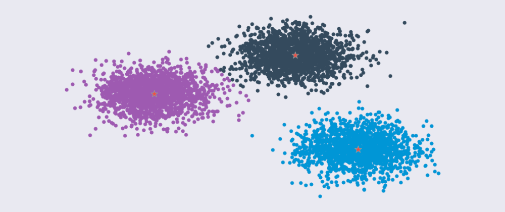
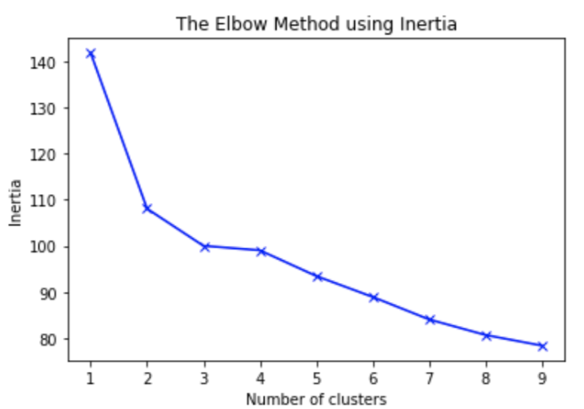

Text Summarizer
===============

Overview
--------

Text summarization is a task of producing a concise and fluent summary
while preserving key information content and overall meaning. Assume
there is a document :math:`D` that consists of :math:`n` sentences: :math:`(S_0,
S_1, ..., S_{n-1})`. The problem of text summarization can be formulated
as creating another document :math:`D’`, where :math:`D’ = (S’_0, S’_1, ..., S’_{m-1})`
and :math:`m \le n`.

In general, there are two categories of text summarization:
**extractive summarization** and **abstractive summarization**. If for
each :math:`i` in :math:`[0, m), S’_i` is in :math:`{S_0, S_1, ...,
S_{n-1}}`, the summarization is **extractive summarization**. If there
exists :math:`j` in :math:`[0, m), S’_j` is not in :math:`{S_0, S_1, ..., S_{n-1}}`, the
summarization is **abstractive summarization**.

To create a summarization, the conventional approaches are to first rank
the sentences in :math:`D`. Then the top :math:`m` scoring sentences in :math:`D`
are selected as the summary :math:`D’`. The key to these approaches is how
to define a sorting metric.

Another summarization approach is k-means. Each sentence in :math:`D` is
represented as a numerical vector, and :math:`D` will be modeled as :math:`m`
clusters of numerical vectors. The distance metric can be Euclidean,
Cosine, or Manhattan distance. The sentences closest to the :math:`m` cluster
centroids will be chosen as the sentences in :math:`D’`. The numerical
representations of :math:`D’` sentences can be generated from sentences’
embeddings, for example, Gensim’s Doc2Vec.

More recent advances in text summarization use Deep Neural
Networks (DNN) to create either **extractive** or **abstractive
summaries**.

-  RNN based encoder/decoder network [2]_. Formulates the extractive
   summarization task as a sequence labeling problem and solve it with
   an encoder-decoder framework.
-  BERT based encoder/decoder network [5]_ [6]_. Leverages the BERT
   embedding to semantically extract summaries.
-  Reinforcement learning [3]_. It defines a coherence model. Then uses
   the combined output of the coherence model and Rouge scores as
   rewards to train a neural extractive summary network.
-  Generative Adversarial Network [4]_. It includes a generator
   network and a discriminator network. The generator builds summaries
   from raw text and the discriminator tries to distinguish the
   generator summaries from the labeled summaries.

The **extractive** method is more practical because the summaries it
creates are more grammatically correct and semantically relevant to the
document. So, the library's text summarizers take the **extractive** approach.

The DNN approaches have achieved a state-of-the-art Rouge-1 F1 score of 44.41[6]_.
The library's text summarizer adopts BERT-based DNN approaches.
As a first step, the library's text summarizer implements two versions of
extractive summarizers: **JaccardSummarizer** and
**KMedoidsSummarizer**.

Custom Vocabulary
-----------------

The library's text summarizer can be customized for specific use-cases.
For example, an analyst and might want to use
distinct summarizers with their own vocabulary.

To achieve this, you can simply specify a custom vocabulary list.
During a processing job of the library's summarizer,
only the words in the custom vocabulary are extracted.

This vocabulary customization feature is implemented in **JaccardSummarizer.**
You can
specify your own vocabulary when instantiating a :class:`~smjsindustry.Summarizer`
with :class:`~smjsindustry.JaccardSummarizerConfig`.

JaccardSummarizer
-----------------

This summarizer first preprocesses the document in question to obtain a
set of tokens for each sentence in the document. The preprocessing is
based on a bag of words model. The document is first segmented into a
list of sentences by `Natural Language Toolkit <https://www.nltk.org/>`_’s (NLTK)
``sent_tokenize`` method. Then each sentence is
further tokenized by NLTK’s ``regexp_tokenize`` method, which removes
numbers, punctuations, and spaces from the sentence. Next, stop words are
removed and stemming is applied to the remaining tokens.

JaccardSummarizer is a traditional summarizer. It scores the
sentences in a document measuring similarities. The sentences with higher
similarities to other sentences in the documents are ranked higher. The
top scoring sentences are selected as the summary of the document.

More specifically, the similarity is calculated in terms of `Jaccard
similarity <https://en.wikipedia.org/wiki/Jaccard_index>`__. The Jaccard
similarity of two sentences **A** and **B** is the ratio of the size of
intersection of tokens in **A** and **B** vs the size of union of tokens
in **A** and **B**.

.. math::

   J(A,B) = \frac{|A \cap B|}{|A \cup B|} = \frac{|A \cap B|}{|A|+|B|-|A \cap B|}

Accordingly, it calculates a symmetric Jaccard similarity matrix for
the sentences in the document. Each row and column in the matrix
correspond a sentence in the document.

.. math::

   J_{similarity} = \left[ \begin{array}{cccc}
   j_{0,0} & j_{0,1} & ... & j_{0,n-1} \\
   j_{1,0} & j_{1,1} & ... & j_{1,n-1} \\
   ... & ... & ... & ... \\
   j_{n-1,0} & j_{n-1,1} & ... & j_{n-1,n-1} \\
   \end{array} \right]

Finally, the score of a sentence is the row sum of this sentence’s similarities
to all other sentences in the document.

.. math::

   score_i = \sum_k j_{ik}

Then the top :math:`m` sentences with the highest similarities are selected
via heap sorting or quick select.

KMedoidsSummarizer
------------------

KMedoidsSummarizer is a k-means based approach. It creates
the sentence embeddings using `Gensim’s Doc2Vec
<https://radimrehurek.com/gensim/models/doc2vec.html>`_. Then it uses the
`k-medoids <https://en.wikipedia.org/wiki/K-medoids>`_ algorithm to determine
the :math:`m` sentences in the document closest to the
cluster centroids.

**Number of Clusters in a Document**

The number of clusters in a document can be specified by a user.
Alternatively, it can also be determined by Elbow method using a model’s
inertia, which is a sum of squared sum of each sample’s distance from
its closest centroid.

Quality Evaluation
------------------

We use
Rouge (Recall-Oriented Understudy for Gisting Evaluation) [1]_
to measure the quality of the summarizers in the library's text summarizer. Rouge measures
the n-gram overlap between the system(machine) summaries and
reference(human) summaries. Rouge-1 measures **unigram** overlap.
Rouge-2 measures **bi-gram**, and Rouge-l measures the longest common
subsequences.

We selects a subset of CNN/Daily Mail news corpus, which has human
labeled summaries, to evaluate the quality. The test set has **1,1489**
news articles. The average number of sentences in the test set is
**32.6**. The average number of sentences in the human labeled summaries
is **3.88**.

**JaccardSummarizer performance**

+------+------+------+------+------+------+------+------+------+------+
| sum  | Rou  | Rou  | Rou  | Rou  | Rou  | Rou  | Rou  | Rou  | Rou  |
| mary | ge-1 | ge-1 | ge-1 | ge-2 | ge-2 | ge-2 | ge-l | ge-l | ge-l |
| si   | F1   | Re   | P    | F1   | Re   | P    | F1   | Re   | P    |
| ze(# |      | call | reci |      | call | reci |      | call | reci |
| of   |      |      | sion |      |      | sion |      |      | sion |
| se   |      |      |      |      |      |      |      |      |      |
| nten |      |      |      |      |      |      |      |      |      |
| ces) |      |      |      |      |      |      |      |      |      |
+======+======+======+======+======+======+======+======+======+======+
| 1    | 3    | 2    | 3    | 1    | 1    | 13.5 | 2    | 2    | 3    |
|      | 0.07 | 9.51 | 7.46 | 0.93 | 0.88 |      | 7.33 | 6.07 | 3.35 |
+------+------+------+------+------+------+------+------+------+------+
| 2    | 3    | 4    | 2    | 1    | 1    | 1    | 3    | 3    | 2    |
|      | 2.44 | 3.71 | 8.73 | 2.15 | 6.84 | 0.55 | 1.14 | 7.22 | 9.53 |
+------+------+------+------+------+------+------+------+------+------+
| 3    | 3    | 5    | 2    | 1    | 2    | 9.34 | 3    | 4    | 2    |
|      | 1.37 | 2.96 | 3.94 | 2.43 | 1.59 |      | 2.47 | 5.38 | 6.96 |
+------+------+------+------+------+------+------+------+------+------+
| 4    | 2    | 5    | 2    | 12.2 | 25.3 | 8.46 | 3    | 5    | 2    |
|      | 9.39 | 9.28 | 0.61 |      |      |      | 2.52 | 1.22 | 5.05 |
+------+------+------+------+------+------+------+------+------+------+
| 5    | 2    | 6    | 1    | 11.9 | 2    | 7.84 | 3    | 5    | 2    |
|      | 7.47 | 3.87 | 8.25 |      | 8.33 |      | 2.16 | 5.74 | 3.55 |
+------+------+------+------+------+------+------+------+------+------+

**KMedoidsSummarizer performance**

+------+------+------+------+------+------+------+------+------+------+
| sum  | Rou  | Rou  | Rou  | Rou  | Rou  | Rou  | Rou  | Rou  | Rou  |
| mary | ge-1 | ge-1 | ge-1 | ge-2 | ge-2 | ge-2 | ge-l | ge-l | ge-l |
| si   | F1   | Re   | P    | F1   | Re   | P    | F1   | Re   | P    |
| ze(# |      | call | reci |      | call | reci |      | call | reci |
| of   |      |      | sion |      |      | sion |      |      | sion |
| se   |      |      |      |      |      |      |      |      |      |
| nten |      |      |      |      |      |      |      |      |      |
| ces) |      |      |      |      |      |      |      |      |      |
+======+======+======+======+======+======+======+======+======+======+
| 1    | 2    | 16.2 | 3    | 5.54 | 4.35 | 8.59 | 1    | 1    | 2    |
|      | 0.64 |      | 2.01 |      |      |      | 9.04 | 5.16 | 7.96 |
+------+------+------+------+------+------+------+------+------+------+
| 2    | 2    | 2    | 2    | 7.17 | 7.84 | 7.26 | 2    | 2    | 2    |
|      | 6.72 | 8.71 | 7.33 |      |      |      | 3.98 | 5.14 | 4.43 |
+------+------+------+------+------+------+------+------+------+------+
| 3    | 2    | 3    | 2    | 9.13 | 1    | 7.65 | 2    | 3    | 2    |
|      | 9.35 | 9.91 | 4.81 |      | 2.62 |      | 7.22 | 4.55 | 3.54 |
+------+------+------+------+------+------+------+------+------+------+
| 4    | 2    | 4    | 2    | 8.83 | 1    | 6.72 | 2    | 3    | 2    |
|      | 8.41 | 5.67 | 1.78 |      | 4.47 |      | 7.11 | 9.26 | 1.53 |
+------+------+------+------+------+------+------+------+------+------+
| 5    | 2    | 5    | 2    | 1    | 1    | 7.15 | 2    | 46.1 | 2    |
|      | 8.59 | 3.04 | 0.46 | 0.06 | 9.03 |      | 8.63 |      | 1.46 |
+------+------+------+------+------+------+------+------+------+------+

References
----------

.. [1] Chin-Yew Lin and Eduard Hovy. 2003. Automatic evaluation of summaries
   using n-gram cooccurrence statistics. In Proceedings of the 2003
   Human Language Technology Conference of the North American Chapter of
   the Association for Computational Linguistics
.. [2] Ramesh Nallapati, Feifei Zhai, and Bowen Zhou. 2017. Summarunner: A
   recurrent neural network based sequence model for extractive
   summarization of documents. In Thirty-First AAAI Conference on
   Artificial Intelligence
.. [3] Yuxiang Wu, Baotian Hu. 2018. Learning to Extract Coherent Summary
   via Deep Reinforcement Learning, AAAI Conference on Artificial
   Intelligence
.. [4] Linqing Liu et al. 2018, Generative Adversarial Network for
   Abstractive Text Summarization, AAAI Conference on Artificial
   Intelligence
.. [5] Yang Liu and Mirella Lapata. 2019. Text Summarization with Pretrained
   Encoders, Conference on Empirical Methods in Natural Language
   Processing and 9th International Joint Conference on Natural Language
   Processing
.. [6] Zhong et al. 2020. Extractive Summarization as Text Matching, Annual
   Meeting of the Association for Computational Linguistics
