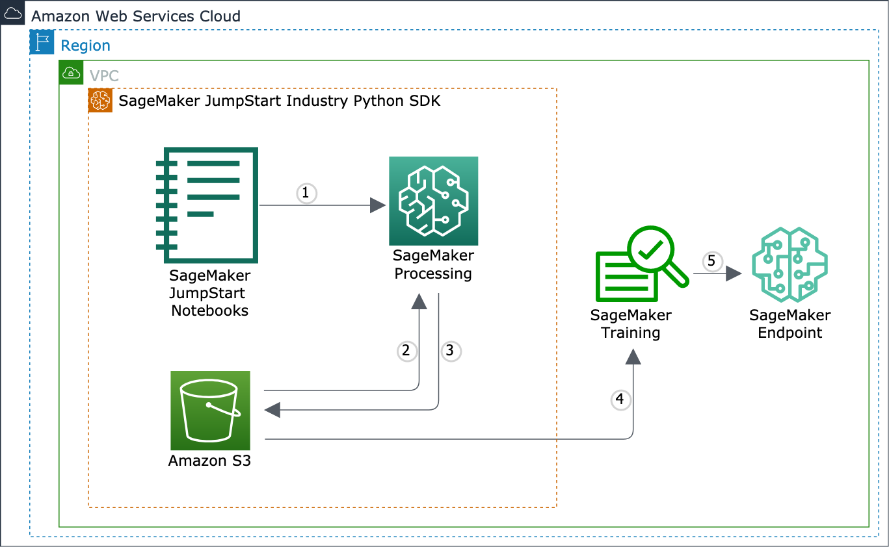

What is the SageMaker JumpStart Industry Python SDK
===================================================

The SageMaker JumpStart Industry Python SDK is an open-source client library for
processing text datasets, training machine learning (ML) language models such as BERT and its variants,
and deploying industry-focused
machine learning models on `Amazon SageMaker JumpStart
<https://docs.aws.amazon.com/sagemaker/latest/dg/studio-jumpstart-industry.html>`_.

.. include:: ../../README.rst
   :start-after: inclusion-marker-1-1-starting-do-not-remove
   :end-before:  inclusion-marker-1-1-ending-do-not-remove

How it works
------------

The following architecture diagram shows what the ``smjsindustry`` library covers
in the ML lifecycle.

       and the coverage of SageMaker JumpStart Industry Python SDK

#. Use `SageMaker JumpStart Industry
   <https://docs.aws.amazon.com/sagemaker/latest/dg/studio-jumpstart-industry.html>`_
   solutions, models, and example notebooks.
   The notebooks walk through how to use the ``smjsindustry`` library to process
   industry text data and fine-tune pretrained models.
   To preview the example notebooks in finance, see
   `Tutorials in Finance <notebooks/index.html>`_.

   .. note::

      The SageMaker JumpStart Industry notebooks
      are hosted and runnable only through SageMaker Studio.
      Log in to the `SageMaker console
      <https://console.aws.amazon.com/sagemaker>`_,
      and launch SageMaker Studio.
      To find instructions on how to access the notebooks, see
      `SageMaker JumpStart <https://docs.aws.amazon.com/sagemaker/latest/dg/studio-jumpstart.html>`_
      in the *Amazon SageMaker Developer Guide*.

#. The SageMaker JumpStart Industry Python SDK helps run SageMaker
   processing jobs to process input text data into a multimodal dataset.
   You can encrypt the Amazon S3 bucket and processing containers using Amazon VPC.
#. After the processing job is complete, SageMaker copies the result from
   the processing containers to the Amazon S3 bucket.
   SageMaker terminates the processing job and its resources.
#. You can download the result from the Amazon S3 bucket to the Studio notebook kernel
   and you can start training pretrained language models,
   such as BERT and its variants.
#. You evaluate the model performance and start using the model for making predictions.

What it does
------------

The library provides API operations to process financial multimodal
(tabular and long-form text) datasets for machine learning.
It provides a set of finance text analysis capabilities as follows:

- It retrieves SEC filings from the SEC EDGAR database.
- It calculates NLP scores for the SEC filings text data.
- It summarizes text data using the :class:`~smjsindustry.Summarizer` class,
  choosing between the Jaccard and k-medoids algorithms.
- It combines text data, tabular data, and categorical data into a multimodal dataset.
- It provides pretrained RoBERTa-SEC language models with
  S&P 500 10-K/Q filings over the last decades and the English Wikipedia corpus.

What it offers
--------------

The SageMaker JumpStart Industry Python SDK is a client library
of SageMaker JumpStart.
The SageMaker JumpStart Industry materials consist of the following:

- The SageMaker JumpStart Industry Python SDK
- `3 JumpStart finance example notebooks on SageMaker Studio <https://docs.aws.amazon.com/sagemaker/latest/dg/studio-jumpstart-industry.html#studio-jumpstart-industry-examples>`_

  - SEC filing retrieval, NLP scoring, and summarization
  - Paycheck protection program loan return classification
  - SEC standard industry code (SIC) multi-class classification

  To preview the notebooks, see `Tutorials in Finance <notebooks/index.html>`_.

- `4 RoBERTa-SEC text embedding model cards in the JumpStart model zoo <https://docs.aws.amazon.com/sagemaker/latest/dg/studio-jumpstart-industry.html#studio-jumpstart-industry-models>`_
- `1 JumpStart solution for corporate credit rating solution <https://docs.aws.amazon.com/sagemaker/latest/dg/studio-jumpstart-industry.html#studio-jumpstart-industry-solutions>`_

.. note::

   The SageMaker JumpStart Industry notebooks
   are hosted and runnable only through SageMaker Studio.
   Log in to the `SageMaker console
   <https://console.aws.amazon.com/sagemaker>`_,
   and launch SageMaker Studio.
   To find instructions on how to access the notebooks, see
   `SageMaker JumpStart <https://docs.aws.amazon.com/sagemaker/latest/dg/studio-jumpstart.html>`_
   in the *Amazon SageMaker Developer Guide*.
